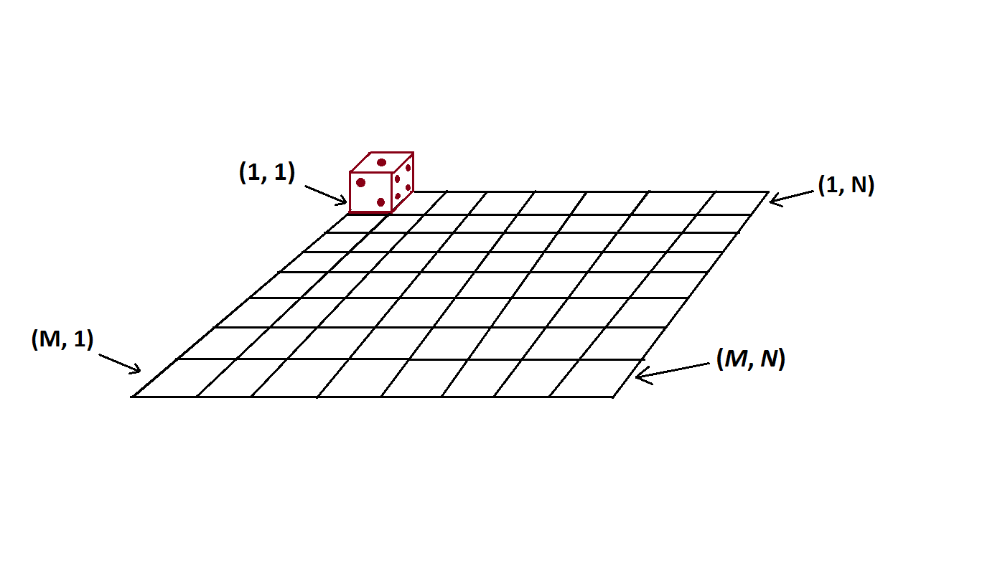

# Dice Path

You are given an MxN grid and a 6 sided dice starting at the point (1, 1). You can only move dice toward right or down by rotating it in the respective direction. The value of the dice is the number of pips on the top face of it.

If at ith step dice is rotated to right, then new configuration will be

Top[i] = Left[i-1]
Bottom[i] = Right[i-1]
Left[i] = Bottom[i-1]
Right[i] = Top[i-1]
Front[i] = Front[i-1]
Back[i] = Back[i-1]
Similarly, if at ith step dice is rotated down, then new configuration will be

Top[i] = Back[i-1]
Bottom[i] = Front[i-1]
Left[i] = Left[i-1]
Right[i] = Right[i-1]
Front[i] = Top[i-1]
Back[i] = Bottom[i-1]
Initially dice is at point (1, 1), and its top face has 1 pip, front face has 2 pips, and left face has 3 pips.
A path sum to a point is the sum of value of dice when it is rolled to that point from (1, 1). As already stated, value at the current location is the number of pips on the top face of the dice. Find the maximum path sum to (M, N).

**Note**
The sum of pips at each pair of opposing sides is always 7.

## Input
The first line contains an integer, T, which denotes the number of test cases. T lines follow.
Each of these lines contains two space separated integers, M N, which represent the final point in the grid.

## Output
For each test case, print the sum of maximal path to (M, N).

## Constraints

1 ≤ T ≤ 3600
1 ≤ M, N ≤ 60

## Sample Input #00

    4
    2 2
    1 2
    2 1
    3 3
## Sample Output #00

    9
    4
    6
    19
## Explanation
**Case #00:** There are two ways to reach (2, 2). Both's sum will be 9.

Position :    (1, 1) -> (1, 2) -> (2, 2)
Direction:          Right     Down
Value    :      1    +    3    +    5     =    9
**Case #01:** Dice has to roll toward right only one time.

Position :    (1, 1) -> (1, 2)
Direction:          Right
Value    :      1    +    3      =    4
**Case #02:** Dice has to roll down only one time.

Position :    (1, 1) -> (2, 1)
Direction:          Down
Value    :      1    +    5      =    6
**Case #03:** There are six ways in which dice can be rotated to (3, 3)

Position :    (1, 1) -> (1, 2) -> (1, 3) -> (2, 3) -> (3, 3)
Direction:          Right     Right     Down      Down
Value    :      1    +    3    +     6   +    5    +    1    = 16

Position :    (1, 1) -> (1, 2) -> (2, 2) -> (2, 3) -> (3, 3)
Direction:          Right     Down      Right     Down
Value    :      1    +    3    +     5   +    6    +    4    = 19

Position :    (1, 1) -> (1, 2) -> (2, 2) -> (3, 2) -> (3, 4)
Direction:          Right     Down      Down      Right
Value    :      1    +    3    +     5   +    4    +    6    = 19

Position :    (1, 1) -> (2, 1) -> (2, 2) -> (2, 3) -> (3, 3)
Direction:          Down      Right     Right     Down
Value    :      1    +    5    +     3   +    2    +    6    = 17

Position :    (1, 1) -> (2, 1) -> (2, 2) -> (3, 2) -> (3, 3)
Direction:          Down      Right     Down      Right
Value    :      1    +    5    +     3   +    6    +    2    = 17

Position :    (1, 1) -> (2, 1) -> (3, 1) -> (3, 2) -> (3, 3)
Direction:          Down      Down      Right     Right
Value    :      1    +    5    +     6   +    3    +    1    = 16
So (Right, Down, Right, Down) or (Right, Down, Down, Right) will be best rotations for this case.

Tested by: abhiranjan