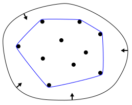

# Convex Hull

Convex Hull of a set of points, in 2D plane, is a convex polygon with minimum area such that each point lies either on the boundary of polygon or inside it.

Let's consider a 2D plane, where we plug pegs at the points mentioned. We enclose all the pegs with a elastic band and then release it to take its shape. The closed structure formed by elastic band is similar to that of convex hull.

In the above figure, convex hull of the points, represented as dots, is the polygon formed by blue line.

## Tasks
Given a set of N points, Find the perimeter of the convex hull for the points.

## Input Format
First line of input will contain a integer, N, number of points. Then follow N lines where each line contains the coordinate, xi yi, of ith point.

## Output Format
Print the perimeter of convex hull for the given set of points. An error margin of +/- 0.2 is acceptable.

## Constraints
3 <= N <= 104

0 <= xi, yi <= 104

There exists, at least, three points which are non-colinear.

## Sample Input

    6    
    1 1    
    2 5    
    3 3    
    5 3    
    3 2    
    2 2
## Sample Output

    12.2   
## Explanation
For the given set of points in sample input, the convex hull is formed by the triangle whose vertices are given by (1, 1), (2, 5), (5, 3). Here perimeter of the hull is 12.200792856.