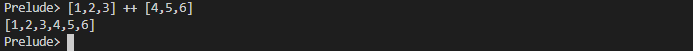

# Functions 

## Basic Functions

How to call function in haskell

    max 5 7
    sqrt 4
    maz (5 + 2) (sqrt  2)

**Defining Function**

    sqrt number = number * number

**In GHCi defining function**

    let sqrt number = number * number

**Comment in haskell**

    -- This is comment

**Simple Conditionals**

    posOrNeg x =
        if x >= 0
        then "Positive"
        else "Negative"
    
- No Parentheses around condition
- No return statements

## Pure Functions

- All Haskell function are pure
    - cannot modify state
    - cannot depend on state
    - Give the same arguments, always return the same output

Examples
- Print a string to the console => Not pure --modifies external state
- Read a file => Not pure --depends on external state at different times
- Compute the length of a string => Pure -- no state
- Get the current time => Not Pure --return different values when called a different times
- Get a random number => Not pure -- return different values each time it is called

## Recursion

Function which called itself

    pow2 n =
     if n == 0
     then 1
     else 2 * (pow2 (n-1))

no loops in haskell so recursion is used all the times.

    repeatString str n =
     if n == 0
     then ""
     else str ++ (repeatString str (n -1))

**Recursion Replaces Loops**
for loop
```java
int pow2(int n){
    int x = 1;
    for(int i = 0; i < n ; ++i)
        x*=2;
    return x;
}
```
```haskell
pow2 n = pow2loop n 1 0
pow2loop n x i =
 if i<n
 then pow2loop n (x*2) (i+1)
 else x
```

## Lists

Collection type list

    x=[1,2,3]

`:` use to **append list**
    
    y = 0 : x


    x' = 1 : 2 : 3 : []


`++` use to **concat the list**

    [1,2,3] ++ [4,5,6]



**Homogeneous List**

Not a valid list

    error=[1,"aman",3.0]

## List Functions

**Head**
Returns the first element of the list

**Tail**
Returns the element except the first element

**null**
Return boolean by checking the empty list


```haskell
double nums=
    if null nums
        then []
        else (2*(head nums)) : (double (tail nums))
```
The above function doubles the value of the list

Function to remove the odd value from list
```haskell
removeOdd nums=
    if null nums
        then []
        else
            if (mod (head nums) 2) == 0
                then (head nums) : (removeOdd (tail nums))
                else removeOdd (tail nums)
```


## Tuples

    x = (1,"hello")

- can contain different types

|Tuples         |Lists              |
|-----          |----               |
|(..)           |[...]              |
|different types| same type         |
| fixed length  | unbounded length  |

Example

    headAndLength list = (head list, length list)


**Accessing Tuple Elements**

- **fst** - to access first element of tuple

- **snd** - to access second element of tuple


**Tuple Warning**
- Big tuple
- Tuple spanning different parts of an application

## Pattern Matching

null' [] = True
null' [x:xs] = False

head' (x:xs) = x
head' [] = error "head of empty list"

```haskell
double nums =
    if null nums
        then []
        else (nums*2 ): double (tail nums)
```

Using Patter Matching
double [] = []
double [x:xs] = 2 * x : double xs

## Guards
```haskell
pow2 n
 | n == 0 =1
 | otherwise = 2 * (pow2 (n-1))
```
- No '=' before guards
- '|' before each guard

```haskell
removeOdd nums=
    if null nums
        then []
        else
            if (mod (head nums) 2) == 0
                then (head nums) : (removeOdd (tail nums))
                else removeOdd (tail nums)
```

```haskell
removeOdd [] = []
removeOdd (x :xs)
 | mod x 2 == 0 = x : (removeOdd xs)
 | otherwise = removeOdd xs
```

## Case Expressions

```haskell
double nums = case nums of 
    []      -> []
    (x:xs)  -> (2 * x) : (double xs)
```

```haskell
anyEven nums = case removeOdd nums of 
    []      -> False
    (x:xs)  -> True
```

- no Guards in case expression

## Let and Where

**Let** binding 
```haskell
fancySeven =
    let x = 4
        y = 3
    in x + y
```

**Where** binding
```haskell
fancyScreem = x + y
    where x = 4
          y = 3
```

- Where - top down
- Let bottom up

## Whitespace

- Do not use tabs. Ever.
- Indent further when breaking expression onto another line

## Lazy

- Infinite data structure creation due to lazy 
- Haskell does not compile until needed
