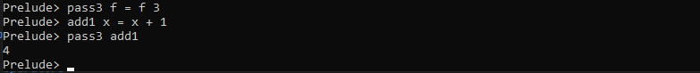

# Higher Order Functions

## Functions as Values

- Passed as function arguments
- Created on the fly
- Higher-Order Function

Example

    pass3 f = f 3

`f` is a function



    compose f g x = f (g x)

`f` and `g` are function here


Want to return a constant value all the time

    always x = 7

or
    always' = const 7

## Partial Application

```java
int foo (int x, int y, int z){
    return x + y + z;
}
```

if we call the above java example with just two arguments it will givw error

```haskell
foo x y z = x + y + z
```

- Arguments must be given in order

## Operators

- +, *, : , ++ are all functions
- (+), (*), (:), (++)

    plus1 = (+) 1

Turning function into operators
    
    mod 10 2
    10 'mod' 2


## Map

- Applies a function to every element in a list

    map length["hello", "abc", "1234"]

Output => [5,3,4]

    map (+1) [1,3,5,7]

Output => [2,4,6,8]

    double = map (2*)

## Filter

- Tests each elements, keep those that pass

    notNull xs = not (null xs)

using filter 

    filter notNull ["","avx","","hello"]


## Fold

- Combines all the values in a list
- Two versions
    - foldl
    - foldr

    foldl (+) 0 [1,2,3,4]

Output => 10

    showPlus s x = "(" ++ s ++ "+" ++ (show x) ++ ")"

    foldr (+) 0 [1,2,3,4]

Output => 10

- foldl :slightly faster
- foldr : can use infinite lists


## Zip

    zip [1,2,3] [4,5,6]


    zipWith (+) [1,2,3] [4,5,6]


## Lamda Expressions

    plus3 x y z = x + y + z

to remove small functions like plus3 we can use lambda expression

    zipWith3 (\ x y z -> x + y + z)

    map (\x -> 2 * x) [1,2,3]


- Too Simple : partial application
- Too Complex : named function

## Function Operators

- (.) Function Composition
- ($) Function Application

Example (.)

    stringLength = length . show
    notNull = not . null

Example ($)

    f $ g x = f (g x)
    f $ g $ h $ k $ x = f(g (h (k x)))
- main buisness of $ is to remove paranthesis ()
- makes code more readable

