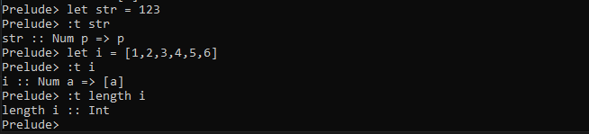

# Types

## Type System

| Static Types                          | Dynamic Types                 |
| -------------                         | -------------                 |
|Variable have a fixed type             | Variable can store any type   |
|More errors caught at compile -time    | More run-time error           |
|Write lots of types                    | Never write a type            |
|Repeated code for different types      | Same code work for many types |

**Haskell Type**
- Statically typed
    - LOTS of compile-time errors
    - Few run-time errors
- Types are inferred
    - Don't have to write out explicit types
    - Explicit types communicate with PEOPLE, checked by compiler
- Same code can work for many different types

## Exporing Types in GHCi

- `:t` print the type of an expression

    
- `a->b` function taking type a as a parameter, and returning type b
    
    
    
## Explicit Types

    str :: [Char]
    str = "hello"

    foo :: Int -> Int
    foo x = x + 1

## Type Inference

    square x = x * x

## When To Use Explicit Types

- Communicating with people

    mystrey :: [Char] - > Int

- Optimizing Performance

## Polymorphism

    length_ints :: [Int] -> Int
    length_ints [] = 0
    length_ints (x:xs) = length_ints xs + 1

    length_chars :: [Char] -> Int
    length_chars [] = 0
    length_chars (x:xs) = length_chars xs + 1

Polymorphism

    length :: a -> Int
    length [] = 0
    length (x:xs) = length xs + 1

- Type variables - start lower case
    - a,b,x,foo,hello
- Concrete types = start Upper case
    - Int, Integer, Char, Double

Polymorphic Function

    head :: [a] -> a
    head (x:xs) = x

- Repeatd type variable always represent the same type

## Type Class Contraints

    length :: a -> Int
    length [] = 0
    length (x:xs) = length xs + 1

`=>` contraint on the type variable

