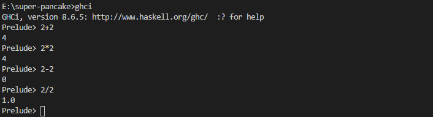

# Hello Haskell

To start Haskell in command prompt
    
    ghci

Start with basic arithmetic operation

- Add

    2+2

- Multiplication

    2*2

- Subtraction

    2-2

- Divide

    2/2



To exit the GHCi 

    :quit

or

    :q


To return to the `Prelude>` or load module

    :m

To load the haskell file

    :load

or 

    :l


To declare function in Prelude

    let triple x = x * 3


## Excersice

1. Given the following lines of code as they might appear in a source file, how would you change them to use them directly in the REPL?

        half x = x / 2
        square x = x * x

    Solution:

    To open in the Prelude directly

        let half x = x /2 

    To open from .hs file

        square :: Integer -> Integer
        square input = input * input

    `:test.hs` in Prelude

    

2. Write one function that can accept one argument and work for all the following expressions. Be sure to name the function.

        3.14 * (5 * 5)
        3.14 * (10 * 10)
        3.14 * (2 * 2)
        3.14 * (4 * 4)

    Solution:

        pieMultiplication :: (Float, Float) -> Float
        pieMultiplication (input1, input2) = 3.14 * (input1 * input2)

    

3. There is a value in Prelude called pi. Rewrite your function to use pi instead of 3.14.

    Solution

        pieMultiplication :: (Float, Float) -> Float
        pieMultiplication (input1, input2) = pi * (input1 * input2)

    


To use infix function

    10 `div` 4

    div 10 4

    (+) 10 100


To get information about the operators

    :info 


`infixl` means left associative
`infixr` means right associative

## Exercise: Parentheses and Association

Below are some pairs of functions that are alike except for parenthesization. Read them carefully and decide if the parentheses change the results of the function. Check your work in GHCi.

1.  a) 8 + 7 * 9 = 71
    b) (8 + 7) * 9 = 135

2.  a) perimeter x y = (x * 2) + (y * 2)
    b) perimeter x y = x * 2 + y * 2

3.  a) f x = x / 2 + 9
    b) f x = x / (2 + 9)


## Exercises: Heal the Sick

The following code samples are broken and won’t compile. The first two are as you might enter into the REPL; the third is from a sourcefile. Find the mistakes and fix them so that they will.
1. let area x = 3. 14 * (x * x)

This one is correct

2. let double x = b * 2

`b` is not defined

3. x = 7
    y = 10
   f = x + y

`y` indendation

## Exercises: A Head Code

Now for some exercises. First, determine in your head what the
following expressions will return, then validate in the REPL:
1. let x = 5 in x
    5

2. let x = 5 in x * x
    25

3. let x = 5; y = 6 in x * y
    30

4. let x = 3; y = 1000 in x + 3
    6

    ```haskell
    headCode1 = x
        where x = 5

    headCode2 = x * x
        where x = 5

    headCode3 = x * y
        where x = 5
            y = 6
            
    headCode4 = x + 3
        where x = 3
            y = 1000
    ```

    


The prompt changes to *Main instead of Prelude to indicate that you have a module called Main loaded.
Rewrite with where clauses:
1. let x = 3; y = 1000 in x * 3 + y
2. let y = 10; x = 10 * 5 + y in x * 5
3. let x = 7; y = negate x; z = y * 10 in z / x + y

    ```haskell
    mainCode1 = x * 3 + y
        where x = 3
            y = 1000

    mainCode2 = x * 5
        where y = 10
            x = 10 * 5 + y
            
    mainCode3 = z / x + y
        where x = 7
            y = negate x
            z = y * 10
    ```

    

## Chapter Exercises

The goal for all the following exercises is just to get you playing with code and forming hypotheses about what it should do. Read the code
carefully, using what we’ve learned so far. Generate a hypothesis about what you think the code will do. Play with it in the REPL and
find out where you were right or wrong.

**Parenthesization**
Given what we know about the precedence of (*), (+), and (^), how can we parenthesize the following expressions more explicitly without changing their results? Put together an answer you think is correct, then test in the GHCi REPL.
Example:
2 + 2 * 3 - 3 = `5`
2 + (2 * 3) - 3 = `5`

Attempt the above on the following expressions.
1. 2 + 2 * 3 - 1 = `7`
2. (^) 10 $ 1 + 1 = `100`
3. 2 ^ 2 * 4 ^ 5 + 1 = `4097`
    - first all the power operations 4*1024+1
    - second multiplication 4096+1
    - last output

**Equivalent expressions**

Which of the following pairs of expressions will return the same result when evaluated? Try to reason them out in your head by reading the code and then enter them into the REPL to check your work:
1.  1 + 1
    2
2.  10 ^ 2
    10 + 9 * 10
3.  400 - 37
    (-) 37 400
4.  100 `div` 3
    100 / 3
5.  2 * 5 + 18
    2 * (5 + 18)

Only 5 will give different output due to paranthesis operations. In first command multiplication will be done first but in the second addition will be done first, that's why it will give different output.

**More fun with functions**
Here is a bit of code as it might be entered into a source file. Remember that when you write code in a source file, the order is unimportant, but when writing code directly into the REPL the order does matter. Given that, look at this code and rewrite it such that it could be evaluated in the REPL (remember: you’ll need let when entering it directly into the REPL). Be sure to enter your code into the REPL to make sure it evaluates correctly.
z = 7
x = y ^ 2
waxOn = x * 5
y = z + 8

    

1. Now you have a value called waxOn in your REPL. What do you think will happen if you enter:
10 + waxOn
(+10) waxOn
(-) 15 waxOn
(-) waxOn 15

    

2. Earlier we looked at a function called triple. While your REPL has waxOn in session, re-enter the triple function at the prompt: let triple x = x * 3

3. Now, what will happen if we enter this at our GHCi prompt.Try to reason out what you think will happen first, considering what role waxOn is playing in this function call. Then enter it, see what does happen, and check your understanding: triple waxOn 

    

4. Rewrite waxOn as an expression with a where clause in your source file. Load it into your REPL and make sure it still works as expected!

    ```haskell
    waxOn = x * 5
        where x = y ^ 2
            y = z + 8
            z = 7
    ```
    

5. Now to the same source file where you have waxOn, add the triple function. Remember: You don’t need let and the function name should be at the left margin (that is, not nested as one of the waxOn expressions). Make sure it works by loading it into your REPL and then entering triple waxOn again at the REPL prompt. You should have the same answer as you did above.

    ```haskell
    triple :: Integer -> Integer
    triple x = x * 3
    ```

    

6. Now, without changing what you’ve done so far in that file, add a new function called waxOff that looks like this: waxOff x = triple x

7. Load the source file into your REPL and enter waxOff waxOn at the prompt. You now have a function, waxOff that can be applied to a variety of arguments — not just waxOn but any (numeric) value you want to put in for 𝑥. Play with that a bit. What is the result of waxOff 10 or waxOff (-50)? Try modifying your waxOff function to do something new — perhaps you want to first triple the 𝑥 value and then square it or divide it by 10. Just spend some time getting comfortable with modifying the source file code, reloading it, and checking your modification in the REPL.

    
