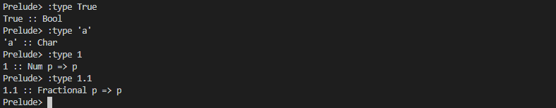
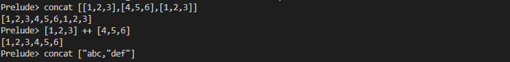
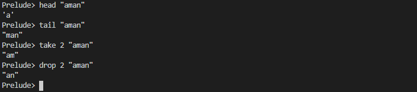
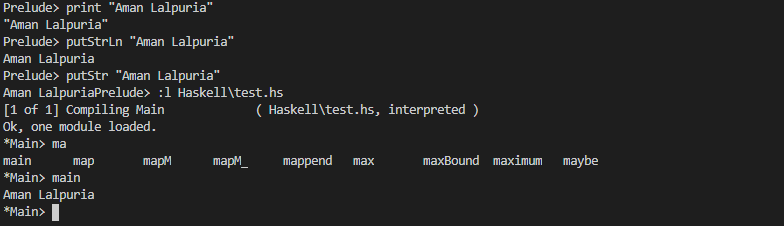
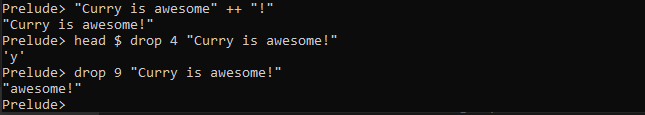

# Strings 
`:type` - helps rp know the categorized value



`::` - symbol is read as "has the type"

`++` - use to concatenate



`head` - to take the first element of the strin

`tail` - to take the rest of the element except first element

`take` - to take the specified number of variable

`drop` - to left the specified number of variable and give rest of the string




**Printing String**

1. print 'Aman Lalpuria'
2. putStrLn "Aman Lalpuria"
3. putStr "Aman Lalpuria"
4. In .hs file
    ```haskell
    main :: IO()
    main = putStrLn("Aman Lalpuria")
    ```
    

## Exercises: Scope
1. These lines of code are from a REPL session. Is 𝑦 in scope for 𝑧?

    Prelude> let x = 5

    Prelude> let y = 7

    Prelude> let z = x * y

2. These lines of code are from a REPL session. Is ℎ in scope for
function 𝑔? Go with your gut here.

    Prelude> let f = 3

    Prelude> let g = 6 * f + h

3. This code sample is from a source file. Is everything we need
to execute area in scope?

    area d = pi * (r * r)

    r = d / 2

4. This code is also from a source file. Now are 𝑟 and 𝑑 in scope
for area?

    area d = pi * (r * r)

    where r = d / 2

*Answer*

Only 1 and 4 are in the scope.

## Exercises: Syntax Errors
Read the syntax of the following functions and decide whether it will compile. Test them in your REPL and try to fix the syntax errors where they occur.
1. ++ [1, 2, 3] [4, 5, 6]
2. '<3' ++ ' Haskell'
3. concat ["<3", " Haskell"]

Option 3 will give the correct answer, in  first option ++ should be covered in paranthesis for the correct answer and in the second option [Char] should be in  double inverted commas " ".

## Chapter Exercises
**Reading syntax**
1. For the following lines of code, read the syntax carefully and decide if they are written correctly. Test them in your REPL after you’ve decided to check your work. Correct as many as you can.

    a) concat [[1, 2, 3], [4, 5, 6]]

    b) ++ [1, 2, 3] [4, 5, 6]

    c) (++) "hello" " world"

    d) ["hello" ++ " world]

    e) 4 !! "hello"

    f) (!!) "hello" 4

    g) take "4 lovely"

    h) take 3 "awesome"

    Wrong b, d, e, g

2. Next we have two sets: the first set is lines of code and the other is a set of results. Read the code and figure out which results came from which lines of code. Be sure to test them in the REPL.

    a) concat [[1 * 6], [2 * 6], [3 * 6]]

    b) "rain" ++ drop 2 "elbow"

    c) 10 * head [1, 2, 3]

    d) (take 3 "Julie") ++ (tail "yes")

    e) concat [tail [1, 2, 3],
            tail [4, 5, 6],
            tail [7, 8, 9]]
            
    Can you match each of the previous expressions to one of these results presented in a scrambled order?

    a) "Jules"

    b) [2,3,5,6,8,9]

    c) "rainbow"

    d) [6,12,18]

    e) 10

    *Result*

    a) [6,12,18]

    b) "rainbow"

    c) 10

    d) "Jules"
    
    e) [2,3,5,6,8,9]

**Building functions**
1. Given the list-manipulation functions mentioned in this chapter, write functions that take the following inputs and return the expected outputs. Do them directly in your REPL and use the take and drop functions you’ve already seen.
Example
-- If you apply your function to this value:
"Hello World"
-- Your function should return:
"ello World"
The following would be a fine solution:
Prelude> drop 1 "Hello World"
"ello World"
Now write expressions to perform the following transformations, just with the functions you’ve seen in this chapter. You
do not need to do anything clever here.
    a) -- Given

    "Curry is awesome"

    -- Return

    "Curry is awesome!"

    b) -- Given

    "Curry is awesome!"

    -- Return

    "y"

    c) -- Given

    "Curry is awesome!"

    -- Return

    "awesome!"

    

2. Now take each of the above and rewrite it in a source file as a general function that could take different string inputs as arguments but retain the same behavior. Use a variable as the argument to your (named) functions. If you’re unsure how to do this, refresh your memory by looking at the waxOff exercise from the previous chapter and the TopOrLocal module from this chapter.

    ```haskell
    addVariable input = concat[input,"!"]

    valueat5 input = head $ drop4 input

    drop4 :: String -> [Char]
    drop4 input = drop 4 input

    stringafter9 input = drop 9 input
    ```

3. Write a function of type String -> Char which returns the third character in a String. Remember to give the function a name and apply it to a variable, not a specific String, so that it could be reused for different String inputs, as demonstrated (feel free to name the function something else. Be sure to fill in the type signature and fill in the function definition after the equals sign):thirdLetter ::thirdLetter x =
-- If you apply your function to this value:
"Curry is awesome"
-- Your function should return
`r'
Note that programming languages conventionally start indexing things by zero, so getting the zeroth index of a string will get you the first letter. Accordingly, indexing with 3 will actually get you the fourth. Keep this in mind as you write this function.

    ```haskell
    get3 :: String -> Char
    get3 input = head $ drop3 input

    drop3 :: String -> [Char]
    drop3 input = drop 2 input
    ```

    or
    
    ```haskell
    get3 :: String -> Char
    get3 input = head $ drop 2 input
    ```

4. Now change that function so the string operated on is always the same and the variable represents the number of the letter you want to return (you can use “Curry is awesome!” as your string input or a different string if you prefer). 

    letterIndex :: Int -> Char letterIndex x =

    ```haskell
    getValue :: Int -> Char
    getValue position = head $ drop position "Curry is awesome"
    ```

5. Using the take and drop functions we looked at above, see if you can write a function called rvrs (an abbreviation of ‘reverse’ used because there is a function called ‘reverse’ already in Prelude, so if you call your function the same name, you’ll get an error message). rvrs should take the string “Curry is awesome” and return the result “awesome is Curry.” This may not be the most lovely Haskell code you will ever write, but it is quite possible using only what we’ve learned so far. First write it as a single function in a source file. This doesn’t need to, and shouldn’t, work for reversing the words of any sentence. You’re expected only to slice and dice this particular string with take and drop.

    ```haskell
    rvrs :: String
    rvrs = third ++ " " ++ second ++ " " ++ first
        where first = take 5 input
            second = take 2 $ drop 6 input
            third = drop 9 input
            input = "Curry is awesome"
    ```

6. Let’s see if we can expand that function into a module. Why would we want to? By expanding it into a module, we can add more functions later that can interact with each other. We can also then export it to other modules if we want to and use this code in those other modules. There are different ways you could lay it out, but for the sake of convenience, we’ll show you a sample layout so that you can fill in the blanks:
module Reverse where

    Into the parentheses after print you’ll need to fill in your function name rvrs plus the argument you’re applying rvrs to, in this
    case “Curry is awesome.” That rvrs function plus its argument are now the argument to print. It’s important to put them inside the parentheses so that that function gets applied and evaluted first, and then that result is printed. Of course, we have also mentioned that you can use the $ symbol to avoid using parentheses, too. Try modifying your main function to use that instead of the parentheses.

    ```haskell
    rvrs :: String
    rvrs = third ++ " " ++ second ++ " " ++ first
        
    input :: String          
    input = "Curry is awesome"

    first :: String
    first = take 5 input

    second :: String
    second = take 2 $ drop 6 input

    third :: String
    third = drop 9 input
    ```