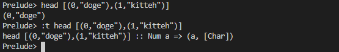
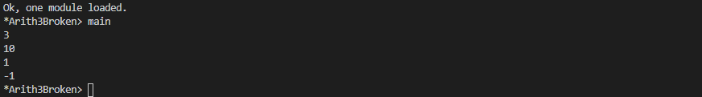

# Types

## Exercises: Type Matching
Below you’ll find a list of several standard functions we’ve talked
about previously. Under that is a list of their type signatures. Match
the function to its type signature. Try to do it without peeking at the
type signatures (either in the text or in GHCi) and then check your
work. You may find it easier to start from the types and work out
what you think a function of that type would do.

1. Functions:

    a) not

    b) length

    c) concat

    d) head

    e) (<)

2. Type signatures:

    a) _ :: [a] -> a

    b) _ :: [[a]] -> [a]

    c) _ :: Bool -> Bool

    d) _ :: [a] -> Int

    e) _ :: Ord a => a -> a -> Bool

    *Answer:*
    
        1.a = 2.c
        1.b = 2.d
        1.c = 2.b
        1.d = 2.a
        1.e = 2.e


## Exercises: Type Arguments
Given a function and its type, tell us what type results from applying
some or all of the arguments.
You can check your work in the REPL like this (using the first
question as an example):
```haskell
Prelude> let f :: a -> a -> a -> a; f = undefined
Prelude> let x :: Char; x = undefined
Prelude> :t f x
```
It turns out that you can check the types of things that aren’t really
implemented yet, so long as you give GHCi an undefined to bind the
signature to.
1. If the type of f is 
a -> a -> a -> a, and the type of 𝑥 is Char then
the type of f x is

    `a) Char -> Char -> Char`

    b) x -> x -> x -> x

    c) a -> a -> a

    d) a -> a -> a -> Char

2. If the type of g is a -> b -> c -> b, then the type of
g 0 'c' "woot" is

    a) String

    b) Char -> String

    c) Int

    `d) Char`

3. If the type of h is (Num a, Num b) => a -> b -> b, then the type of
h 1.0 2 is:

    a) Double

    `b) Integer`

    c) Integral b => b

    d) Num b => b

    Note that because the type variables 𝑎 and 𝑏 are different, the
compiler must assume that the types could be different.

4. If the type of h is (Num a, Num b) => a -> b -> b, then the type of
h 1 (5.5 :: Double) is

    a) Integer

    b) Fractional b => b

    `c) Double`

    d) Num b => b

5. If the type of jackal is (Ord a, Eq b) => a -> b -> a, then the type
of
jackal "keyboard" "has the word jackal in it"

    `a) [Char]`

    b) Eq b => b

    c) b -> [Char]

    d) b

    e) Eq b => b -> [Char]

6. If the type of jackal is (Ord a, Eq b) => a -> b -> a, then the type
of
jackal "keyboard"

    a) b

    b) Eq b => b

    c) [Char]

    d) b -> [Char]

    `e) Eq b => b -> [Char]`

7. If the type of kessel is (Ord a, Num b) => a -> b -> a, then the
type of
kessel 1 2 is

    a) Integer

    b) Int

    c) a

    `d) (Num a, Ord a) => a`

    e) Ord a => a

    f ) Num a => a

8. If the type of kessel is (Ord a, Num b) => a -> b -> a, then the
type of
kessel 1 (2 :: Integer) is

    a) (Num a, Ord a) => a

    b) Int

    c) a

    d) Num a => a

    `e) Ord a => a`

    f ) Integer

9. If the type of kessel is (Ord a, Num b) => a -> b -> a, then the
type of
kessel (1 :: Integer) 2 is

    a) Num a => a

    b) Ord a => a

    `c) Integer`

    d) (Num a, Ord a) => a
    
    e) a

## Exercises: Parametricity
All you can really do with a parametrically polymorphic value is pass or not pass it to some other expression. Prove that to yourself with these small demonstrations.
1. Given the type a -> a, which is the type for id, attempt to make
a function that is not bottom and terminates successfully that
does something other than returning the same value. This is
impossible, but you should try it anyway.

    ```haskell
    id :: a -> a 
    id a = a
    ```
    It didn't work

2. We can get a more comfortable appreciation of parametricity
by looking at `a -> a -> a`. This hypothetical function `a -> a ->
a` has two–and only two–implementations. Write both possible versions of a -> a -> a. After doing so, try to violate the constraints of parametrically polymorphic values we outlined above.

    ```haskell
    id2 :: a -> a -> a
    id2 a _ = a

    id2' :: a -> a -> a
    id2' _  a = a
    ```

3. Implement a -> b -> b. How many implementations can it have? Does the behavior change when the types of 𝑎 and 𝑏 change?

    ```haskell
    id3 :: a -> b -> b
    id3 _ b = b
    ```

## Exercises: Apply Yourself
Look at these pairs of functions. One function is unapplied, so
the compiler will infer maximally polymorphic type. The second
function has been applied to a value, so the inferred type signature may have become concrete, or at least less polymorphic. Figure out how the type would change and why, make a note of what you think the new inferred type would be and then check your work in GHCi.

1. ```Haskell
   -- Type signature of general function  
    (++) :: [a] -> [a] -> [a]
    ```

    ```Haskell
    -- How might that change when we apply
    -- it to the following value?
    myConcat x = x ++ " yo"
    ```

    It will change to 
    ```Haskell
    (++) :: [Char] -> [Char] -> [Char]
    ```
2. ```Haskell
   -- General function
   (*) :: Num a => a -> a -> a
    ```
    ```haskell
    -- Applied to a value
    myMult x = (x / 3) * 5
    ```
    As function `*` is of type superclass `Num` it will change to
    ```Haskell
   (*) :: Fractional a => a -> a -> a
    ```
3. ```haskell
    take :: Int -> [a] -> [a]
    myTake x = take x "hey you"
    ```

    Here
    ```Haskell
    -- myTake definition is 
    myTake :: Int -> [a]
    -- [a] list is of type char so it change to [char]
    myTake :: Int -> [Char]
    -- so take will change to 
    take :: Int -> [Char] -> [Char]
    ```

4. ```haskell
    (>) :: Ord a => a -> a -> Bool
    myCom x = x > (length [1..10])
    ```

    ```haskell
    -- myCom definition
    myCom :: Int -> Bool
    -- (>) definition changes to 
    (>) :: Int -> Int -> Bool
    ```

5. ```haskell
    (<) :: Ord a => a -> a -> Bool
    myAlph x = x < 'z'
    ```

     ```haskell
    -- myAlph definition
    myAlph :: Char -> Bool
    -- (<) definition changes to 
    (<) :: Char -> Char -> Bool
    ```

## Chapter Exercises
Welcome to another round of “Knowing is not enough; we must
apply.

**Multiple choice**

1. A value of type [a] is

    a) a list of alphabetic characters

    b) a list of lists

    `c) a list whose elements are all of some type 𝑎`

    d) a list whose elements are all of different types

2. A function of type [[a]] -> [a] could

    `a) take a list of strings as an argument`

    b) transform a character into a string

    c) transform a string in to a list of strings

    d) take two arguments

3. A function of type [a] -> Int -> a

    a) takes one argument

    `b) returns one element of type 𝑎 from a list`

    c) must return an Int value

    d) is completely fictional

4. A function of type (a, b) -> a

    a) takes a list argument and returns a Char value

    b) has zero arguments

    `c) takes a tuple argument and returns the first value`

    d) requires that 𝑎 and 𝑏 be of different types

**Determine the type**

For the following functions, determine the type of the specified value. We suggest you type them into a file and load the contents of the file in GHCi. In all likelihood, it initially will not have the polymorphic types you might expect due to the monomorphism restriction. We’ll explain more much later, but for now it means that top-level declarations by default will have a concrete type if any can be determined. You can fix this by setting up your file like so:

```Haskell
{-# LANGUAGE NoMonomorphismRestriction #-}
module DetermineTheType where
-- simple example
example = 1
```
If you had not included the NoMonomorphismRestriction pragma,
example would have had the type Integer instead of Num a => a. Do
your best to determine the most polymorphic type an expression
could have in the following exercises.
1. All function applications return a value. Determine the value
returned by these function applications and the type of that
value.

    a) (* 9) 6
    
    
    
    b) head [(0,"doge"),(1,"kitteh")]

    

    c) head [(0 :: Integer ,"doge"),(1,"kitteh")]

    

    d) if False then True else False

    


    e) length [1, 2, 3, 4, 5]

    

    f ) (length [1, 2, 3, 4]) > (length "TACOCAT")

    

1. Given
    ```haskell
    x = 5
    y = x + 5
    w = y * 10
    ```
    What is the type of w?

    w type will be Num as x is of type of Num 
    
    

    if we want to make it of type Int, just change 

    ```haskell
    x = 5 :: Int
    ```

    


2. Given

    ```haskell
    x = 5
    y = x + 5
    z y = y * 10
    ```
    What is the type of z?

    z is of type Num

    


3. Given
    ```haskell
    x = 5
    y = x + 5
    f = 4 / y
    ```
    What is the type of f?

    `f` is of type fractional

    


4. Given
    ```haskell
    x = "Julie"
    y = " <3 "
    z = "Haskell"
    f = x ++ y ++ z
    ```
    What is the type of f?
    
    `f` is of type [Char]

    

**Does it compile?**

For each set of expressions, figure out which expression, if any, causes the compiler to squawk at you (n.b. we do not mean literal squawking) and why. Fix it if you can.

1. ```haskell
    bigNum = (^) 5 $ 10
    wahoo = bigNum $ 10
    ```
    It will not compile

    Case 1 : If wahoo is suppose to call bigNum, this is the code:
    ```haskell
    bigNum = (^) 5 $ 10
    wahoo = bigNum 
    ```
    Case 2 : If wahoo should pass the parameter to bigNum, this is the code:
    ```haskell
    bigNum input= (^) 5 $ input
    wahoo = bigNum $ 10
    ```
    

2. ```haskell
    x = print
    y = print "woohoo!"
    z = x "hello world"
    ```

    It will compile

3. ```haskell
    a = (+)
    b = 5
    c = b 10
    d = c 200
    ```

    It will not compile

    As we can see a is declare for doing addition, this can be the code than:
    ```haskell
    a = (+)
    b = 5
    c = a b 10
    d = a c 200
    ```

4. ```haskell
    a = 12 + b
    b = 10000 * c
    ```
    It will not compile as `c` is not declared
    ```haskell
    a = 12 + b
    b = 10000 * c
    c = 1
    ```
**Type variable or specific type constructor?**

1. You will be shown a type declaration, and you should categorize each type. The choices are a fully polymorphic type variable, constrained polymorphic type variable, or concrete type constructor.
    ```haskell
    f :: Num a => a -> b -> Int -> Int
    -- [0] [1] [2] [3]
    ```
    Here, the answer would be: constrained polymorphic (Num) ([0]), fully polymorphic ([1]), and concrete ([2] and [3]).

    ```Haskell
    -- f :: Num a => a -> b -> Int -> Int
    x = 3               -- Constrained Polymorphic
    y = ['a','b','c']   -- fully polymorphic
    z = 4 :: Int        -- Concrete
    f x y z= x + length y + z  
    ```

2. Categorize each component of the type signature as described
in the previous example.
    ```haskell
    f :: zed -> Zed -> Blah
    ```
    - zed is fully polymorphic, its a function don't know what type is going return
    - Zed and Blah `concrete` are constructor already definerd
  
3. Categorize each component of the type signature
    ```haskell
    f :: Enum b => a -> b -> C
    ```
    - Enum b is constrained polymorphic 
    - a is fully polymorphic
    - c is concrete
  
4. Categorize each component of the type signature  
    ```haskell
    f :: f -> g -> C
    ```
    - f and g are fully polymorphic
    - C is concrete

**Write a type signature**

For the following expressions, please add a type signature. You
should be able to rely on GHCi type inference to check your work,
although you might not have precisely the same answer as GHCi
gives (due to polymorphism, etc).

1. While we haven’t fully explained this syntax yet, you’ve seen it in Chapter 2 and as a solution to an exercise in Chapter 4. This syntax is a way of destructuring a single element of a list.
    ```haskell
    functionH ::
    functionH (x:_) = x
    ```

    ```haskell
    functionH :: [a] -> a
    ```

2. ```haskell
    functionC ::
    functionC x y = if (x > y) then True else False
    ```

    ```haskell
    functionC :: Ord a => a -> a -> Bool
    ```

3. ```haskell
    functionS ::
    functionS (x, y) = y
    ```

    ```haskell
    functionS :: (a,b) -> b
    ```


**Given a type, write the function**

You will be shown a type and a function that needs to be written. Use the information the type provides to determine what the function
should do. We’ll also tell you how many ways there are to write
the function. Syntactically different but semantically equivalent
implementations are not counted as being different. For example,
writing a function one way then rewriting the semantically identical
function but using anonymous lambda syntax does not count as two
implementations.
To make things a little easier, we’ll demonstrate how to solve this
kind of exercise. Given:
```haskell
myFunc :: (x -> y)
-> (y -> z)
-> c
-> (a, x)
-> (a, z)
myFunc xToY yToZ _ (a, x) = undefined
```
Talking through the above, we have a function that takes four
arguments. The final result is a tuple with the type (a, z). It turns out,the 𝑐 argument is nowhere in our results and there’s nothing really to do with it, so we use the underscore to ignore that. We named the two function arguments by their types and pattern matched on the tuple argument. The only way to get the second value of the tuple from the type 𝑥 to the type 𝑧 is to use both of the functions furnished to us. If we tried the following:

```haskell
myFunc xToY yToZ _ (a, x) = (a, (xToY x))
```
We would get a type error that it expected the type 𝑧 but the actual type was 𝑦. That’s because we’re on the right path, but not quite done yet! Accordingly, the following should typecheck:

```haskell
myFunc :: (x -> y)
        -> (y -> z)
        -> c
        -> (a, x)
        -> (a, z)

myFunc xToY yToZ _ (a, x) = (a, (yToZ (xToY x)))
```
1. There is only one function definition that typechecks and doesn’t go into an infinite loop when you run it.
    ```haskell
    i :: a -> a
    i = undefined
    ```

    ```haskell
    i :: a -> a
    i a = a
    ```
2. There is only one version that works.
    ```haskell
    c :: a -> b -> a
    c = undefined
    ```

     ```haskell
    c :: a -> b -> a
    c a _ = a
    ```
3. Given alpha equivalence are c'' and c (see above) the same
thing?
    ```haskell
    c'' :: b -> a -> b
    c'' = ?
    ```
4. Only one version that works.
    ```haskell
    c' :: a -> b -> b
    c' = undefined
    ```

     ```haskell
    c' :: a -> b -> b
    c' _ b = b
    ```
5. There are multiple possibilities, at least two of which you’ve
seen in previous chapters.
    ```haskell
    r :: [a] -> [a]
    r = undefined
    ```

    ```haskell
    r :: [a] -> [a]
    r (x:xa)= [x] : r xa    -- recursion reading first element of list and appedning to the output
    r _ = []                -- if list is empty
    ```
6. Only one version that will typecheck.
    ```haskell
    co :: (b -> c) -> (a -> b) -> a -> c
    co = undefined
    ```

    ```haskell
    co :: (b -> c) -> (a -> b) -> a -> c
    co bToc aTob a = bToc $ aTob a 
    ```
7. One version will typecheck
    ```haskell
    a :: (a -> c) -> a -> a
    a = undefined
    ```

    ```haskell
    a :: (a -> c) -> a -> a
    a xa _= xa
    ```
8. One version will typecheck.
    ```haskell
    a' :: (a -> b) -> a -> b
    a' = undefined
    ```

    ```haskell
    a' :: (a -> b) -> a -> b
    a' aTob a = aTob a
    ```

**Fix it**

Won’t someone take pity on this poor broken code and fix it up? Be sure to check carefully for things like capitalization parentheses, and indentation.
1. ```haskell
    module sing where
    fstString :: [Char] ++ [Char]
    fstString x = x ++ " in the rain"
    sndString :: [Char] -> Char
    sndString x = x ++ " over the rainbow"
    sing = if (x > y) then fstString x or sndString y
    where x = "Singin"
    x = "Somewhere"
    ```

    ```haskell
    module Sing where

    fstString :: [Char] -> [Char]
    fstString x = x ++ " in the rain"

    sndString :: [Char] -> [Char]
    sndString x = x ++ " over the rainbow"
        
    sing = if (x > y)
        then fstString x
        else sndString y
        where x = "Singin"
            y = "Somewher"
    ```

    

2. Now that it’s fixed, make a minor change and make it sing the
other song. If you’re lucky, you’ll end up with both songs stuck
in your head!

    ```haskell
    module Sing where

    fstString :: [Char] -> [Char]
    fstString x = x ++ " in the rain"

    sndString :: [Char] -> [Char]
    sndString x = x ++ " over the rainbow"
        
    sing = if (x < y)
        then fstString x
        else sndString y
        where x = "Singin"
            y = "Somewher"
    ```
    

3. ```haskell
   -- arith3broken.hs
    module Arith3Broken where
    main :: IO ()
    Main = do
    print 1 + 2
    putStrLn 10
    print (negate -1)
    print ((+) 0 blah)
    where blah = negate 1
    ```
    ```haskell
    -- arith3broken.hs
    module Arith3Broken where
    main :: IO ()
    main = do
        print (1 + 2)
        putStrLn(show 10)
        print (negate (-1))
        print ((+) 0 blah)
        where blah = negate 1
    ```
    

**Type-Kwon-Do**

The name is courtesy of Phillip Wright.3 Thank you for the idea!
The focus here is on manipulating terms in order to get the types
to fit. This sort of exercise is something you’ll encounter in writing
real Haskell code, so the practice will make it easier to deal with
when you get there. Practicing this will make you better at writing
ordinary code as well.
We provide the types and bottomed out (declared as undefined)
terms. Bottom and undefined will be explained in more detail later.
The contents of the terms are irrelevant here. You’ll use only the
declarations provided and what the Prelude provides by default
unless otherwise specified. Your goal is to make the ???’d declaration
pass the typechecker by modifying it alone.
Here’s a worked example for how we present these exercises and
how you are expected to solve them. Given the following:
```haskell
data Woot
data Blah

f :: Woot -> Blah
f = undefined

g :: (Blah, Woot) -> (Blah, Blah)
g = ???
```
Here it’s 𝑔 that you’re supposed to implement; however, you
can’t evaluate anything. You’re to only use type-checking and typeinference to validate your answers. Also note that we’re using a trick
for defining datatypes which can be named in a type signature, but
have no values. Here’s an example of a valid solution:
```haskell
g :: (Blah, Woot) -> (Blah, Blah)
g (b, w) = (b, f w)
```
The idea is to only fill in what we’ve marked with ???.
Not all terms will always be used in the intended solution for a problem

1. ```haskell
    f :: Int -> String
    f = undefined

    g :: String -> Char
    g = undefined

    h :: Int -> Char
    h = ???
    ```
    ```haskell
    f :: Int -> String
    f = undefined

    g :: String -> Char
    g = undefined

    h :: Int -> Char
    h input = g $ f input
    ```


2. ```haskell
    data A
    data B
    data C
    q :: A -> B
    q = undefined
    w :: B -> C
    w = undefined
    e :: A -> C
    e = ???
    ```

    ```haskell
    data A
    data B
    data C

    q :: A -> B
    q = undefined

    w :: B -> C
    w = undefined

    e :: A -> C
    e input = w $ q input
    ```
3. ```haskell
   data X
    data Y
    data Z
    xz :: X -> Z
    xz = undefined
    yz :: Y -> Z
    yz = undefined
    xform :: (X, Y) -> (Z, Z)
    xform = ???
    ```

    ```haskell
    data X
    data Y
    data Z

    xz :: X -> Z
    xz = undefined

    yz :: Y -> Z
    yz = undefined

    xform :: (X, Y) -> (Z, Z)
    xform (x,y) = (xz x, yz y)
    ```
4. ```haskell
    munge :: (x -> y) -> (y -> (w, z)) -> x -> w
    munge = ???
    ```
    ```haskell
    munge :: (x -> y) -> (y -> (w, z)) -> x -> w
    munge xToy yTowzTuple x = fst $ yTowzTuple $ xToy x
    ```
