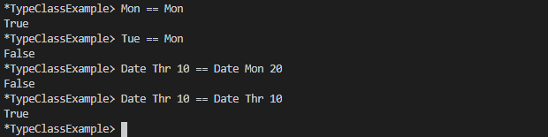
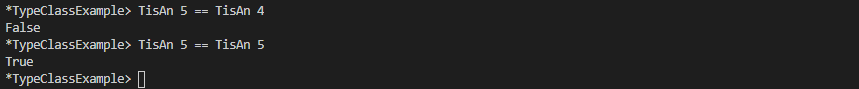
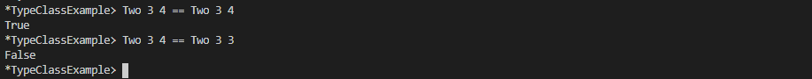
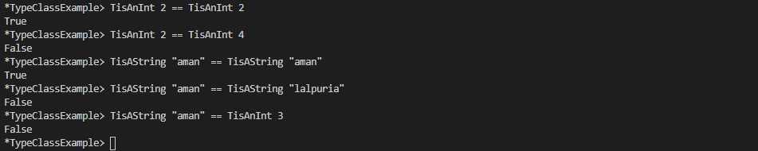
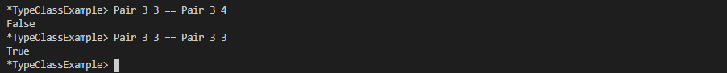
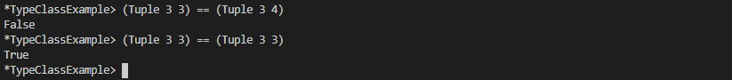
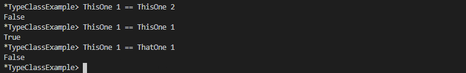
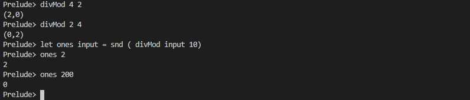
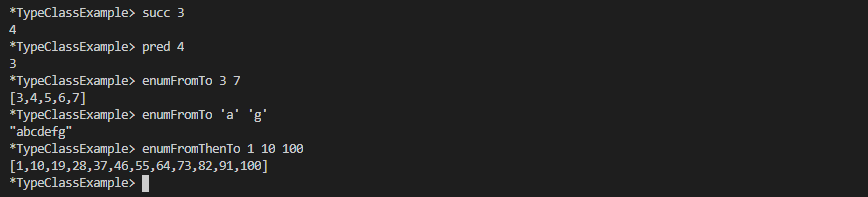

# Typeclasses

1. Creating a datatype

    ```Haskell
    data DayOfWeek = Mon | Tue | Wed | Thr | Fri | Sat | Sun

    -- day of week and numerical day of month
    data Date = Date DayOfWeek Int
    ```

2. Creating a typeclass for created datatype

    ```Haskell

    instance Eq DayOfWeek where
    (==) Mon Mon = True
    (==) Tue Tue = True
    (==) Wed Wed = True
    (==) Thr Thr = True
    (==) Fri Fri = True
    (==) Sat Sat = True
    (==) Sun Sun = True
    (==) _ _ = False

    instance Eq Date where
    (==) (Date weekday dayOfMonth) (Date weekday' dayOfMonth') = 
        weekday == weekday' && dayOfMonth == dayOfMonth'
    ```

    

## Exercises: Eq Instances

Write the Eq instance for the datatype provided.
1. It’s not a typo, we’re just being cute with the name.
    ```haskell
    data TisAnInteger =
        TisAn Integer
    ```
    ```haskell
    instance Eq TisAnInteger where
        (==) (TisAn a) (TisAn a') = a == a'
    ```

    

2. ```haskell
   data TwoIntegers =
    Two Integer Integer
    ```
    ```Haskell
    instance Eq TwoIntegers where
        (==) (Two a b) (Two a' b') = a == a' && b == b'
    ```
    

3. ```haskell
   data StringOrInt =
      TisAnInt Int
    | TisAString String
    ```
    ```haskell
    instance Eq StringOrInt where
        (==) (TisAnInt a) (TisAnInt a') = a == a'
        (==) (TisAString a) (TisAString a') = a == a'
        (==) _ _ = False
    ```
    

4. ```haskell
   data Pair a =
    Pair a a
    ```
    ```haskell
    instance Eq a => Eq (Pair a) where
        (==) (Pair a b) (Pair a' b') = a == a' && b == b'
    ```
    

5. ```haskell
   data Tuple a b =
    Tuple a b
    ```
    ```haskell
    instance (Eq a, Eq b) => Eq (Tuple a b)where
        (==) (Tuple a b) (Tuple a' b') = a == a' && b == b'
    ```
    

6. ```haskell
   data Which a =
      ThisOne a
    | ThatOne a
    ```
    ```haskell
   instance (Eq a)=> Eq (Which a) where
    (==) (ThisOne a) (ThisOne a') = a == a'
    (==) (ThatOne a) (ThatOne a') = a == a'
    (==) _ _ = False
    ```
    

7. ```haskell
   data EitherOr a b =
      Hello a
    | Goodbye b
    ```
    ```haskell
   instance (Eq a, Eq b) => Eq(EitherOr a b) where
    (==) (Hello a) (Hello a') = a == a'
    (==) (Goodbye b) (Goodbye b') = b == b'
    (==) _ _ = False
    ```
    

## Exercises: Tuple Experiment 

Look at the types given for quotRem
and divMod. What do you think those functions do? Test your hypotheses by playing with them in the REPL. We’ve given you a sample
to start with below:

Prelude> let ones x = snd (divMod x 10)



This shows `divMod` returns a tuple containing the result of integral division and modulo

**ORD**

- `LT` - first argument is less than the second one
- `EQ` - the arguments are equal
- `GT` - first argument is greater than the second one
  
## Exercises: Will They Work?
Next, take a look at the following code examples and try to decide if
they will work, what result they will return if they do, and why or
why not (be sure, as always, to test them in your REPL once you have
decided on your answer):
1. ```haskell 
   max (length [1, 2, 3]) (length [8, 9, 10, 11, 12])
   ```

    This will work `max 3 5` and gives output 5 type Num.

2. ```haskell
   compare (3 * 4) (3 * 5)
    ```

    This will work `compare 12 15` and gives output LT type Ord as 12 is less than 15

3. ```haskell
   compare "Julie" True
   ```

   This will not work as [Char] can not be compared with type Bool.

4. ```haskell
   (5 + 3) > (3 + 6)
   ```

   This will work `8 > 9` and give response False type Bool

**Enum**

- Enum helps to get succesor and predecor
- Enum can helps to get the list of a
  


## Chapter Exercises
**Multiple choice**

1. The Eq class
   
    a) includes all types in Haskell

    b) is the same as the Ord class

    c) makes equality tests possible

    d) only includes numeric types

2. The typeclass Ord
 
    a) allows any two values to be compared

    b) is a subclass of Eq

    c) is a superclass of Eq

    d) has no instance for Bool

3. Suppose the typeclass Ord has an operator >. What is the type
of >?

    a) Ord a => a -> a -> Bool

    b) Ord a => Int -> Bool

    c) Ord a => a -> Char

    d) Ord a => Char -> [Char]

4. In x = divMod 16 12
   
    a) the type of 𝑥 is Integer

    b) the value of 𝑥 is undecidable

    c) the type of 𝑥 is a tuple

    d) 𝑥 is equal to 12 / 16

5. The typeclass Integral includes
   
    a) Int and Integer numbers

    b) integral, real, and fractional numbers

    c) Schrodinger’s cat

    d) only positive numbers

**Does it typecheck?**

For this section of exercises, you’ll be practicing looking for type and typeclass errors.

For example, printIt will not work because functions like 𝑥 have
no instance of Show, the typeclass that lets you convert things to
Strings (usually for printing):
```haskell
x :: Int -> Int
x blah = blah + 20
printIt :: IO ()
printIt = putStrLn (show x)
```

Here’s the type error you get if you try to load the code:
```
No instance for (Show (Int -> Int)) arising
from a use of ‘show’
```
In the first argument of ‘putStrLn’, namely ‘(show x)’

`In the expression: putStrLn (show x)
In an equation for ‘printIt’: printIt = putStrLn (show x)`

It’s saying it can’t find an implementation of the typeclass Show for
the type Int -> Int, which makes sense. Nothing with the function
type constructor (->) has an instance of Show6 by default in Haskell.
Examine the following code and decide whether it will typecheck.
Then load it in GHCi and see if you were correct. If it doesn’t typecheck, try to match the type error against your understanding of
why it didn’t work. If you can, fix the error and re-run the code.
1. Does the following code typecheck? If not, why not?
    ```haskell
    data Person = Person Bool
    printPerson :: Person -> IO ()
    printPerson person = putStrLn (show person)
    ```
2. Does the following typecheck? If not, why not?
    ```haskell
    data Mood = Blah | Woot deriving Show
    settleDown x = if x == Woot
    then Blah
    else x
    ```
3. If you were able to get settleDown to typecheck:
    
   a) What values are acceptable inputs to that function?

   b) What will happen if you try to run settleDown 9? Why?

   c) What will happen if you try to run Blah > Woot? Why?

4. Does the following typecheck? If not, why not?
   
    ```haskell
    type Subject = String
    type Verb = String
    type Object = String
    data Sentence =
    Sentence Subject Verb Object
    deriving (Eq, Show)
    s1 = Sentence "dogs" "drool"
    s2 = Sentence "Julie" "loves" "dogs"
    ```
    
**Given a datatype declaration, what can we do?**

Given the following datatype definitions:

```haskell
data Rocks = Rocks String deriving (Eq, Show)
data Yeah = Yeah Bool deriving (Eq, Show)
data Papu = Papu Rocks Yeah
deriving (Eq, Show)
```
Which of the following will typecheck? For the ones that don’t
typecheck, why don’t they?
1. ```haskell
   phew = Papu "chases" True
   ```
2. ```haskell
   truth = Papu (Rocks "chomskydoz")
    (Yeah True)
    ```
3. ```haskell
   equalityForall :: Papu -> Papu -> Bool
    equalityForall p p' = p == p
    ```
4. ```haskell
   comparePapus :: Papu -> Papu -> Bool
    comparePapus p p' = p > p
    ```

**Match the types**

We’re going to give you two types and their implementations. Then
we’re going to ask you if you can substitute the second type for the
first. You can test this by typing the first declaration and its type into
a file and editing in the new one, loading to see if it fails. Don’t just
guess, test all your answers!

1. For the following definition.
a)  ```haskell
    i :: Num a => a
    i = 1
    ```
b) Try replacing the type signature with the following:
```haskell
i :: a
```
After you’ve formulated your own answer, then tested that
answer and believe you understand why you were right or
wrong, make sure to use GHCi to check what type GHC
infers for the definitions we provide without a type assigned.
For example, for this one, you’d type in:

Prelude> let i = 1

Prelude> :t i
-- Result elided intentionally.

2. a) ```haskell
   f :: Float
    f = 1.0
    ```
b) ```haskell
    f :: Num a => a
    ```
3. a) ```haskell
   f :: Float
    f = 1.0
    ```
b) ```haskell
    f :: Fractional a => a
    ```
4. Hint for the following: type :info RealFrac in your REPL.
a) ```haskell
    f :: Float
    f = 1.0
    ```
b) ```haskell
    f :: RealFrac a => a
    ```
5. a) ```haskell
   freud :: a -> a
   freud x = x
    ```
b) ```haskell
    freud :: Ord a => a -> a
    ```
6. a) ```haskell
    freud' :: a -> a
    freud' x = x
    ```
b) ```haskell
    freud' :: Int -> Int
    ```
7. a) ```haskellmyX = 1 :: Int
    sigmund :: Int -> Int
    sigmund x = myX
    ```
b) ```haskell
    sigmund :: a -> a
    ```
8. a) ```haskell
    myX = 1 :: Int
    sigmund' :: Int -> Int
    sigmund' x = myX
    ```
b) ```haskell
    sigmund' :: Num a => a -> a
    ```
9. a) You’ll need to import sort from Data.List.
    ```haskell
    jung :: Ord a => [a] -> a
    jung xs = head (sort xs)
    ```
b) ```haskell
    jung :: [Int] -> Int
    ```
10. a) ```haskell
    young :: [Char] -> Char
    young xs = head (sort xs)
    ```
b) ```hsakell
    young :: Ord a => [a] -> a
    ```
1.  a) ```haskell 
   mySort :: [Char] -> [Char]
    mySort = sort
    signifier :: [Char] -> Char
    signifier xs = head (mySort xs)
    ```
b) ```haskell
    signifier :: Ord a => [a] -> a
    ```