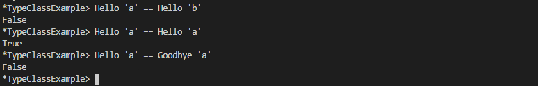

# Typeclasses

1. Creating a datatype

    ```Haskell
    data DayOfWeek = Mon | Tue | Wed | Thr | Fri | Sat | Sun

    -- day of week and numerical day of month
    data Date = Date DayOfWeek Int
    ```

2. Creating a typeclass for created datatype

    ```Haskell

    instance Eq DayOfWeek where
    (==) Mon Mon = True
    (==) Tue Tue = True
    (==) Wed Wed = True
    (==) Thr Thr = True
    (==) Fri Fri = True
    (==) Sat Sat = True
    (==) Sun Sun = True
    (==) _ _ = False

    instance Eq Date where
    (==) (Date weekday dayOfMonth) (Date weekday' dayOfMonth') = 
        weekday == weekday' && dayOfMonth == dayOfMonth'
    ```

    

## Exercises: Eq Instances

Write the Eq instance for the datatype provided.
1. It’s not a typo, we’re just being cute with the name.
    ```haskell
    data TisAnInteger =
        TisAn Integer
    ```
    ```haskell
    instance Eq TisAnInteger where
        (==) (TisAn a) (TisAn a') = a == a'
    ```

    

2. ```haskell
   data TwoIntegers =
    Two Integer Integer
    ```
    ```Haskell
    instance Eq TwoIntegers where
        (==) (Two a b) (Two a' b') = a == a' && b == b'
    ```
    

3. ```haskell
   data StringOrInt =
      TisAnInt Int
    | TisAString String
    ```
    ```haskell
    instance Eq StringOrInt where
        (==) (TisAnInt a) (TisAnInt a') = a == a'
        (==) (TisAString a) (TisAString a') = a == a'
        (==) _ _ = False
    ```
    

4. ```haskell
   data Pair a =
    Pair a a
    ```
    ```haskell
    instance Eq a => Eq (Pair a) where
        (==) (Pair a b) (Pair a' b') = a == a' && b == b'
    ```
    

5. ```haskell
   data Tuple a b =
    Tuple a b
    ```
    ```haskell
    instance (Eq a, Eq b) => Eq (Tuple a b)where
        (==) (Tuple a b) (Tuple a' b') = a == a' && b == b'
    ```
    

6. ```haskell
   data Which a =
      ThisOne a
    | ThatOne a
    ```
    ```haskell
   instance (Eq a)=> Eq (Which a) where
    (==) (ThisOne a) (ThisOne a') = a == a'
    (==) (ThatOne a) (ThatOne a') = a == a'
    (==) _ _ = False
    ```
    

7. ```haskell
   data EitherOr a b =
      Hello a
    | Goodbye b
    ```
    ```haskell
   instance (Eq a, Eq b) => Eq(EitherOr a b) where
    (==) (Hello a) (Hello a') = a == a'
    (==) (Goodbye b) (Goodbye b') = b == b'
    (==) _ _ = False
    ```
    

## Exercises: Tuple Experiment 

Look at the types given for quotRem
and divMod. What do you think those functions do? Test your hypotheses by playing with them in the REPL. We’ve given you a sample
to start with below:

Prelude> let ones x = snd (divMod x 10)


This shows `divMod` returns a tuple containing the result of integral division and modulo

**ORD**

- `LT` - first argument is less than the second one
- `EQ` - the arguments are equal
- `GT` - first argument is greater than the second one
  
## Exercises: Will They Work?
Next, take a look at the following code examples and try to decide if
they will work, what result they will return if they do, and why or
why not (be sure, as always, to test them in your REPL once you have
decided on your answer):
1. ```haskell 
   max (length [1, 2, 3]) (length [8, 9, 10, 11, 12])
   ```

    This will work `max 3 5` and gives output 5 type Num.

2. ```haskell
   compare (3 * 4) (3 * 5)
    ```

    This will work `compare 12 15` and gives output LT type Ord as 12 is less than 15

3. ```haskell
   compare "Julie" True
   ```

   This will not work as [Char] can not be compared with type Bool.

4. ```haskell
   (5 + 3) > (3 + 6)
   ```

   This will work `8 > 9` and give response False type Bool
   