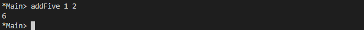

# More Functional Patterns

## Exercises: Grab Bag
Note the following exercises are from source code files, not written
for use directly in the REPL. Of course, you can change them to test
directly in the REPL if you prefer.
1. Which (two or more) of the following are equivalent?
   
    a) mTh x y z = x * y * z

    b) mTh x y = \z -> x * y * z

    c) mTh x = \y -> \z -> x * y * z

    d) mTh = \x -> \y -> \z -> x * y * z

    All are equivalent.

2. The type of mTh (above) is Num a => a -> a -> a -> a.
Which is the type of mTh 3?

    a) Integer -> Integer -> Integer

    b) Num a => a -> a -> a -> a

    c) Num a => a -> a

    d) Num a => a -> a -> a

    Answer d)

    

3. Next, we’ll practice writing anonymous lambda syntax.
For example, one could rewrite:
    ```haskell
    addOne x = x + 1
    ```
    Into:
    ```haskell
    addOne = \x -> x + 1
    ```
    Try to make it so it can still be loaded as a top-level definition by GHCi. This will make it easier to validate your answers.

    a) Rewrite the f function in the where clause.
    ```haskell
    addOneIfOdd n = case odd n of
        True -> f n
        False -> n
        where f n = n + 1
    ```

    ```Haskell
    addOneIfOdd = \n -> case odd n of
    True -> f n
    False -> n
    where f n = n + 1
    ```
    

    b) Rewrite the following to use anonymous lambda syntax:
    ```haskell
    addFive x y = (if x > y then y else x) + 5
    ```

    ```haskell
    addFive = \x -> \y -> (if x > y then y else x) + 5
    ```

    

    c) Rewrite the following so that it doesn’t use anonymous
    lambda syntax:
    ```haskell
    mflip f = \x -> \y -> f y x
    ```

    ```haskell
    mflip = \f -> \x -> \y -> f y x

    y = 1 
    x = 2 
    f y x = x + y
    ```

    


## Exercises: Variety Pack
1. Given the following declarations
    ```Haskell
    k (x, y) = x
    k1 = k ((4-1), 10)
    k2 = k ("three", (1 + 2))
    k3 = k (3, True)
    ```

    a) What is the type of k?

        K is of type Tuple

    b) What is the type of k2? Is it the same type as k1 or k3?

        k2 is of type tuple same as k1 and k3.

    c) Of k1, k2, k3, which will return the number 3 as the result?

        k1 and k3
1. Fill in the definition of the following function:
    ```Haskell
    -- Remember: Tuples have the same syntax for their
    -- type constructors and their data constructors.
    f :: (a, b, c) -> (d, e, f) -> ((a, d), (c, f))
    f = undefined
    ```

    ```haskell
    f :: (a, b, c) -> (d, e, f) -> ((a, d), (c, f))
    f (a,b,c) (d,e,f)= ((a, d), (c, f))
    ```

    

## Exercises: Case Practice
We’re going to practice using case expressions by rewriting functions.
Some of these functions you’ve seen in previous chapters (and some
you’ll see later using different syntax yet again!), but you’ll be writing
new versions now. Please note these are all written as they would be
in source code files, and we recommend you write your answers in
source files and then load into GHCi to check, rather than trying to
do them directly into the REPL.
First, rewrite `if-then-else` expressions into case expressions.
1. The following should return x when x is greater than y.
    ```haskell
    functionC x y = if (x > y) then x else y
    ```
    ```haskell
    functionC x y =
    case check of
        True -> x
        False -> y
    where check = x > y
    ```
    

2. The following will add 2 to even numbers and otherwise simply
return the input value.
    ```Haskell
    ifEvenAdd2 n = if even n then (n+2) else n
    ```

    ```haskell
    ifEvenAdd2 n =
    case even n of
        True -> n + 2
        False -> n
    ```
    

The next exercise doesn’t have all the cases covered. See if you
can fix it.

3. The following compares a value, x, to zero and returns an indicator
for whether x is a postive number or negative number. But
what if x is 0? You may need to play with the compare function a
bit to find what to do.
    ```haskell
    nums x =
        case compare x 0 of
            LT -> -1
            GT -> 1
    ```
    ```
    nums x =
        case compare x 0 of
            LT -> -1
            GT -> 1
            EQ -> 0
    ```
    

## Exercises: Artful Dodgy
Given the following definitions tell us what value results from further applications. When you’ve written down at least some of the answers and think you know what’s what, type the definitions into a file and load them in GHCi to test your answers.

```haskell
-- Types not provided, try filling them in yourself.
dodgy x y = x + y * 10
oneIsOne = dodgy 1
oneIsTwo = (flip dodgy) 2
```

```haskell
dodgy :: Num a => a -> a-> a
dodgy x y = x + y * 10

oneIsOne :: Num a => a -> a
oneIsOne = dodgy 1

oneIsTwo :: Num a => a -> a
oneIsTwo = (flip dodgy) 2
```

1. For example, given the expression dodgy 1 0, what do you think
will happen if we evaluate it? If you put the definitions in a file
and load them in GHCi, you can do the following to see the
result.

    Prelude> dodgy 1 0
    
    1

    Now attempt to determine what the following expressions reduce
to. Do it in your head, verify in your REPL after you think
you have an answer.
2. dodgy 1 1
3. dodgy 2 2
4. dodgy 1 2
5. dodgy 2 1
6. oneIsOne 1
7. oneIsOne 2
8. oneIsTwo 1
9. oneIsTwo 2
10. oneIsOne 3
11. oneIsTwo 3

    1 - 1

    2 - 11

    3 - 22

    4 - 21

    5 - 12

    6 - 11

    7 - 21

    8 - 21

    9 - 22

    10- 31

    11- 23

## Exercises: Guard Duty
1. It is probably clear to you why you wouldn’t put an otherwise in
your top-most guard, but try it with avgGrade anyway and see
what happens. It’ll be more clear if you rewrite it as an actual
otherwise match: | otherwise = 'F'. What happens now if you
pass a 90 as an argument? 75? 60?

    ```Haskell
    avgGrade :: (Fractional a, Ord a) => a -> Char
    avgGrade marks
        | otherwise = 'F'
        | x >= 0.9 = 'A'
        | x >= 0.8 = 'B'
        | x >= 0.7 = 'C'
        | x >= 0.6 = 'D'
        | x >= 0.5 = 'E'
        where x = marks/100
    ```
    
    
2. What happens if you take avgGrade as it is written and reorder
the guards? Does it still typecheck and work the same? Try
moving | y >= 0.7 = 'C' and passing it the argument 90, which
should be an ‘A.’ Does it return an ‘A’?

    ```haskell
    avgGrade :: (Fractional a, Ord a) => a -> Char
    avgGrade marks
        | x >= 0.7 = 'C'
        | x >= 0.9 = 'A'
        | x >= 0.8 = 'B'
        | x >= 0.6 = 'D'
        | x >= 0.5 = 'E'
        | otherwise = 'F'
        where x = marks/100
    ```

    


3. The following function returns
    ```haskell
    pal xs
        | xs == reverse xs = True
        | otherwise = False
    ```
    a) xs written backwards when it’s True

    `b) True when xs is a palindrome`

    c) False when xs is a palindrome

    d) False when xs is reversed

4. What types of arguments can pal take?
   
   List of Eq types, so that it can be compared

5. What is the type of the function pal?
   
   pal : : Eq a => [a] -> Bool
6. The following function returns
    ```haskell
    numbers x
    | x < 0 = -1
    | x == 0 = 0
    | x > 0 = 1
    ```
    a) the value of its argument plus or minus 1

    b) the negation of its argument
    
    `c) an indication of whether its argument is a positive or negative number or zero`

    d) binary machine language

7. What types of arguments can numbers take?
   
   Type of Ord Num
   
8. What is the type of the function numbers?

    numbers :: (Ord a, Num a, Num p) => a -> p

## Chapter Exercises

**Multiple choice**
1. A polymorphic function
    
    a) changes things into sheep when invoked

    b) has multiple arguments

    c) has a concrete type

    `d) may resolve to values of different types, depending on inputs`

2. Two functions named f and g have types Char -> String and
String -> [String] respectively. The composed function g . f
has the type

    a) Char -> String

    `b) Char -> [String]`

    c) [[String]]

    d) Char -> String -> [String]

3. A function f has the type Ord a => a -> a -> Bool and we apply
it to one numeric value. What is the type now?

    a) Ord a => a -> Bool

    b) Num -> Num -> Bool

    c) Ord a => a -> a -> Integer

    `d) (Ord a, Num a) => a -> Bool`
4. A function with the type (a -> b) -> c

    a) requires values of three different types

    `b) is a higher-order function`

    c) must take a tuple as its first argument

    d) has its parameters in alphabetical order
5. Given the following definition of f, what is the type of f True?
    ```haskell
    f :: a -> a
    f x = x
    ```
    `a) f True :: Bool`

    b) f True :: String

    c) f True :: Bool -> Bool

    d) f True :: a

**Let’s write code**

1. The following function returns the tens digit of an integral
argument.
    ```haskell
    tensDigit :: Integral a => a -> a
    tensDigit x = d
    where xLast = x `div` 10
    d = xLast `mod` 10
    ```
    a) First, rewrite it using divMod.

    ```haskell
    tensDigit :: Integral a => a -> a
    tensDigit x = d
        where (xLast,_) = x `divMod` 10
            (_,d) = xLast `divMod` 10
    ```

    b) Does the divMod version have the same type as the original
    version?
    
    Yes
    
    c) Next, let’s change it so that we’re getting the hundreds digit
instead. You could start it like this (though that may not be
the only possibility):
    
    ```haskell
    hunsD x = d2
        where d = undefined
        ... 
    ```
    ```haskell
    hunsD x = d2
    where d = x `div` 100
          d2 = d `mod` 10
    ```

    ```haskell
    hunsDDigit :: Integral a => a -> a
    hunsDDigit x = d
    where (xLast,_) = x `divMod` 100
          (_,d) = xLast `divMod` 10
    ```
2. Implement the function of the type a -> a -> Bool -> a once
each using a case expression and once with a guard.
    ```haskell
    foldBool :: a -> a -> Bool -> a
    foldBool = error "Error: Need to implement foldBool!"
    ```
    The result is semantically similar to if-then-else expressions
    but syntactically quite different. Here is the pattern matching
    version to get you started:
    ```haskell
    foldBool3 :: a -> a -> Bool -> a
    foldBool3 x y True = x
    foldBool3 x y False = y
    ```

    ```haskell
    foldBoolGuard :: a -> a -> Bool -> a
    foldBoolGuard input1 input2 condition 
        | condition == True = input1
        | condition == False = input2

    foldBoolCase :: a -> a -> Bool -> a
    foldBoolCase input1 input2 condition =
        case condition of
            True -> input1
            False -> input2
        
    foldBool3 :: a -> a -> Bool -> a
    foldBool3 x _ True = x
    foldBool3 _ y False = y
    ```
    

3. Fill in the definition. Note that the first argument to our function
is also a function which can be applied to values. Your second
argument is a tuple, which can be used for pattern matching:
    ```haskell
    g :: (a -> b) -> (a, c) -> (b, c)
    g = undefined
    ```

    ```haskell
    g :: (a -> b) -> (a, c) -> (b, c)
    g fInput (a,c) = (fInput a,c)                 -- f a to get b and c we can return as it is

    fInput :: Num a => a -> a
    fInput a = a + 1
    ```
    

4. For this next exercise, you’ll experiment with writing pointfree
versions of existing code. This involves some new information,
so read the following explanation carefully.

    Typeclasses are dispatched by type. Read is a typeclass like Show,
but it is the dual or “opposite” of Show. In general, the Read typeclass
isn’t something you should plan to use a lot, but this exercise
is structured to teach you something about the interaction
between typeclasses and types.
The function read in the Read typeclass has the type:
    ```haskell
    read :: Read a => String -> a
    ```
    Notice a pattern?
    ```haskell
    read :: Read a => String -> a
    show :: Show a => a -> String
    ```
    Write the following code into a source file. Then load it and
run it in GHCi to make sure you understand why the evaluation
results in the answers you see.
    ```haskell
    -- arith4.hs
    module Arith4 where
    -- id :: a -> a
    -- id x = x
    roundTrip :: (Show a, Read a) => a -> a
    roundTrip a = read (show a)
    main = do
    print (roundTrip 4)
    print (id 4)
    ```

    ```haskell
    main = do
        print (roundTrip 4)
        print (roundTrip2 4 :: Double)

    roundTrip :: (Show a, Read a) => a -> a
    roundTrip a = read (show a)
    ```
5. Next, write a pointfree version of roundTrip. (n.b., this refers to
the function definition, not to its application in main)

    ```haskell
    main = do
        print (roundTrip 4)

    roundTrip :: (Show a, Read a) => a -> a
    roundTrip = read . show
    ```
6. We will continue to use the code in module Arith4 for this exercise
as well.

    When we apply `show` to a value such as (1 :: Int), the 𝑎 that
implements Show is Int, so GHC will use the Int instance of the
Show typeclass to stringify our Int of 1.
    
    However, read expects a String argument in order to return an
𝑎. The String argument that is the first argument to read tells
the function nothing about what type the de-stringified result
should be. In the type signature roundTrip currently has, it knows
because the type variables are the same, so the type that is the
input to show has to be the same type as the output of read.

    Your task now is to change the type of roundTrip in Arith4 to (Show a, Read b) => a -> b. How might we tell GHC which instance of Read to dispatch against the String now? Make the expression print (roundTrip 4) work. You will only need the has the type
syntax of `::` and parentheses for scoping.

    ```haskell
    main = do
        print (roundTrip 4 :: Double)

    roundTrip :: (Show a, Read b) => a -> b
    roundTrip a = read (show a)
    ```