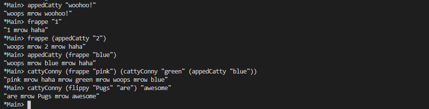
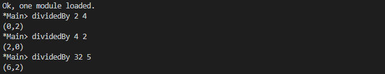
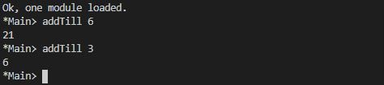

# Recursion

Factorial of a number

```Haskell
numberFactorial :: (Num a, Ord a) => a -> a
numberFactorial number
    | number >= 1 = number * numberFactorial (number - 1)
    | otherwise = 1
```

## Intermission: Exercise

Write out the evaluation of the following. It might be a little less
noisy if you do so with the form that didn’t use (.).
```haskell
applyTimes 5 (+1) 5
```
```
applyTimes 5 (+1) 5

(+1) (applyTimes 4 (+1) 5)
(+1) ((+1) (applyTimes 3 (+1) 5))
(+1) ((+1) ((+1) (applyTimes 2 (+1) 5)))
(+1) ((+1) ((+1) ((+1) (applyTimes 1 (+1) 5))))
(+1) ((+1) ((+1) ((+1) ((+1) (applyTimes 0 (+1) 5)))))
(+1) ((+1) ((+1) ((+1) ((+1) (5)))))
(+1) ((+1) ((+1) ((+1) (6))))
(+1) ((+1) ((+1) (7)))
(+1) ((+1) (8))
(+1) (9)
10
```

## Chapter Exercises
Review of types
1. What is the type of [[True, False], [True, True], [False, True]]?

    a) Bool

    b) mostly True

    c) [a]

    `d) [[Bool]]`
2. Which of the following has the same type as [[True, False],
[True, True], [False, True]]?

    a) [(True, False), (True, True), (False, True)]

    `b) [[3 == 3], [6 > 5], [3 < 4]]`

    c) [3 == 3, 6 > 5, 3 < 4]

    d) ["Bool", "more Bool", "Booly Bool!"]
3. For the following function
    ```haskell
    func :: [a] -> [a] -> [a]
    func x y = x ++ y
    ```
    which of the following is true?
    
    a) x and y must be of the same type
    
    b) x and y must both be lists
    
    c) if x is a String then y must be a String
    
    `d) all of the above`
4. For the func code above, which is a valid application of func to
both of its arguments?

    a) func "Hello World"

    `b) func "Hello" "World"`

    c) func [1, 2, 3] "a, b, c"

    d) func ["Hello", "World"]

**Reviewing currying**

Given the following definitions, tell us what value results from further applications.
```haskell
cattyConny :: String -> String -> String
cattyConny x y = x ++ " mrow " ++ y

-- fill in the types

flippy = flip cattyConny
appedCatty = cattyConny "woops"
frappe = flippy "haha"
```

```haskell
cattyConny :: String -> String -> String
cattyConny x y = x ++ " mrow " ++ y

-- fill in the types
flippy :: String -> String -> String
flippy = flip cattyConny

appedCatty :: String -> String
appedCatty = cattyConny "woops"

frappe :: String -> String
frappe = flippy "haha"
```

1. What is the value of appedCatty "woohoo!" ? Try to determine the
answer for yourself, then test in the REPL.
2. frappe "1"
3. frappe (appedCatty "2")
4. appedCatty (frappe "blue")
5. cattyConny (frappe "pink") (cattyConny "green" (appedCatty "blue"))
6. cattyConny (flippy "Pugs" "are") "awesome"

    

**Recursion**
1. Write out the steps for reducing dividedBy 15 2 to its final answer
according to the Haskell code.

    ```haskell
    dividedBy :: Integral a => a -> a -> (a, a)
    dividedBy num denom = go num denom 0
        where go n  d count
                | n < d = (count, n)
                | otherwise = go (n-d) d (count + 1)
    ```
    


2. Write a function that recursively sums all numbers from 1 to n,
n being the argument. So that if n was 5, you’d add `1 + 2 + 3 + 4 + 5` to get 15. The type should be (Eq a, Num a) => a -> a.

    ```haskell
    addTill :: (Num a, Eq a, Ord a) => a -> a
    addTill 0 = 0
    addTill n = n + addTill (n -1) 
    ```

    

**Fixing dividedBy**

Our dividedBy function wasn’t quite ideal. For one thing. It was a
partial function and doesn’t return a result (bottom) when given a
divisor that is 0 or less.

Using the pre-existing div function we can see how negative numbers
should be handled:
```haskell
Prelude> div 10 2
5
Prelude> div 10 (-2)
-5
Prelude> div (-10) (-2)
5
Prelude> div (-10) (2)
-5
```
The next issue is how to handle zero. Zero is undefined for division
in math, so really we ought to use a datatype that lets us say
there was no sensible result when the user divides by zero. If you
need inspiration, consider using the following datatype to handle
this.
```haskell
data DividedResult =
Result Integer
| DividedByZero
```