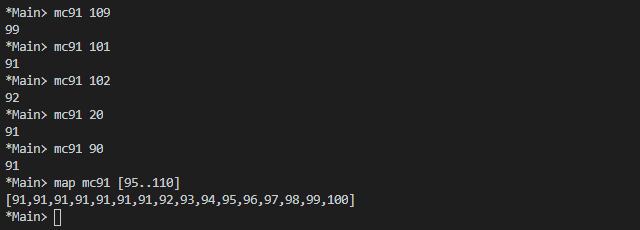
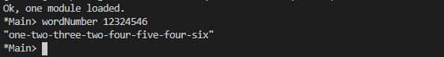

# Recursion

Factorial of a number

```Haskell
numberFactorial :: (Num a, Ord a) => a -> a
numberFactorial number
    | number >= 1 = number * numberFactorial (number - 1)
    | otherwise = 1
```

## Intermission: Exercise

Write out the evaluation of the following. It might be a little less
noisy if you do so with the form that didn’t use (.).
```haskell
applyTimes 5 (+1) 5
```
```
applyTimes 5 (+1) 5

(+1) (applyTimes 4 (+1) 5)
(+1) ((+1) (applyTimes 3 (+1) 5))
(+1) ((+1) ((+1) (applyTimes 2 (+1) 5)))
(+1) ((+1) ((+1) ((+1) (applyTimes 1 (+1) 5))))
(+1) ((+1) ((+1) ((+1) ((+1) (applyTimes 0 (+1) 5)))))
(+1) ((+1) ((+1) ((+1) ((+1) (5)))))
(+1) ((+1) ((+1) ((+1) (6))))
(+1) ((+1) ((+1) (7)))
(+1) ((+1) (8))
(+1) (9)
10
```

## Chapter Exercises
Review of types
1. What is the type of [[True, False], [True, True], [False, True]]?

    a) Bool

    b) mostly True

    c) [a]

    `d) [[Bool]]`
2. Which of the following has the same type as [[True, False],
[True, True], [False, True]]?

    a) [(True, False), (True, True), (False, True)]

    `b) [[3 == 3], [6 > 5], [3 < 4]]`

    c) [3 == 3, 6 > 5, 3 < 4]

    d) ["Bool", "more Bool", "Booly Bool!"]
3. For the following function
    ```haskell
    func :: [a] -> [a] -> [a]
    func x y = x ++ y
    ```
    which of the following is true?
    
    a) x and y must be of the same type
    
    b) x and y must both be lists
    
    c) if x is a String then y must be a String
    
    `d) all of the above`
4. For the func code above, which is a valid application of func to
both of its arguments?

    a) func "Hello World"

    `b) func "Hello" "World"`

    c) func [1, 2, 3] "a, b, c"

    d) func ["Hello", "World"]

**Reviewing currying**

Given the following definitions, tell us what value results from further applications.
```haskell
cattyConny :: String -> String -> String
cattyConny x y = x ++ " mrow " ++ y

-- fill in the types

flippy = flip cattyConny
appedCatty = cattyConny "woops"
frappe = flippy "haha"
```

```haskell
cattyConny :: String -> String -> String
cattyConny x y = x ++ " mrow " ++ y

-- fill in the types
flippy :: String -> String -> String
flippy = flip cattyConny

appedCatty :: String -> String
appedCatty = cattyConny "woops"

frappe :: String -> String
frappe = flippy "haha"
```

1. What is the value of appedCatty "woohoo!" ? Try to determine the
answer for yourself, then test in the REPL.
2. frappe "1"
3. frappe (appedCatty "2")
4. appedCatty (frappe "blue")
5. cattyConny (frappe "pink") (cattyConny "green" (appedCatty "blue"))
6. cattyConny (flippy "Pugs" "are") "awesome"

    

**Recursion**
1. Write out the steps for reducing dividedBy 15 2 to its final answer
according to the Haskell code.

    ```haskell
    dividedBy :: Integral a => a -> a -> (a, a)
    dividedBy num denom = go num denom 0
        where go n  d count
                | n < d = (count, n)
                | otherwise = go (n-d) d (count + 1)
    ```
    


2. Write a function that recursively sums all numbers from 1 to n,
n being the argument. So that if n was 5, you’d add `1 + 2 + 3 + 4 + 5` to get 15. The type should be (Eq a, Num a) => a -> a.

    ```haskell
    addTill :: (Num a, Eq a, Ord a) => a -> a
    addTill 0 = 0
    addTill n = n + addTill (n -1) 
    ```

    

**Fixing dividedBy**

Our dividedBy function wasn’t quite ideal. For one thing. It was a
partial function and doesn’t return a result (bottom) when given a
divisor that is 0 or less.

Using the pre-existing div function we can see how negative numbers
should be handled:
```haskell
Prelude> div 10 2
5
Prelude> div 10 (-2)
-5
Prelude> div (-10) (-2)
5
Prelude> div (-10) (2)
-5
```
The next issue is how to handle zero. Zero is undefined for division
in math, so really we ought to use a datatype that lets us say
there was no sensible result when the user divides by zero. If you
need inspiration, consider using the following datatype to handle
this.
```haskell
data DividedResult =
Result Integer
| DividedByZero
```

```haskell
dividedByB :: Integral a => a -> a -> Maybe (a, a)
dividedByB _ 0              = Nothing
dividedByB 0 _              = Just (0, 0)
dividedByB dividend dividor = Just $ go dividend dividor 0
  where
    sign = (dividend*dividor) `div` (abs (dividend*dividor))
    go n d count
     | abs n < abs d = (count*sign, n)
     | otherwise = go (n-(d*sign)) d (count + 1)
```

**McCarthy 91 function**

We’re going to describe a function in English, then in math notation,
then show you what your function should return for some test inputs.
Your task is to write the function in Haskell.
The McCarthy 91 function yields 𝑥 − 10 when 𝑥 > 100 and 91
otherwise. The function is recursive.

mc91 = undefined

You haven’t seen map yet, but all you need to know right now is
that it applies a function to each member of a list and returns the
resulting list. It’ll be explained in more detail in the next chapter.
```haskell
Prelude> map mc91 [95..110]
[91,91,91,91,91,91,91,92,93,94,95,96,97,98,99,100]
```

```haskellmc91 n
  | n <= 100  = mc91 . mc91 $ n + 11
  | otherwise = n - 10
```



**Numbers into words**
```haskell
module WordNumber where

import Data.List (intersperse)

digitToWord :: Int -> String
digitToWord n = undefined

digits :: Int -> [Int]
digits n = undefined

wordNumber :: Int -> String
wordNumber n = undefined
```

Here `undefined` is a placeholder to show you where you need to
fill in the functions. The n to the right of the function names is the
argument which will be an integer.

Fill in the implementations of the functions above so that wordNumber
returns the English word version of the Int value. You will first write
a function that turns integers from 0-9 into their corresponding
English words, ”one,” ”two,” and so on. Then you will write a function
that takes the integer, separates the digits, and returns it as a list of
integers. Finally you will need to apply the first function to the list
produced by the second function and turn it into a single string with
interspersed hyphens.

We’ve laid out multiple functions for you to consider as you tackle
the problem. You may not need all of them, depending on how you
solve it–these are just suggestions. Play with them and look up their
documentation to understand them in deeper detail.
You will probably find this difficult.

```haskell
div :: Integral a => a -> a -> a
mod :: Integral a => a -> a -> a
map :: (a -> b) -> [a] -> [b]
concat :: [[a]] -> [a]
intersperse :: a -> [a] -> [a]
(++) :: [a] -> [a] -> [a]
(:[]) :: a -> [a]
```

Also consider:

```haskell
Prelude> div 135 10
13
Prelude> mod 135 10
5
Prelude> div 13 10
1
Prelude> mod 13 10
3
```

Here is what your output should look in the REPL when it’s working:
```haskell
Prelude> wordNumber 12324546
"one-two-three-two-four-five-four-six"
Prelude>
```

```haskelldigitToWord :: Int -> String
digitToWord 0 = "zero"
digitToWord 1 = "one"
digitToWord 2 = "two"
digitToWord 3 = "three"
digitToWord 4 = "four"
digitToWord 5 = "five"
digitToWord 6 = "six"
digitToWord 7 = "seven"
digitToWord 8 = "eight"
digitToWord 9 = "nine"
digitToWord _ = "#*$(#&$*(&*#($&"

-- Cannot deal with negatives in digitToWords so just return abs value
digits :: Int -> [Int]
digits num = digits' (abs num)
  where digits' n
           | n < 10 && n > -1 = [abs n]
           | otherwise        = ((digits . div n) 10) ++ [mod n 10]


wordNumber :: Int -> String
wordNumber n = (concat . intersperse "-" . map digitToWord) $ digits n
```

