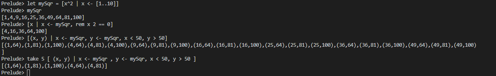
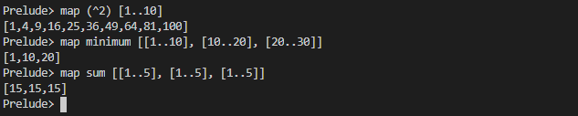

# List

## Pattern Matching

**Head**
```haskell
myHead (x:_) = x
```

**Tail**
```haskell
myTail :: [a] -> Maybe [a]
myTail [] = Nothing
myTail (x:[]) = Nothing
myTail (_:xs) = Just xs
```

## Range


## Exercise: EnumFromTo
Some things you’ll want to know about the Enum typeclass:
```haskell
Prelude> :info Enum
class Enum a where
succ :: a -> a
pred :: a -> a
toEnum :: Int -> a
fromEnum :: a -> Int
enumFrom :: a -> [a]
enumFromThen :: a -> a -> [a]
enumFromTo :: a -> a -> [a]
enumFromThenTo :: a -> a -> a -> [a]
Prelude> succ 0
1
Prelude> succ 1
2
Prelude> succ 'a'
'b'
```
Write your own enumFromTo definitions for the types provided. Do
not use range syntax to do so. It should return the same results as if you did [start..stop].
eftBool :: Bool -> Bool -> [Bool]
eftBool = undefined
eftOrd :: Ordering -> Ordering -> [Ordering]
eftOrd = undefined
eftInt :: Int -> Int -> [Int]
eftInt = undefined
eftChar :: Char -> Char -> [Char]
eftChar = undefined

```haskell
eftBool :: Bool -> Bool -> [Bool]
eftBool True _ = []
eftBool False False = [False]
eftBool False True = [False, True]

eftOrd :: Ordering -> Ordering -> [Ordering]
eftOrd GT _  = []
eftOrd EQ EQ = [EQ]
eftOrd EQ GT = [EQ, GT]
eftOrd EQ _  = []
eftOrd LT EQ = [LT, EQ]
eftOrd LT LT = [LT]
eftOrd LT GT = LT:(eftOrd EQ GT)

eftInt :: Int -> Int -> [Int]
eftInt first last
    | first <= last = first : (eftInt (first + 1) last)
    | otherwise = []

eftChar :: Char -> Char -> [Char]
eftChar first last
    | first <= last = first : (eftChar (succ first) last)
    | otherwise = []
```


## Split

`splitAt` function cuts a list into a two part at the element specified by the Int and makes a tiple of two lists.


## takeWhile and dropWhile


## Exercises: Thy Fearful Symmetry
1. Using takeWhile and dropWhile, write a function that takes a string
and returns a list of strings, using spaces to separate the elements
of the string into words, as in the following sample:
    ```haskell
    *Main> myWords "all i wanna do is have some fun"
    ["all","i","wanna","do","is","have","some","fun"]
    ```

    ```haskell
    myWords :: [Char] -> [[Char]]
    myWords input
        | input == [] = []
        | otherwise = (takeWhile (/=' ') input):(myWords $ (dropWhile (==' ') . dropWhile (/=' ')) input)
    ```
    
    

2. Next, write a function that takes a string and returns a list of
strings, using newline separators to break up the string as in the
following (your job is to fill in the undefined function):
    ```haskell
    module PoemLines where
    firstSen = "Tyger Tyger, burning bright\n"
    secondSen = "In the forests of the night\n"
    thirdSen = "What immortal hand or eye\n"
    fourthSen = "Could frame thy fearful symmetry?"
    sentences = firstSen ++ secondSen ++ thirdSen ++ fourthSen
    -- putStrLn sentences -- should print
    -- Tyger Tyger, burning bright
    -- In the forests of the night
    -- What immortal hand or eye
    -- Could frame thy fearful symmetry?
    -- Implement this
    myLines :: String -> [String]
    myLines = undefined
    -- What we want 'myLines sentences' to equal
    shouldEqual =
    [ "Tyger Tyger, burning bright"
    , "In the forests of the night"
    , "What immortal hand or eye"
    , "Could frame thy fearful symmetry?"
    ]
    -- The main function here is a small test
    -- to ensure you've written your function
    -- correctly.
    main :: IO ()
    main = print $ "Are they equal? " ++ show (myLines sentences == shouldEqual)
    ```

    ```haskell
    myLines :: String -> [String]
    myLines input
        | input == [] = []
        | otherwise = (takeWhile (/='\n') input):(myWords $ (dropWhile (=='\n') $ dropWhile (/='\n') input))
    ```

3. Now let’s look at what those two functions have in common.
Try writing a new function that parameterizes the character
you’re breaking the string argument on and rewrite myWords and
myLines using it.

    ```haskell
    mySection :: (Eq a) => a -> [a] -> [[a]]
    mySection _ [] = []
    mySection d x = (takeSection x):(mySection d $ dropSection x)
    where
        takeSection = takeWhile (/=d)
        dropSection = (dropWhile (==d) . dropWhile (/=d))
    ```

## Exercises: Comprehend Thy Lists
Take a look at the following functions, figure what you think the
output lists will be, and then run them in your REPL to verify (note
that you will need the mySqr list from above in scope to do this):
```haskell
[x | x <- mySqr, rem x 2 == 0]
[(x, y) | x <- mySqr, y <- mySqr, x < 50, y > 50]
take 5 [ (x, y) | x <- mySqr, y <- mySqr, x < 50, y > 50 ]
```
```haskell
mySqr=[x^2 | x <- [1..10]]
```


## elem
Fetch Capital Letters from a String 

```haskell
[x | x <- "Three Letter Acronym", elem x ['A'..'Z']]
```


Check if the char is vowel

```haskell
elem 'a' ['A','E','I','O','U'] || elem 'a' ['a','e','i','o','u']
```


## Exercises: Square Cube
Given the following:
```haskell
Prelude> let mySqr = [x^2 | x <- [1..5]]
Prelude> let myCube = [y^3 | y <- [1..5]]
```

1. First write an expression that will make tuples of the outputs of
mySqr and myCube.
    

2. Now alter that expression so that it only uses the x and y values
that are less than 50.
    ```haskell
    [ (x, y) | x <- mySqr, y <- myCube , x < 50, y < 50]
    ```

3. Apply another function to that list comprehension to determine
how many tuples inhabit your output list.
    ```haskell
    length [ (x, y) | x <- mySqr, y <- myCube , x < 50, y < 50]
    ```
    

## Exercises: Bottom Madness
Will it blow up?
1. Will the following expression return a value or be ⊥?
[x^y | x <- [1..5], y <- [2, undefined]]
2. take 1 $ [x^y | x <- [1..5], y <- [2, undefined]]
3. sum [1, undefined, 3]
4. length [1, 2, undefined]
5. length $ [1, 2, 3] ++ undefined
6. take 1 $ filter even [1, 2, 3, undefined]
7. take 1 $ filter even [1, 3, undefined]
8. take 1 $ filter odd [1, 3, undefined]
9. take 2 $ filter odd [1, 3, undefined]
10. take 3 $ filter odd [1, 3, undefined]

Blow up are : 1 , 3, 5, 7, 10

**Intermission: Is it in normal form?**

For each expression below, determine whether it’s in:
1. normal form, which implies weak head normal form;
2. weak head normal form only; or,
3. neither.

Remember that an expression cannot be in normal form or weak
head normal form if the outermost part of the expression isn’t a data
constructor. It can’t be in normal form if any part of the expression
is unevaluated.
1. [1, 2, 3, 4, 5]
2. 1 : 2 : 3 : 4 : _
3. enumFromTo 1 10
4. length [1, 2, 3, 4, 5]
5. sum (enumFromTo 1 10)
6. ['a'..'m'] ++ ['n'..'z']
7. (_, 'b')
   
Possible Answer
1. NF
2. WHNF
3. neither
4. neither
5. neither
6. neither
7. WHNF

## Exercises: More Bottoms
As always, we encourage you to try figuring out the answers before
you enter them into your REPL.
1. Will the following expression return a value or be ⊥? 
   ```haskell
   take 1 $ map (+1) [undefined, 2, 3]
   ```

   It will throw exception as map will not be able to add 1 to the 1st element as we are taking 1

2. Will the following expression return a value? 
   ```haskell
   take 1 $ map (+1) [1, undefined, 3]
   ```

   It will give [2]. This will compile because as we know Haskell is Lazy so it will compile only what is required
3. Will the following expression return a value?
   ```haskell
   take 2 $ map (+1) [1, undefined, 3]
   ```
   It will throw exception as map will not be able to add 1 to the 2st element as we are taking 2

4. What does the following mystery function do? What is its type? Describe it (to yourself or a loved one) in standard English and
then test it out in the REPL to make sure you were correct.
    ```haskell
    itIsMystery xs = map (\x -> elem x "aeiou") xs
    ```

    It will check if the Char is vowel or not.
    


5. What will be the result of the following functions:
   
a) ```haskell
    map (^2) [1..10]
    ```

b)  ```haskell
    map minimum [[1..10], [10..20], [20..30]]
    -- n.b. `minimum` is not the same function
    -- as the `min` that we used before
    ```

c)  ```haskell
    map sum [[1..5], [1..5], [1..5]]
    ```
    
    

6. Back in the Functions chapter, you wrote a function called
foldBool. That function exists in a module known as Data.Bool
and is called bool. Write a function that does the same (or similar,
if you wish) as the map (if-then-else) function you saw above
but uses bool instead of the if-then-else syntax. Your first step
should be bringing the bool function into scope by typing import
Data.Bool at your Prelude prompt.

    ```haskell
    foldBoolGuard :: a -> a -> Bool -> a
    foldBoolGuard input1 input2 condition 
        | condition == True = input1
        | condition == False = input2
    ```

## Exercises: Filtering

1. Given the above, how might we write a filter function that would
give us all the multiples of 3 out of a list from 1-30?

    ```haskell
    filter (\x -> (rem x 3) == 0) [1..30]
    ```
    

2. Recalling what we learned about function composition, how
could we compose the above function with the length function
to tell us *how many* multiples of 3 there are between 1 and
30?

    ```haskell
    length $ filter (\x -> (rem x 3) == 0) [1..30]
    ```

    

3. Next we’re going to work on removing all articles (’the’, ’a’, and
’an’) from sentences. You want to get to something that works
like this:
    ```haskell
    Prelude> myFilter "the brown dog was a goof"
    ["brown","dog","was","goof"]
    ```

    You may recall that earlier in this chapter we asked you to write a
function that separates a string into a list of strings by separating
them at spaces. That is a standard library function called words.
You may consider starting this exercise by using words (or your
version, of course).

    ```haskell
    myFilter :: String -> [String]
    myFilter = (filter (not . flip elem ["the", "a", "an"]) . words)
    ```
    

## Zipping exercises
1. Write your own version of zip :: [a] -> [b] -> [(a, b)] and
ensure it behaves the same as the original.

    ```haskell
    myZip :: [a] -> [b] -> [(a, b)]
    myZip _ [] = []
    myZip [] _ = []
    myZip(x:xs) (y:ys) = (x,y):myZip xs ys
    ```
    


2. Do what you did for zip, but now for `zipWith :: (a -> b -> c)
-> [a] -> [b] -> [c]`

    ```haskell
    -- as we have 1st argument function so for that we are not checking null value
    myZipWith :: (a -> b -> c) -> [a] -> [b] -> [c]
    myZipWith _ [] _ = []
    myZipWith _ _ [] = []
    myZipWith f (x:xs) (y:ys) = (f x y):myZipWith f xs ys
    ```

    

3. Rewrite your zip in terms of the zipWith you wrote.

    ```haskell
    zipUmyZipWith :: [a] -> [b] -> [(a, b)]
    zipUmyZipWith = myZipWith (,)
    ```
    


## Chapter Exercises
The first set of exercises here will mostly be review but will also
introduce you to some new things. The second set is more conceptually
challenging but does not use any syntax or concepts we haven’t
already studied. If you get stuck, it may help to flip back to a relevant
section and review.

**Data.Char**
These first few exercises are straightforward but will introduce you to
some new library functions and review some of what we’ve learned
so far. Some of the functions we will use here are not standard in
Prelude and so have to be imported from a module called Data.Char.
You may do so in a source file (recommended) or at the Prelude
prompt with the same phrase: import Data.Char (write that at the top
of your source file). This brings into scope a bunch of new standard
functions we can play with that operate on Char and String types.
1. Query the types of isUpper and toUpper.
    
    
   
2. Given the following behaviors, which would we use to write
a function that filters all the uppercase letters out of a String?
Write that function such that, given the input “HbEfLrLxO,”
your function will return “HELLO.”

    ```haskell
    Prelude Data.Char> isUpper 'J'
    True
    Prelude Data.Char> toUpper 'j'
    'J'
    ```

    ```haskell
    filterUpper :: String -> String
    filterUpper [] = []
    filterUpper (x:xa)
        | isUpper x = x :filterUpper xa
        | otherwise = filterUpper xa
    ```

    

3. Write a function that will capitalize the first letter of a String and
return the entire String. For example, if given the argument
“julie,” it will return “Julie.”

    ```haskell
    capitalFirst :: String -> String
    capitalFirst [] = []
    capitalFirst (x:xa) = toUpper x : xa
    ```
    


4. Now make a new version of that function that is recursive such
that if you give it the input “woot” it will holler back at you
“WOOT.” The type signature won’t change, but you will want to
add a base case.

    ```haskell
    capitalAll :: String -> String
    capitalAll [] = []
    capitalAll (x:xa) = toUpper x : capitalAll xa
    ```
    

5. To do the final exercise in this section, we’ll need another standard
function for lists called head. Query the type of head and
experiment with it to see what it does. Now write a function
that will capitalize the first letter of a String and return only that
letter as the result.


    ```haskell
    returnFirst :: String -> Maybe Char
    returnFirst [] = Nothing
    returnFirst x = Just $ toUpper $ head x 
    ```
    


6. Cool. Good work. Now rewrite it as a composed function. Then,
for fun, rewrite it pointfree.

    ```haskell
    returnFirst :: String -> Maybe Char
    returnFirst [] = Nothing
    returnFirst x = Just $ toUpper $ head x 
    ```
    

**Ciphers**

We’ll still be using Data.Char for this next exercise. You should save
these exercises in a module called Cipher because we’ll be coming
back to them in later chapters. You’ll be writing a Caesar cipher for
now, but we’ll suggest some variations on the basic program in later
chapters.

A Caesar cipher is a simple substitution cipher, in which each
letter is replaced by the letter that is a fixed number of places down
the alphabet from it. You will find variations on this all over the place
— you can shift leftward or rightward, for any number of spaces. A
rightward shift of 3 means that ’A’ will become ’D’ and ’B’ will become
’E,’ for example. If you did a leftward shift of 5, then ’a’ would become
’v’ and so forth.

Your goal in this exercise is to write a basic Caesar cipher that
shifts rightward. You can start by having the number of spaces to
shift fixed, but it’s more challenging to write a cipher that allows
you to vary the number of shifts so that you can encode your secret
messages differently each time.

There are Caesar ciphers written in Haskell all over the internet,
but to maximize the likelihood that you can write yours without
peeking at those, we’ll provide a couple of tips. When yours is working
the way you want it to, we would encourage you to then look
around and compare your solution to others out there.
The first lines of your text file should look like this:

```haskell

module Cipher where
import Data.Char

```

Data.Char includes two functions called ord and chr that can be
used to associate a Char with its Int representation in the Unicode
system and vice versa:
```haskell
*Cipher> :t chr
chr :: Int -> Char
*Cipher> :t ord
ord :: Char -> Int
```
Using these functions is optional; there are other ways you can
proceed with shifting, but using chr and ord might simplify the process
a bit.
You want your shift to wrap back around to the beginning of the
alphabet, so that if you have a rightward shift of 3 from ’z,’ you end
up back at ’c’ and not somewhere in the vast Unicode hinterlands.
Depending on how you’ve set things up, this might be a bit tricky.
Consider starting from a base character (e.g., ’a’) and using mod to
ensure you’re only shifting over the 26 standard characters of the
English alphabet.
You should include an unCaesar function that will decipher your
text as well. In a later chapter, we will test it.
Writing your own standard functions
Below are the outlines of some standard functions. The goal here is
to write your own versions of these to gain a deeper understanding
of recursion over lists and how to make functions flexible enough
to accept a variety of inputs. You could figure out how to look up
the answers, but you won’t do that because you know you’d only be
cheating yourself out of the knowledge. Right?
Let’s look at an example of what we’re after here. The and2 function
can take a list of Bool values and returns True if and only if no
values in the list are False. Here’s how you might write your own
version of it:

`Refer Cipher.hs`

```haskell
-- direct recursion, not using (&&)
myAnd :: [Bool] -> Bool
myAnd [] = True
myAnd (x:xs) = if x == False then False else myAnd xs
-- direct recursion, using (&&)
myAnd :: [Bool] -> Bool
myAnd [] = True
myAnd (x:xs) = x && myAnd xs
```
And now the fun begins:
1. myOr returns True if any Bool in the list is True.
    ```haskell
    myOr :: [Bool] -> Bool
    myOr = undefined
    ```

    ```haskell
    myOr :: [Bool] -> Bool
    myOr []          = False
    myOr (True:_)    = True
    myOr (False:xs)  = myOr xs
    ```

    

2. myAny returns True if a -> Bool applied to any of the values in
the list returns True.
    ```haskell
    myAny :: (a -> Bool) -> [a] -> Bool
    myAny = undefined
    ```
    Example for validating myAny:
    ```haskell
    Prelude> myAny even [1, 3, 5]
    False
    Prelude> myAny odd [1, 3, 5]
    True
    ```
    ```haskell
    myAny :: (a -> Bool) -> [a] -> Bool
    myAny f input = myOr output
        where output = map f input
    ```

    

3. After you write the recursive myElem, write another version that
uses any.

    ```haskell
    -- the built-in version of 'elem' in GHC 7.10
    -- and newer has a type that uses Foldable
    -- instead of the list type specifically. You
    -- can ignore that and write the concrete
    -- version that works only for list.
    myElem :: Eq a => a -> [a] -> Bool

    Prelude> myElem 1 [1..10]
    True
    Prelude> myElem 1 [2..10]
    False
    ```
    ```haskell
    myElem :: Eq a => a -> [a] -> Bool
    myElem _ [] = False
    myElem toFind listInput = myAny (toFind ==) listInput
    ```

    

4. Implement myReverse.
   ```haskell
    myReverse :: [a] -> [a]
    myReverse = undefined

    Prelude> myReverse "blah"
    "halb"
    Prelude> myReverse [1..5]
    [5,4,3,2,1]
    ```

    ```haskell
    myReverse :: [a] -> [a]
    myReverse [] = []
    myReverse input = last input : myReverse (init input)
    ```

    

5. squish flattens a list of lists into a list
   
    ```haskell
    squish :: [[a]] -> [a]
    squish = undefined
    ```

    ```haskell
    squish :: [[a]] -> [a]
    squish [] = []
    squish (x:xa) = x ++ squish xa
    ```

    

6. squishMap maps a function over a list and concatenates the results.
    
    ```haskell
    squishMap :: (a -> [b]) -> [a] -> [b]
    squishMap = undefined

    Prelude> squishMap (\x -> [1, x, 3]) [2]
    [1,2,3]
    Prelude> squishMap (\x -> "WO "++[x]++" HOO ") "123"
    "WO 1 HOO WO 2 HOO WO 3 HOO "
    ```

    ```haskell 
    -- we not using appender : as both are list, so we are concating the list together
    squishMap :: (a -> [b]) -> [a] -> [b]
    squishMap _ [] = []
    squishMap f (x:xa) = f x ++ (squishMap f xa)
    ```
    


7. squishAgain flattens a list of lists into a list. This time re-use the
squishMap function.

    ```haskell
    squishAgain :: [[a]] -> [a]
    squishAgain = undefined
    ```
8. myMaximumBy takes a comparison function and a list and returns
the greatest element of the list based on the last value that
the comparison returned GT for. If you import maximumBy from
Data.List, you’ll see the type is:

    ```haskell
    Foldable t => (a -> a -> Ordering) -> t a -> a
    ```
    rather than

    ```haskell
    (a -> a -> Ordering) -> [a] -> a
    myMaximumBy :: (a -> a -> Ordering) -> [a] -> a
    myMaximumBy = undefined

    Prelude> let xs = [1, 53, 9001, 10]
    Prelude> myMaximumBy compare xs
    9001
    ```
    ```haskell
    myMaximumBy :: (a -> a -> Ordering) -> [a] -> a
    myMaximumBy _ []        = error "Gotta give me something!"
    myMaximumBy _ (x:[])    = x
    myMaximumBy f (x:xa)
    | f x y == GT         = x
    | otherwise           = y
    where y = myMaximumBy f xa
    ```

9. myMinimumBy takes a comparison function and a list and returns
the least element of the list based on the last value that the
comparison returned LT for.
    ```haskell
    myMinimumBy :: (a -> a -> Ordering) -> [a] -> a
    myMinimumBy = undefined

    Prelude> let xs = [1, 53, 9001, 10]
    Prelude> myMinimumBy compare xs
    1
    ```

    Using the myMinimumBy and myMaximumBy functions, write your own
versions of maximum and minimum. If you have GHC 7.10 or newer,
you’ll see a type constructor that wants a Foldable instance
instead of a list as has been the case for many functions so far.

    ```haskell
    myMaximum :: (Ord a) => [a] -> a
    myMaximum = undefined
    myMinimum :: (Ord a) => [a] -> a
    myMinimum = undefined
    ```

    ```haskell
    myMaximumBy :: (a -> a -> Ordering) -> [a] -> a
    myMaximumBy _ []        = error "Gotta give me something!"
    myMaximumBy _ (x:[])    = x
    myMaximumBy f (x:xa)
    | f x y == GT         = x
    | otherwise           = y
    where y = myMaximumBy f xa

    myMinimumBy :: (a -> a -> Ordering) -> [a] -> a
    myMinimumBy _ []        = error "Gotta give me something!"
    myMinimumBy _ (x:[])    = x
    myMinimumBy f (x:xa)
    | f x y == LT         = x
    | otherwise           = y
    where y = myMaximumBy f xa
    ```

    
