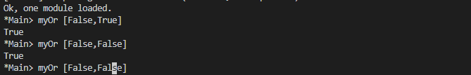
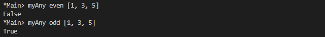

# Folding lists

Length function 

```haskell
length :: [a] -> Integer
length [] = 0
length (_:xs) = 1 + length xs
```

Concat function
```haskell
concat :: [[a]] -> [a]
concat [] = []
concat (x:xs) = x ++ concat xs
```


Foldl Example
```haskell
foldl (^) 2 [1..3]
((2 ^ 1) ^ 2) ^ 3
(2 ^ 2) ^ 3
4 ^ 3
64
```

Foldr Example
```haskell
foldr (^) 2 [1..3]
(1 ^ (2 ^ (3 ^ 2)))
(1 ^ (2 ^ 9))
1 ^ 512
1
```

Scan Function


## Exercises: Understanding Folds
1. ```haskell
   foldr (*) 1 [1..5]
   ```
    will return the same result as which of the following:

    a) flip (*) 1 [1..5]

    `b) foldl (flip (*)) 1 [1..5]`

    `c) foldl (*) 1 [1..5]`

2. Write out the evaluation steps for
    ```haskell
    foldl (flip (*)) 1 [1..3]
    ```

    ```haskell
    foldl (flip (*)) 1 [1..3]

    foldl (flip (*)) (1 * 1) [2,3]
    foldl (flip (*)) (2 * (1 * 1)) [3]
    (3 * (2 * (1 * 1)))
    ```
3. One difference between foldr and foldl is:
   
    a) foldr, but not foldl, traverses the spine of a list from right to left

    b) foldr, but not foldl, always forces the rest of the fold

    `c) foldr, but not foldl, associates to the right`

    d) foldr, but not foldl, is recursive
4. Folds are catamorphisms, which means they are generally used
to

    a) reduce structure

    b) expand structure

    c) render you catatonic

    d) generate infinite data structures

5. The following are simple folds very similar to what you’ve already seen, but each has at least one error. Please fix them and test in your REPL:

    a)  ```
        foldr (++) ["woot", "WOOT", "woot"]
        ```

    b)  ```
        foldr max [] ["fear is the little death"]
        ```

    c) ```
        foldr and True [False, True]
        ```

    d) This one is more subtle than the previous. Can it ever
    return a different answer?
    ```haskell
    foldr (||) True [False, True]
    ```
    e) ```
        foldl ((++) . show) "" [1..5]
        ```

    f) ```
        foldr const 'a' [1..5]
        ```

    g) ```
        foldr const 0 "tacos"
        ```

    h) ```
        foldl (flip const) 0 "burritos
        "```

    i) ```
        foldl (flip const) 'z' [1..5]
        ```

    Possible Answers

    a). ```
        foldr (++) "" ["woot", "WOOT", "woot"]
        ```

    b). ```
        foldr max [] ["fear is the little death"]
        ```

    c). ```
        foldr (&&) True [False, True]
        ```

    d). ```
        foldr (||) False [False, False]
        ```

    e). ```
        foldl (flip ((++) . show)) "" [1..5]
        ```

    f). ```
        foldr (flip const) 'a' [1..5]
        ```
        or
        Change the list from int to char
    
    g). ```
        foldr const "" ["tacos"]
        ```
        or
        ```
        foldr (flip const) 0 "tacos"
        ```

    h). ```
        foldl const 0 "burritos"
        ```

    i). ```
         foldl const 'z' [1..5]
        ```

## Exercises: Database Processing
Write the following functions for processing this data.
```haskell
import Data.Time
data DatabaseItem = DbString String | DbNumber Integer | DbDate UTCTime deriving (Eq, Ord, Show)

theDatabase :: [DatabaseItem]
theDatabase =
[ DbDate (UTCTime
(fromGregorian 1911 5 1)
(secondsToDiffTime 34123))
, DbNumber 9001
, DbString "Hello, world!"
, DbDate (UTCTime
(fromGregorian 1921 5 1)
(secondsToDiffTime 34123))
]
```

1. Write a function that filters for DbDate values and returns a list
of the UTCTime values inside them.
    ```haskell
    filterDbDate :: [DatabaseItem] -> [UTCTime]
    filterDbDate = undefined
    ```

    ```haskell
    filterDbDate :: [DatabaseItem] -> [UTCTime]
    filterDbDate = foldr ((++) . key) []
    where
        key :: DatabaseItem -> [UTCTime]
        key (DbDate x) = [x]
        key _          = []
    ```
2. Write a function that filters for DbNumber values and returns a list
of the Integer values inside them.
    ```haskell
    filterDbNumber :: [DatabaseItem] -> [Integer]
    filterDbNumber = undefined
    ```

    ```haskell
    filterDbNumber :: [DatabaseItem] -> [Integer]
    filterDbNumber = foldr ((++) . key) []
    where
        key :: DatabaseItem -> [Integer]
        key (DbNumber x) = [x]
        key _          = []
    ```
3. Write a function that gets the most recent date.
    ```haskell
    mostRecent :: [DatabaseItem] -> UTCTime
    mostRecent = undefined
    ```

    ```haskell
    mostRecent :: [DatabaseItem] -> UTCTime
    mostRecent = (foldr max oldUTC) . filterDbDate
    where
        oldUTC = UTCTime (fromGregorian 1 1 1) (secondsToDiffTime 1)
    ```
4. Write a function that sums all of the DbNumber values.
    ```haskell
    sumDb :: [DatabaseItem] -> Integer
    sumDb = undefined
    ```

    ```haskell
    sumDb :: [DatabaseItem] -> Integer
    sumDb input = sum $ filterDbNumber input
    ```
5. Write a function that gets the average of the DbNumber values.
    
    ```haskell
    -- You'll probably need to use fromIntegral
    -- to get from Integer to Double.
    avgDb :: [DatabaseItem] -> Double
    avgDb = undefined
    ```

    ```haskell
    avgDb :: [DatabaseItem] -> Double
    avgDb input = fromIntegral $ sumOfDbNumber `div` fromIntegral countOfDbNumber
        where
            sumOfDbNumber = sumDb input
            countOfDbNumber = length $ filterDbNumber input
    ```


## Scans Exercises
1. Modify your fibs function to only return the first 20 Fibonacci
numbers.

    ```haskell
    fibs20 :: [Integer]
    fibs20 = take 20 $ 1 : scanl (+) 1 fibs20
    ```

    

2. Modify fibs to return the Fibonacci numbers that are less than 100.

    ```haskell
    fibsLess100 :: [Integer]
    fibsLess100 = takeWhile (<100) $ 1 : scanl (+) 1 fibsLess100
    ```

    
    
3. Try to write the factorial function from Recursion as a scan.
You’ll want scanl again, and your start value will be 1. Warning:
this will also generate an infinite list, so you may want to pass it
through a take function or similar.

    ```haskell
    fibsFactorial :: Int -> Integer
    fibsFactorial input = fibsFactorials !! input
    where
        fibsFactorials :: [Integer]
        fibsFactorials = scanl (*) 1 [1..]
    ```

    

## Chapter Exercises
Warm-up and review
For the following set of exercises, you are not expected to use folds.
These are intended to review material from previous chapters. Feel
free to use any syntax or structure from previous chapters that seems
appropriate.
1. Given the following sets of consonants and vowels:
    ```haskell
    stops = "pbtdkg"
    vowels = "aeiou"
    ```
    a) Write a function that takes inputs from stops and vowels
and makes 3-tuples of all possible stop-vowel-stop combinations.
These will not all correspond to real words in
English, although the stop-vowel-stop pattern is common
enough that many of them will.
    
    ```haskell
    stopvowelstop ::[(Char, Char, Char)]
    stopvowelstop = [(s1, v, s2) | s1 <- stops, v <- vowels, s2 <- stops]
    ```
    b) Modify that function so that it only returns the combinations
that begin with a p.
    ```haskell
    stopvowelstopPCombo ::[(Char, Char, Char)]
    stopvowelstopPCombo = [(s1, v, s2) | s1 <- stops, v <- vowels, s2 <- stops, s1 == 'p']
    ```
    
    c) Now set up lists of nouns and verbs (instead of stops and
vowels) and modify the function to make tuples representing
possible noun-verb-noun sentences.

    ```haskell
    nouns :: [String]
    nouns = ["he","she","it"]

    verbs :: [String]
    verbs = ["loves","like","hate"]

    nounVerbNoun ::[(String, String, String)]
    nounVerbNoun = [(s1, v, s2) | s1 <- nouns, v <- verbs, s2 <- nouns]
    ```


2. What does the following mystery function do? What is its type?
Try to get a good sense of what it does before you test it in the
REPL to verify it.
    ```haskell
    seekritFunc x =
        div (sum (map length (words x)))
            (length (words x))
    ```
    


3. We’d really like the answer to be more precise. Can you rewrite
that using fractional division?
    ```haskell
    seekritFunc' :: String -> Double
    seekritFunc' x = (/) (fromIntegral $ sum (map length (words x))) (fromIntegral $ length (words x))
    ```

**Rewriting functions using folds**

In the previous chapter, you wrote these functions using direct recursion
over lists. The goal now is to rewrite them using folds. Where possible, to gain a deeper understanding of folding, try rewriting the
fold version so that it is point-free.

Point-free versions of these functions written with a fold should
look like:
```haskell
myFunc = foldr f z
```
So for example with the and function:
```haskell
-- Again, this type will be less reusable than
-- the one in GHC 7.10 and newer. Don't worry.
-- direct recursion, not using (&&)
myAnd :: [Bool] -> Bool
myAnd [] = True
myAnd (x:xs) =
if x == False
then False
else myAnd xs
-- direct recursion, using (&&)
myAnd :: [Bool] -> Bool
myAnd [] = True
myAnd (x:xs) = x && myAnd xs
-- fold, not point-free in the folding function
myAnd :: [Bool] -> Bool
myAnd = foldr
(\a b ->
if a == False
then False
else b) True
-- fold, both myAnd and the folding function are point-free now
myAnd :: [Bool] -> Bool
myAnd = foldr (&&) True
```
The goal here is to converge on the final version where possible.
You don’t need to write all variations for each example, but the
more variations you write, the deeper your understanding of these
functions will become.
1. myOr returns True if any Bool in the list is True.
    ```haskell
    myOr :: [Bool] -> Bool
    myOr = undefined
    ```
    
    ```haskell
    myOr :: [Bool] -> Bool
    myOr input = foldr (||) True input
    ```
    

2. myAny returns True if a -> Bool applied to any of the values in the
list returns True.
    ```haskell
    myAny :: (a -> Bool) -> [a] -> Bool
    myAny = undefined
    Example for validating myAny:
    Prelude> myAny even [1, 3, 5]
    False
    Prelude> myAny odd [1, 3, 5]
    True
    ```
    ```haskell
    myAny :: (a -> Bool) -> [a] -> Bool
    myAny f = foldr (\a b -> f a || b) False
    ```
    

3. Write two versions of myElem. One version should use folding
and the other should use any.
    ```haskell
    myElem :: Eq a => a -> [a] -> Bool
    Prelude> myElem 1 [1..10]
    True
    Prelude> myElem 1 [2..10]
    False
    ```
    ```haskell
    myElemAny :: Eq a => a -> [a] -> Bool
    myElemAny e = any (== e)
    ```
4. Implement myReverse, don’t worry about trying to make it
lazy.
    ```haskell
    myReverse :: [a] -> [a]
    myReverse = undefined
    Prelude> myReverse "blah"
    "halb"
    Prelude> myReverse [1..5]
    [5,4,3,2,1]
    ```
    ```haskell
    myReverse :: [a] -> [a]
    myReverse = foldl (flip (:)) []
    ```

    


5. Write myMap in terms of foldr. It should have the same behavior
as the built-in map.
    ```haskell
    myMap :: (a -> b) -> [a] -> [b]
    myMap = undefined
    ```
    ```haskell
    myMap :: (a -> b) -> [a] -> [b]
    myMap f = foldr ((:) . f) []
    ```
6. Write myFilter in terms of foldr. It should have the same behavior
as the built-in filter.
    ```haskell
    myFilter :: (a -> Bool) -> [a] -> [a]
    myFilter = undefined
    ```

    ```haskell
    myFilter :: (a -> Bool) -> [a] -> [a]
    myFilter f = foldr (\x xs -> if f x then x:xs else xs) []
    ```
7. squish flattens a list of lists into a list
    ```haskell
    squish :: [[a]] -> [a]
    squish = undefined
    ```
    ```haskell
    squish :: [[a]] -> [a]
    squish = foldr (++) []
    ```
8. squishMap maps a function over a list and concatenates the results.
    ```haskell
    squishMap :: (a -> [b]) -> [a] -> [b]
    squishMap = undefined
    Prelude> squishMap (\x -> [1, x, 3]) [2]
    [1,2,3]
    Prelude> squishMap (\x -> "WO " ++ [x] ++ " OT ") "blah"
    "WO b OT WO l OT WO a OT WO h OT "
    ```

    ```haskell
    squishMap :: (a -> [b]) -> [a] -> [b]
    squishMap f = foldr ((++) . f) []
    ```
9. squishAgain flattens a list of lists into a list. This time re-use the
squishMap function.
    ```haskell
    squishAgain :: [[a]] -> [a]
    squishAgain = undefined
    ```
    ```haskell
    squishAgain :: [[a]] -> [a]
    squishAgain = squishMap id
    ```
10. myMaximumBy takes a comparison function and a list and returns
the greatest element of the list based on the last value that the
comparison returned GT for.
    ```haskell
    myMaximumBy :: (a -> a -> Ordering) -> [a] -> a
    myMaximumBy = undefined

    Prelude> myMaximumBy (\_ _ -> GT) [1..10]
    1
    Prelude> myMaximumBy (\_ _ -> LT) [1..10]
    10
    Prelude> myMaximumBy compare [1..10]
    10
    ```

    ```haskell
    myMaximumBy :: (a -> a -> Ordering) -> [a] -> a
    myMaximumBy _ [] = undefined
    myMaximumBy f (x:xs) = foldl compareFn x xs
        where compareFn b x' = if f x' b == GT then x' else b
    ```
11. myMinimumBy takes a comparison function and a list and returns
the least element of the list based on the last value that the
comparison returned LT for.
    ```haskell
    myMinimumBy :: (a -> a -> Ordering) -> [a] -> a
    myMinimumBy = undefined
    Prelude> myMinimumBy (\_ _ -> GT) [1..10]
    10
    Prelude> myMinimumBy (\_ _ -> LT) [1..10]
    1
    Prelude>
    ```

    ```haskell
    myMinimumBy :: (a -> a -> Ordering) -> [a] -> a
    myMinimumBy _ [] = undefined
    myMinimumBy f (x:xs) = foldl compareFn x xs
        where compareFn b x' = if f x' b == LT then x' else b
    ```