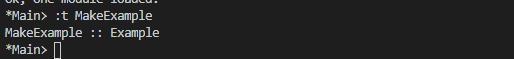

# Algebric Datatypes

## Exercises: Dog Types
Given the datatypes defined in the above sections,
```haskell
data Doggies a = Husky a | Mastiff a deriving (Eq, Show)

data DogueDeBordeaux doge = DogueDeBordeaux doge
```

1. Is Doggies a type constructor or a data constructor?
   
   Type Constructor

2. What is the kind of Doggies?
    ```haskell
    Doggies :: * -> *
    ```
3. What is the kind of Doggies String?
   ```haskell
    Doggies String :: * 
    ```
4. What is the type of Husky 10?
   ```haskell
    Husky 10 :: Num a => Doggies a
    ```
5. What is the type of Husky (10 :: Integer)?
   ```haskell
    Husky 10 :: Doggies Integer
    ```
6. What is the type of Mastiff "Scooby Doo"?
   ```haskell
    Mastiff "Scooby Doo" :: Doggies String
    ```
7. Is DogueDeBordeaux a type constructor or a data constructor?
   
   DogueDeBordeaux a is both a type and data constructor.
8. What is the type of DogueDeBordeaux?
   ```haskell
   DogueDeBordeaux :: doge -> DogueDeBordeaux doge
   ```
9.  What is the type of DogueDeBordeaux "doggie!"
    ```haskell
    DogueDeBordeaux "doggie!" :: DogueDeBordeaux String
    ```

## Exercises: Vehicles
For these exercises, we’ll use the datatypes defined in the above
section. It would be good if you’d typed them all into a source file
already, but if you hadn’t please do so now. You can then define some
sample data on your own, or use these to get you started:
```haskell
myCar = Car Mini (Price 14000)
urCar = Car Mazda (Price 20000)
clownCar = Car Tata (Price 7000)
doge = Plane PapuAir
```
1. What is the type of myCar?
   
   Vehicle
2. Given the following, define the functions:
   ```haskell
    isCar :: Vehicle -> Bool
    isCar = undefined

    isPlane :: Vehicle -> Bool
    isPlane = undefined

    areCars :: [Vehicle] -> [Bool]
    areCars = undefined
    ```

    ```haskell
    isCar :: Vehicle -> Bool
    isCar (Car _ _) = True
    isCar _ = False

    isPlane :: Vehicle -> Bool
    isPlane (Plane _) = True
    isPlane _ = False

    areCars :: [Vehicle] -> [Bool]
    areCars input = map isCar input

    -- or 
    areCars' :: [Vehicle] -> [Bool]
    areCars' [] = []
    areCars' (x:xa) = isCar x : areCars' xa
    ```

    

3. Now we’re going to write a function to tell us the manufacturer
of a piece of data:
    ```haskell
    getManu :: Vehicle -> Manufacturer
    getManu = undefined
    ```

    ```haskell
    getManu :: Vehicle -> Manufacturer
    getManu (Car manufacturer _) = manufacturer
    getManu (Car _ _) = error "Unknown Manufacturer"

    getManu' :: Vehicle -> Maybe Manufacturer
    getManu' (Car manufacturer _) = Just $ manufacturer
    getManu' (Car _ _) = Nothing
    ```
    

4. Given that we’re returning the Manufacturer, what will happen if
you use this on Plane data?

    It will throw error
5. All right. Let’s say you’ve decided to add the size of the plane as
an argument to the Plane constructor. Add that to your datatypes
in the appropriate places and change your data and functions
appropriately.

    ```haskell
    data Industry = AirlineType Airline | ManufacturerType Manufacturer deriving (Eq, Show)

    getManuIndustry :: Vehicle -> Industry
    getManuIndustry (Car manufacturer _) = ManufacturerType manufacturer
    getManuIndustry (Plane airline) = AirlineType airline
    ```

    

## Exercises: Cardinality
While we haven’t explicitly described the rules for calculating the
cardinality of datatypes yet, you might already have an idea of how
to do it for simple datatypes with nullary constructors. Try not to
overthink these exercises — follow your intuition based on what you
know.
1. ```haskell
   data PugType = PugData
   ```

   Cardinality is 1

2. For this one, recall that Bool is also defined with the |:
    ```haskell
    data Airline =
    PapuAir
    | CatapultsR'Us
    | TakeYourChancesUnited
    ```

   Cardinality is 3

3. Given what we know about Int8, what’s the cardinality of Int16?
   
   Cardinality is 2^16 = 65536

4. Use the REPL and maxBound and minBound to examine Int and
Integer. What can you say about the cardinality of those types?

   Cardinality of `Int` 18446744073709551616
   maxBound is not supported by Integer

5. Extra credit (impress your friends!): What’s the connection
between the 8 in Int8 and that type’s cardinality of 256?

    2^8=256 this is the connection

## Exercises: For Example
```haskell
data Example = MakeExample deriving Show
```
1. You can query the type of a value in GHCi with the :type command,
also abbreviated :t. Example:
    ```haskell
    Prelude> :t False
    False :: Bool
    ```
    What is the type of data constructor MakeExample? What happens
when you request the type of Example?

    Example

    

2. What if you try :info on Example in GHCi? Can you determine
what typeclass instances are defined for the Example type using
:info in GHCi?

    

3. Try making a new datatype like Example but with a single type
argument added to MakeExample, such as Int. What has changed
when you query MakeExample with :type in GHCi?

    ```haskell
    data Example' = MakeExample' Int deriving Show
    ```

    

## Exercises: Logic Goats
1. Reusing the TooMany typeclass, write an instance of the typeclass
for the type (Int, String). This will require adding a language
pragma named FlexibleInstances4 if you do not use a newtype
— GHC will tell you what to do.

    ```haskell
    {-# LANGUAGE FlexibleInstances #-}

    class TooMany a where
    tooMany :: a -> Bool

    instance TooMany (Int, String) where
        tooMany (n,_) = n > 7
    ```

2. Make another TooMany instance for (Int, Int). Sum the values
together under the assumption this is a count of goats from two
fields.
    
    ```haskell
    instance TooMany (Int, String) where
        tooMany (n,m) = n + m
    ```
3. Make another TooMany instance, this time for (Num a, TooMany a)
=> (a, a). This can mean whatever you want, such as summing
the two numbers together.

    ```haskell
    instance TooMany (Num a, TooMany a) => TooMany (a, a) where
        tooMany (x, y) = tooMany (x + y)
    ```

## Exercises: Pity the Bool
1. Given a datatype
    ```haskell
    data BigSmall = Big Bool | Small Bool deriving (Eq, Show)
    ```
    What is the cardinality of this datatype? Hint: We already know
Bool’s cardinality. Show your work as demonstrated earlier.

    Cardinality = 4

    Big True | Big False | Small True | Small False

2. Given a datatype
   ```haskell
    -- needed to have Int8 in scope
    import Data.Int
    data NumberOrBool = Numba Int8 | BoolyBool Bool deriving (Eq, Show)
    -- Example use of Numba, parentheses due to
    -- syntactic collision between (-) minus and
    -- the negate function
    let myNumba = Numba (-128)
    ```
    What is the cardinality of NumberOrBool? What happens if you
try to create a Numba with a numeric literal larger than 127? And
with a numeric literal smaller than (-128)?
If you choose (-128) for a value precisely, you’ll notice you get
a spurious warning:
    ```haskell
    Prelude> let n = Numba (-128)
    Literal 128 is out of the Int8 range -128..127
    If you are trying to write a large negative
    literal, use NegativeLiterals
    ```
    Now, since -128 is a perfectly valid Int8 value you could choose
to ignore this. What happens is that (-128) desugars into (negate
128). The compiler sees that you expect the type Int8, but Int8’s
max boundary is 127. So even though you’re negating 128, it
hasn’t done that step yet and immediately whines about 128 being
larger than 127. One way to avoid the warning is the following:
    ```haskell
    Prelude> let n = (-128)
    Prelude> let x = Numba n
    ```
    Or you can use the NegativeLiterals extension as it recommends:
    ```haskell
    Prelude> :set -XNegativeLiterals
    Prelude> let n = Numba (-128)
    ```
Note that the negative literals extension doesn’t prevent the
warning if you use negate.

- Cardinality - 2^8 + 2 = 258
- It will throw error out of range
  
## Exercises: How Does Your Garden Grow?
1. Given the type
```haskell
data FlowerType = Gardenia | Daisy | Rose | Lilac deriving Show

type Gardener = String

data Garden = Garden Gardener FlowerType deriving Show
```
What is the normal form of Garden?

```haskell
data Garden = Garden Gardener Gardenia | Gardener Daisy | Gardener Rose | Gardener Lilac
```

## Exercise: Programmers
Write a function that generates all possible values of Programmer. Use
the provided lists of inhabitants of OperatingSystem and ProgrammingLanguage.
```haskell
allOperatingSystems :: [OperatingSystem]
allOperatingSystems =
[ GnuPlusLinux
, OpenBSDPlusNevermindJustBSDStill
, Mac
, Windows
]
allLanguages :: [ProgrammingLanguage]
allLanguages = [Haskell, Agda, Idris, PureScript]
allProgrammers :: [Programmer]
allProgrammers = undefined
```
Programmer is a product of two types, you can determine how many
inhabitants of Programmer you have by calculating:
```haskell
length allOperatingSystems * length allLanguages
```

```haskell
allProgrammers :: [Programmer]
allProgrammers = [Programmer os lang | os <- allOperatingSystems, lang <- allLanguages]
```


**Deconstruucting the contents**

```haskell
newtype Name = Name String deriving Show
newtype Acres = Acres Int deriving Show 
data FarmerType = DairyFarmer | WheatFarmer | SoybeanFarmer deriving Show
data Farmer = Farmer Name Acres FarmerType deriving Show

isDairyFarmer :: Farmer -> Bool
isDairyFarmer (Farmer _ _ DairyFarmer) = True
isDairyFarmer _ = False

data FarmerRec =
    FarmerRec { name :: Name
              , acres :: Acres
              , farmerType :: FarmerType } deriving Show

isDairyFarmerRec :: FarmerRec -> Bool
isDairyFarmerRec farmer = case farmerType farmer of
    DairyFarmer -> True
    _ -> False
```

## Exponentiation in what order?
Consider the following function:
```haskell
convert :: Quantum -> Bool
convert = undefined
```
According to the equality of a -> b and 𝑏u� there should be 23 or 8
implementations of this function. Does this hold? Write it out and
prove it for yourself.

```haskell
data Quantum =
    Yes
  | No
  | Both
  deriving (Eq, Show)

convert1 :: Quantum -> Bool
convert1 _ = True

convert2 :: Quantum -> Bool
convert2 Yes = True
convert2 _   = False

convert3 :: Quantum -> Bool
convert3 No = True
convert3 _  = False

convert4 :: Quantum -> Bool
convert4 Both = True
convert4 _    = False

convert5 :: Quantum -> Bool
convert5 Yes = False
convert5 _   = True

convert6 :: Quantum -> Bool
convert6 No = False
convert6 _  = True

convert7 :: Quantum -> Bool
convert7 Both = False
convert7 _    = True

convert8 :: Quantum -> Bool
convert8 _ = False
```

## Exercises: The Quad
Determine how many unique inhabitants each type has.
Suggestion: just do the arithmetic unless you want to verify. Writing
them out gets tedious quickly.

1. ```haskell
    data Quad = One | Two | Three | Four deriving (Eq, Show)
    -- how many different forms can this take?
    eQuad :: Either Quad Quad
    eQuad = ???
    ```

    4 + 4 = 8
1. ```haskell
   prodQuad :: (Quad, Quad)
   ```

   4 * 4 = 16
2. ```haskell
   funcQuad :: Quad -> Quad
   ```

   4 * 4 = 16

3. ```haskell
   prodTBool :: (Bool, Bool, Bool)
   ```

   2 * 2 * 2 = 8
4. ```haskell
   gTwo :: Bool -> Bool -> Bool
   ```

   2 * 2 * 2 = 8

5. Hint: 5 digit number
    ```haskell
    fTwo :: Bool -> Quad -> Quad
    ```

    2 * 4 * 4 = 32

## Write map for BinaryTree
Given the definition of BinaryTree above, write a map function for the
data structure. You don’t really need to know anything about binary
trees to write these functions. The structure inherent in the definition
of the type is all you need. Just write the recursive functions
and get it done.

No special algorithms are needed, and we don’t expect you to
keep the tree balanced or ordered. Also, remember that we’ve never
once mutated anything. We’ve only built new values from input data.
Given that, when you go to implement mapTree, you’re not changing
an existing tree — you’re building a new one based on an existing
one ( just like when you are mapping functions over lists).
```haskell
-- filling in some details to help you along
-- Note, you do *not* need to use insert' for this.
-- Retain the original structure of the tree.
mapTree :: (a -> b) -> BinaryTree a -> BinaryTree b
mapTree _ Leaf = Leaf
mapTree f (Node left a right) =
    Node undefined undefined undefined

testTree' :: BinaryTree Integer
testTree' = Node (Node Leaf 3 Leaf) 1 (Node Leaf 4 Leaf)

mapExpected = Node (Node Leaf 4 Leaf) 2 (Node Leaf 5 Leaf)
-- acceptance test for mapTree
mapOkay =
    if mapTree (+1) testTree' == mapExpected
    then print "yup okay!"
    else error "test failed!
-- hints for implementing mapTree below this code block
```

```haskell
mapTree :: (a -> b) -> BinaryTree a -> BinaryTree b
mapTree _ Leaf = Leaf
mapTree f (Node left a right) =
  Node (mapTree f left) (f a) (mapTree f right)
```

## Convert binary trees to lists
Write functions to convert BinaryTree values to lists. Make certain
your implementation passes the tests.

```haskell
preorder :: BinaryTree a -> [a]
preorder = undefined

inorder :: BinaryTree a -> [a]
inorder = undefined

postorder :: BinaryTree a -> [a]
postorder = undefined

testTree :: BinaryTree Integer
testTree = Node (Node Leaf 1 Leaf) 2 (Node Leaf 3 Leaf)

testPreorder :: IO ()
testPreorder =
    if preorder testTree == [2, 1, 3]
    then putStrLn "Preorder fine!"
    else putStrLn "Bad news bears."

testInorder :: IO ()
testInorder =
    if inorder testTree == [1, 2, 3]
    then putStrLn "Inorder fine!"
    else putStrLn "Bad news bears."

testPostorder :: IO ()
testPostorder =
    if postorder testTree == [1, 3, 2]
    then putStrLn "Postorder fine!"
    else putStrLn "postorder failed check"

main :: IO ()
main = do
testPreorder
testInorder
testPostorder

```

```haskell

preorder :: BinaryTree a -> [a]
preorder Leaf = []
preorder (Node left a right) = [a] ++ (preorder left) ++ (preorder right)

inorder :: BinaryTree a -> [a]
inorder Leaf = []
inorder (Node left a right) = (inorder left) ++ [a] ++ (inorder right)

postorder :: BinaryTree a -> [a]
postorder Leaf = []
postorder (Node left a right) = (postorder left) ++ (postorder right) ++ [a]
```

## Write foldr for BinaryTree
Given the definition of BinaryTree we have provided, write a catamorphism
for the binary trees.
```haskell
-- any traversal order is fine
foldTree :: (a -> b -> b) -> b -> BinaryTree a -> b
```

```haskell
testFoldTree :: IO ()
testFoldTree =
  if foldTree max 2 testTree' == 4
    then putStrLn "Fold Tree fine!"
    else putStrLn "Fold Tree failed"

foldTree :: (a -> b -> b) -> b -> BinaryTree a -> b
foldTree _ input Leaf = input
foldTree f input bt = foldr f input $ postorder bt

main :: IO ()
main = do
testFoldTree
```

## Chapter Exercises
**Multiple choice**

1. Given the following datatype:
    ```haskell
    data Weekday =
    Monday
    | Tuesday
    | Wednesday
    | Thursday
    | Friday
    ```
    we can say:

    `a) Weekday is a type with five data constructors`

    b) Weekday is a tree with five branches

    c) Weekday is a product type

    d) Weekday takes five arguments

2. and with the same datatype definition in mind, what is the type
of the following function, f?
    ```haskell
    f Friday = "Miller Time"
    ```
    a) f :: [Char]

    b) f :: String -> String

    `c) f :: Weekday -> String`

    d) f :: Day -> Beer

3. Types defined with the data keyword

    a) must have at least one argument

    `b) must begin with a capital letter`

    c) must be polymorphic

    d) cannot be imported from modules

4. The function g xs = xs !! (length xs - 1)
   
    a) is recursive and may not terminate

    b) delivers the head of xs

    `c) delivers the final element of xs`

    d) has the same type as xs

**Ciphers**

In the Lists chapter, you wrote a Caesar cipher. Now, we want to
expand on that idea by writing a Vigenère cipher. A Vigenère cipher
is another substitution cipher, based on a Caesar cipher, but it
uses a series of Caesar ciphers for polyalphabetic substitution. The
substitution for each letter in the plaintext is determined by a fixed
keyword.
So, for example, if you want to encode the message “meet at
dawn,” the first step is to pick a keyword that will determine which
Caesar cipher to use. We’ll use the keyword “ALLY” here. You repeat
the keyword for as many characters as there are in your original
message:
MEET AT DAWN
ALLY AL LYAL
Now the number of rightward shifts to make to encode each
character is set by the character of the keyword that lines up with it.
The ’A’ means a shift of 0, so the initial M will remain M. But the ’L’
for our second character sets a rightward shift of 11, so ’E’ becomes
’P’. And so on, so “meet at dawn” encoded with the keyword “ALLY”
becomes “MPPR AE OYWY.”
Like the Caesar cipher, you can find all kinds of resources to
help you understand the cipher and also many examples written
in Haskell. Consider using a combination of chr, ord, and mod again,
possibly very similar to what you used for writing the original Caesar
cipher.

```haskell
charPosition :: Char -> Int
charPosition character = position
    where
        position = head output
        output = [n | (l, n) <- zip ['a'..'z'] [1..], l == toLower character]

vigenèreCipher :: Cipher -> [Char] -> [Char] -> [Char]
vigenèreCipher _ [] _ = []
vigenèreCipher _ input [] = input
vigenèreCipher encryptOrDecrypt (x:xa) (y:ya) = encode encryptOrDecrypt x (charPosition y - 1) : vigenèreCipher encryptOrDecrypt xa ya
```


For completer code go through `Cipher.hs`

**As-patterns**

“As-patterns” in Haskell are a nifty way to be able to pattern match on
part of something and still refer to the entire original value. Some
examples:
```haskell
f :: Show a => (a, b) -> IO (a, b)
f t@(a, _) = do
print a
return t
```
Here we pattern-matched on a tuple so we could get at the first
value for printing, but used the @ symbol to introduce a binding
named t in order to refer to the whole tuple rather than just a part.
```haskell
Prelude> f (1, 2)
1
(1,2)
```
We can use as-patterns with pattern matching on arbitrary data
constructors, which includes lists:
```haskell
doubleUp :: [a] -> [a]
doubleUp [] = []
doubleUp xs@(x:_) = x : xs
Prelude> doubleUp []
[]
Prelude> doubleUp [1]
[1,1]
Prelude> doubleUp [1, 2]
[1,1,2]
Prelude> doubleUp [1, 2, 3]
[1,1,2,3]
```
Use as-patterns in implementing the following functions:
1. This should return True if (and only if) all the values in the
first list appear in the second list, though they need not be
contiguous.
    ```haskell
    isSubsequenceOf :: (Eq a) => [a] -> [a] -> Bool
    ```
    The following are examples of how this function should work:
    ```haskell
    Prelude> isSubsequenceOf "blah" "blahwoot"
    True
    Prelude> isSubsequenceOf "blah" "wootblah"
    True
    Prelude> isSubsequenceOf "blah” "wboloath"
    True
    Prelude> isSubsequenceOf "blah" "wootbla"
    False
    ```

    ```haskell
    isSubsequenceOf :: (Eq a) => [a] -> [a] -> Bool
    isSubsequenceOf _ [] = False
    isSubsequenceOf [] _ = True
    isSubsequenceOf firstInput@(x:xa) secondInput@(y:ya)
        | x == y = isSubsequenceOf xa secondInput
        | otherwise = isSubsequenceOf firstInput ya
    ```
2. Split a sentence into words, then tuple each word with the capitalized
form of each.

    ```haskell
    capitalizeWords :: String -> [(String, String)]
    Prelude> capitalizeWords "hello world"
    [("hello", "Hello"), ("world", "World")]
    ```
    ```haskell
    capitalizeWords :: String -> [(String, String)]
    capitalizeWords = map capitalizeWord' . words
    where
        capitalizeWord' :: String -> (String, String)
        capitalizeWord' []          = ([],[])
        capitalizeWord' word@(w:ws) = (word, (toUpper w):ws)
    ```

Language exercises
1. Write a function that capitalizes a word.
    ```haskell
    capitalizeWord :: String -> String
    capitalizeWord = undefined
    Example output.
    Prelude> capitalizeWord "Titter"
    "Titter"
    Prelude> capitalizeWord "titter"
    "Titter"
    ```

    ```haskell
    capitalizeWord :: String -> String
    capitalizeWord [] = []
    capitalizeWord (x:xa)= (toUpper x) : xa
    ```
2. Write a function that capitalizes sentences in a paragraph. Recognize
when a new sentence has begun by checking for periods.
Reuse the capitalizeWord function.
    ```haskell
    capitalizeParagraph :: String -> String
    capitalizeParagraph = undefined
    ```
    Example result you should get from your function:
    ```haskell
    Prelude> capitalizeParagraph "blah. woot ha."
    "Blah. Woot ha."
    ```

    ```haskell
    capitalizeWord :: String -> String
    capitalizeWord [] = []
    capitalizeWord (x:xa)= (toUpper x) : xa

    capitalizeParagraph :: String -> String
    capitalizeParagraph [] = []
    capitalizeParagraph input = concat $ map capitalizeWord $ myWords input 

    -- output ["aman","lalpuria"]
    -- can retrive using map
    myWords :: [Char] -> [[Char]]
    myWords input
        | input == [] = []
        | otherwise = (takeWhile (/=' ') input ++ " "):(myWords $ (dropWhile (==' ') . dropWhile (/=' ')) input)
    ```

**Phone exercise**

This exercise by geophf7 originally for 1HaskellADay.8 Thank you
for letting us use this exercise!
Remember old-fashioned phone inputs for writing text where
you had to press a button multiple times to get different letters to
come up? You may still have to do this when you try to search for a
movie to watch using your television remote control. You’re going
to write code to translate sequences of button presses into strings
and vice versa.
So! Here is the layout of the phone:
```
-------------------------------------
|   1       |   2 ABC   |   3 DEF   |
_____________________________________
|   4 GHI   |   5 JKL   |   6 MNO   |
-------------------------------------
|   7 PQRS  |   8 TUV   |   9 WXYZ  |
-------------------------------------
|   * ^     |   0 + _   |   # .,    |
-------------------------------------
```
Where star (*) gives you capitalization of the letter you’re writing
to your friends, and 0 is your space bar. To represent the digit itself,
you press that digit once more than the letters it represents. If you
press a button one more than is required to type the digit, it wraps
around to the first letter. For example,

```
2 -> 'A'
22 -> 'B'
222 -> 'C'
2222 -> '2'
22222 -> 'A'
```
So on and so forth. We’re going to kick this around.
1. Create a data structure that captures the phone layout above.
The data structure should be able to express enough of how the
layout works that you can use it to dictate the behavior of the
functions in the following exercises.
    ```haskell
    -- fill in the rest.
    data DaPhone = DaPhone
    ```
1. Convert the following conversations into the keypresses required to express them. We’re going to suggest types and functions to fill in order to accomplish the goal, but they’re not obligatory. If you want to do it differently…you do you.
    ```haskell
    convo :: [String]
    convo =
    ["Wanna play 20 questions",
    "Ya",
    "U 1st haha",
    "Lol ok. Have u ever tasted alcohol lol",
    "Lol ya",
    "Wow ur cool haha. Ur turn",
    "Ok. Do u think I am pretty Lol",
    "Lol ya",
    "Haha thanks just making sure rofl ur turn"]
    -- validButtons = "1234567890*#"
    type Digit = Char
    -- Valid presses: 1 and up
    type Presses = Int
    reverseTaps :: DaPhone -> Char -> [(Digit, Presses)]
    reverseTaps = undefined
    -- assuming the default phone definition
    -- 'a' -> [('2', 1)]
    -- 'A' -> [('*', 1), ('2', 1)]
    cellPhonesDead :: DaPhone -> String -> [(Digit, Presses)]
    cellPhonesDead = undefined
    ```
3. How many times do digits need to be pressed for each message?
    ```haskell
    fingerTaps :: [(Digit, Presses)] -> Presses
    fingerTaps = undefined
    ```
4. What was the most popular letter for each message? What was
its cost? You’ll want to combine reverseTaps and fingerTaps to
figure out what it cost in taps. reverseTaps is a list because you
need to press a different button in order to get capitals.
    ```haskell
    mostPopularLetter :: String -> Char
    mostPopularLetter = undefined
    ```
5. What was the most popular letter overall? What was the most
popular word?
    ```haskell
    coolestLtr :: [String] -> Char
    coolestLtr = undefined
    coolestWord :: [String] -> String
    coolestWord = undefined
    ```

Refer `Phone.hs`

**Hutton’s Razor**

Hutton’s Razor9 is a very simple expression language that expresses
integer literals and addition of values in that expression language.
The “trick” to it is that it’s recursive and the two expressions you’re
summing together could be literals or themselves further addition
operations. This sort of datatype is stereotypical of expression languages
used to motivate ideas in research papers and functional
pearls. Evaluating or folding a datatype is also in some sense what
you’re doing most of the time while programming anyway.
1. Your first task is to write the “eval” function which reduces an
expression to a final sum.
    ```haskell
    data Expr
    = Lit Integer
    | Add Expr Expr
    eval :: Expr -> Integer
    eval = error "do it to it"
    ```
    Example of expected output:
    ```haskell
    Prelude> eval (Add (Lit 1) (Lit 9001))
    9002
    ```

    ```haskelleval :: Expr -> Integer
    eval (Lit a) = a
    eval (Add a b) = (+) (eval a) (eval b)
    ```
    

2. Write a printer for the expressions.
    ```haskell
    printExpr :: Expr -> String
    printExpr = undefined
    ```
    Expected output:
    ```haskell
    Prelude> printExpr (Add (Lit 1) (Lit 9001))
    "1 + 9001"
    Prelude> let a1 = Add (Lit 9001) (Lit 1)
    Prelude> let a2 = Add a1 (Lit 20001)
    Prelude> let a3 = Add (Lit 1) a2
    Prelude> printExpr a3
    "1 + 9001 + 1 + 20001"
    ```

    ```haskellprintExpr :: Expr -> String
    printExpr (Lit a) = show a      -- show to convert int to string
    printExpr (Add a b) = printExpr a ++ "+" ++ printExpr b
    ```

    
