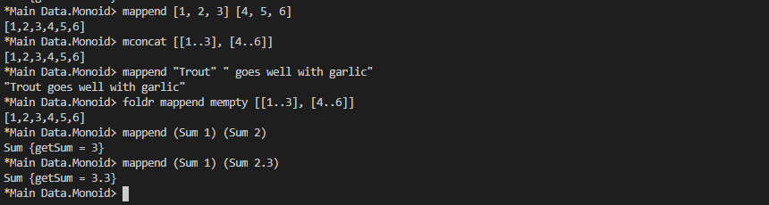
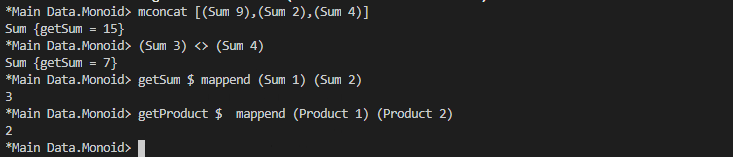

# Monoid, Semigroup

Monid functions





## Exercise: Optional Monoid

Write the Monoid instance for our Maybe type renamed to Optional.

```haskell
data Optional a = Nada | Only a deriving (Eq, Show)

instance Monoid a => Monoid (Optional a) where
mempty = undefined
mappend = undefined
```
Expected output:
```haskell
Prelude> Only (Sum 1) `mappend` Only (Sum 1)
Only (Sum {getSum = 2})
Prelude> Only (Product 4) `mappend` Only (Product 2)
Only (Product {getProduct = 8})
Prelude> Only (Sum 1) `mappend` Nada
Only (Sum {getSum = 1})
Prelude> Only [1] `mappend` Nada
Only [1]
Prelude> Nada `mappend` Only (Sum 1)
Only (Sum {getSum = 1})
```

## Exercise: Maybe Another Monoid
Write a Monoid instance for Maybe type which doesn’t require a Monoid
for the contents. Reuse the Monoid law QuickCheck properties and
use them to validate the instance.

```haskell
-- Don't forget to write an Arbitrary
-- instance for First'. We won't always
-- stub that out explicitly for you.
newtype First' a =
First' { getFirst' :: Optional a }
deriving (Eq, Show)

instance Monoid (First' a) where
mempty = undefined
mappend = undefined

firstMappend :: First' a
-> First' a
-> First' a
firstMappend = mappend
```

## Chapter exercises
Semigroup exercises
Given a datatype, implement the Semigroup instance. Add Semigroup
constraints to type variables where needed. Use the Semigroup
class from the semigroups library or write your own. When we use
<>, we mean the infix mappend from the Semigroup typeclass.

**Note** We’re not always going to derive every instance you may want
or need in the datatypes we provide for exercises. We expect you to
know what you need and to take care of it yourself by this point.
1. Validate all of your instances with QuickCheck. Since Semigroup’s
only law is associativity, that’s the only property you
need to reuse. Keep in mind that you’ll potentially need to
import the modules for Monoid and Semigroup and to avoid
naming conflicts for the ((<>)) depending on your version of
GHC.
    ```haskell
    data Trivial = Trivial deriving (Eq, Show)

    instance Semigroup Trivial where
        _ <> _ = undefined
    
    instance Arbitrary Trivial where
        arbitrary = return Trivial
    
    semigroupAssoc :: (Eq m, Semigroup m) => m -> m -> m -> Bool
    semigroupAssoc a b c = (a <> (b <> c)) == ((a <> b) <> c)
    
    type TrivialAssoc = Trivial -> Trivial -> Trivial -> Bool
    
    main :: IO ()
    main = quickCheck (semigroupAssoc :: TrivialAssoc)
    ```
2.  ```haskell
    newtype Identity a = Identity a
    ```
3.  ```haskell
    data Two a b = Two a b
    ```
    Hint: Ask for another Semigroup instance.
4.  ```haskell
    data Three a b c = Three a b c
    ```
5.  ```haskell
    data Four a b c d = Four a b c d
    ```
6.  ```haskell
    newtype BoolConj =
        BoolConj Bool
    ```
    What it should do:
    ```haskell
    Prelude> (BoolConj True) <> (BoolConj True)
    BoolConj True
    Prelude> (BoolConj True) <> (BoolConj False)
    BoolConj False
    ```
1.  ```haskell
    newtype BoolDisj =
        BoolDisj Bool
    ```
    What it should do:
    ```haskell
    Prelude> (BoolDisj True) <> (BoolDisj True)
    BoolDisj True
    Prelude> (BoolDisj True) <> (BoolDisj False)
    BoolDisj True
    ```
1.  ```haskell
    data Or a b =
    Fst a
    | Snd b
    ```
    The Semigroup for Or should have the following behavior. We
can think of this as having a “sticky” Snd value where it’ll hold
onto the first Snd value when and if one is passed as an argument.
This is similar to the First' Monoid you wrote earlier.
    ```haskell
    Prelude> Fst 1 <> Snd 2
    Snd 2
    Prelude> Fst 1 <> Fst 2
    Fst 2
    Prelude> Snd 1 <> Fst 2
    Snd 1
    Prelude> Snd 1 <> Snd 2
    Snd 1
    ```
9. Keep in mind you won’t be able to easily test associativity for
Combine because it contains functions.
    ```haskell
    newtype Combine a b =
    Combine { unCombine :: (a -> b) }
    ```
    What it should do:
    ```haskell
    Prelude> let f = Combine $ \n -> Sum (n + 1)
    Prelude> let g = Combine $ \n -> Sum (n - 1)
    Prelude> unCombine (f <> g) $ 0
    Sum {getSum = 0}
    Prelude> unCombine (f <> g) $ 1
    Sum {getSum = 2}
    Prelude> unCombine (f <> f) $ 1
    Sum {getSum = 4}
    Prelude> unCombine (g <> f) $ 1
    Sum {getSum = 2}
    ```
    Hint: This function will eventually be applied to a single value
of type 𝑎. But you’ll have multiple functions that can produce a
value of type 𝑏. How do we combine multiple values so we have
a single 𝑏? This one will probably be tricky! Remember that the
type of the value inside of Combine is that of a function. If you
can’t figure out CoArbitrary, don’t worry about QuickChecking
this one.
10. ```haskell
    newtype Comp a =
    Comp { unComp :: (a -> a) }
    ```
    Hint: We can do something that seems a little more specific and
natural to functions now that the input and output types are the
same.

11. ```haskell
    -- Look familiar?
    data Validation a b =
        Failure a | Success b
        deriving (Eq, Show)
    instance Semigroup a =>
        Semigroup (Validation a b) where
        (<>) = undefined
    ```
1.  ```haskell
    -- Validation with a Semigroup
    -- that does something different
    newtype AccumulateRight a b =
        AccumulateRight (Validation a b)
        deriving (Eq, Show)
    instance Semigroup b =>
        Semigroup (AccumulateRight a b) where
        (<>) = undefined
    ```
1.  ```haskell
    -- Validation with a Semigroup
    -- that does something more
    newtype AccumulateBoth a b =
        AccumulateBoth (Validation a b)
        deriving (Eq, Show)
    instance (Semigroup a, Semigroup b) =>
        Semigroup (AccumulateBoth a b) where
        (<>) = undefined
    ```

**Monoid exercises**

Given a datatype, implement the Monoid instance. Add Monoid
constraints to type variables where needed. For the datatypes you’ve
already implemented Semigroup instances for, you just need to
figure out what the identity value is.

1. Again, validate all of your instances with QuickCheck. Example
scaffold is provided for the Trivial type.
    ```haskell
    data Trivial = Trivial deriving (Eq, Show)
    instance Semigroup Trivial where
    (<>) = undefined
    instance Monoid Trivial where
    mempty = undefined
    mappend = (<>)
    type TrivialAssoc = Trivial -> Trivial -> Trivial -> Bool
    main :: IO ()
    main = do
    quickCheck (semigroupAssoc :: TrivialAssoc)
    quickCheck (monoidLeftIdentity :: Trivial -> Bool)
    quickCheck (monoidRightIdentity :: Trivial -> Bool)
    ```
2. ```haskell
   newtype Identity a = Identity a deriving Show
   ```
3. ```haskell
   data Two a b = Two a b deriving Show
   ```
4. ```haskell
   newtype BoolConj =
    BoolConj Bool
    ```
    What it should do:
    ```haskell
    Prelude> (BoolConj True) `mappend` mempty
    BoolConj True
    Prelude> mempty `mappend` (BoolConj False)
    BoolConj False
    ```
5. ```haskell
   newtype BoolDisj =
    BoolDisj Bool
    ```
    What it should do:

    ```haskell
    Prelude> (BoolDisj True) `mappend` mempty
    BoolDisj True
    Prelude> mempty `mappend` (BoolDisj False)
    BoolDisj False
    ```
6.  ```haskell
    newtype Combine a b =
    Combine { unCombine :: (a -> b) }
    ```
    What it should do:
    ```haskell
    Prelude> let f = Combine $ \n -> Sum (n + 1)
    Prelude> unCombine (mappend f mempty) $ 1
    Sum {getSum = 2}
    ```
1. Hint: We can do something that seems a little more specific and
natural to functions now that the input and output types are the
same.
    ```haskell
    newtype Comp a =
    Comp (a -> a)
    ```
8. This next exercise will involve doing something that will feel
a bit unnatural still and you may find it difficult. If you get it
and you haven’t done much FP or Haskell before, get yourself a
nice beverage. We’re going to toss you the instance declaration
so you don’t churn on a missing Monoid constraint you didn’t
know you needed.
    ```haskell
    newtype Mem s a =
    Mem {
    runMem :: s -> (a,s)
    }
    instance Monoid a => Monoid (Mem s a) where
    mempty = undefined
    mappend = undefined
    ```
    Given the following code:
    ```haskell
    f' = Mem $ \s -> ("hi", s + 1)
    main = do
        print $ runMem (f' <> mempty) 0
        print $ runMem (mempty <> f') 0
        print $ (runMem mempty 0 :: (String, Int))
        print $ runMem (f' <> mempty) 0 == runMem f' 0
        print $ runMem (mempty <> f') 0 == runMem f' 0
    ```
    A correct Monoid for Mem should, given the above code, get
the following output:

    ```haskell
    Prelude> main
    ("hi",1)
    ("hi",1)
    ("",0)
    True
    True
    ```
    Make certain your instance has output like the above, this is
sanity-checking the Monoid identity laws for you! It’s not a
proof and it’s not even as good as quick-checking, but it’ll catch
the most common mistakes people make. If you’d like to learn
how to generate functions with QuickCheck, not just values,
look at CoArbitrary in QuickCheck’s documentation.
It’s not a trick and you don’t need a Monoid for 𝑠. Yes, such a
Monoid can and does exist. Hint: chain the s values from one
function to the other. You’ll want to check the identity laws as a
common first attempt will break them.