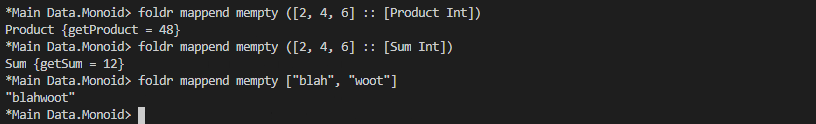

# Monoid, Semigroup

Monid functions




## Exercise: Optional Monoid

Write the Monoid instance for our Maybe type renamed to Optional.

```haskell
data Optional a = Nada | Only a deriving (Eq, Show)

instance Monoid a => Monoid (Optional a) where
mempty = undefined
mappend = undefined
```
Expected output:
```haskell
Prelude> Only (Sum 1) `mappend` Only (Sum 1)
Only (Sum {getSum = 2})
Prelude> Only (Product 4) `mappend` Only (Product 2)
Only (Product {getProduct = 8})
Prelude> Only (Sum 1) `mappend` Nada
Only (Sum {getSum = 1})
Prelude> Only [1] `mappend` Nada
Only [1]
Prelude> Nada `mappend` Only (Sum 1)
Only (Sum {getSum = 1})
```

## Exercise: Maybe Another Monoid
Write a Monoid instance for Maybe type which doesn’t require a Monoid
for the contents. Reuse the Monoid law QuickCheck properties and
use them to validate the instance.

```haskell
-- Don't forget to write an Arbitrary
-- instance for First'. We won't always
-- stub that out explicitly for you.
newtype First' a =
First' { getFirst' :: Optional a }
deriving (Eq, Show)
instance Monoid (First' a) where
mempty = undefined
mappend = undefined
firstMappend :: First' a
-> First' a
-> First' a
firstMappend = mappend
```