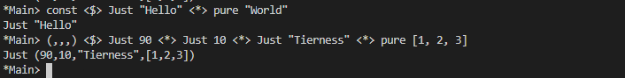

# Applicative

The more core operation of this typeclass is <*>. This is an infix function
called ‘apply’ or sometimes ‘ap,’ or sometimes ‘tie-fighter’ when we’re
feeling particularly zippy.

## Exercises: Lookups
In the following exercises you will need to use the following terms
to make the expressions type-check:
1. ```
   pure
   ```
2. ```haskell
   (<$>)
    -- or fmap
    ```
3. ```haskell
   (<*>)
   ```
Make the following expressions type-check.
1. ```haskell
   added :: Maybe Integer
   added = (+3) (lookup 3 $ zip [1, 2, 3] [4, 5, 6])
   ```
    ```haskell
    added :: Maybe Integer
    added = (+3) <$> (lookup 3 $ zip [1, 2, 3] [4, 5, 6])
    ```
2. ```haskell
   y :: Maybe Integer
    y = lookup 3 $ zip [1, 2, 3] [4, 5, 6]
    z :: Maybe Integer
    z = lookup 2 $ zip [1, 2, 3] [4, 5, 6]
    tupled :: Maybe (Integer, Integer)
    tupled = (,) y z
    ```
    ```haskell
    y :: Maybe Integer
    y = lookup 3 $ zip [1, 2, 3] [4, 5, 6]

    z :: Maybe Integer
    z = lookup 2 $ zip [1, 2, 3] [4, 5, 6]

    tupled :: Maybe (Integer, Integer)
    tupled = (,) <$> y <*> z
    ```
3. ```haskell
   import Data.List (elemIndex)
    x :: Maybe Int
    x = elemIndex 3 [1, 2, 3, 4, 5]
    y :: Maybe Int
    y = elemIndex 4 [1, 2, 3, 4, 5]
    max' :: Int -> Int -> Int
    max' = max
    maxed :: Maybe Int
    maxed = max' x y
    ```
    ```haskell
    x :: Maybe Int
    x = elemIndex 3 [1, 2, 3, 4, 5]

    y :: Maybe Int
    y = elemIndex 4 [1, 2, 3, 4, 5]

    max' :: Int -> Int -> Int
    max' = max

    maxed :: Maybe Int
    maxed = max' <$>  x <*> y
    ```
4. ```haskell
    xs = [1, 2, 3]
    ys = [4, 5, 6]
    x :: Maybe Integer
    x = lookup 3 $ zip xs ys
    y :: Maybe Integer
    y = lookup 2 $ zip xs ys
    summed :: Maybe Integer
    summed = sum $ (,) x y
    ```
    ```haskell
    xs = [1, 2, 3]

    ys = [4, 5, 6]

    x :: Maybe Integer
    x = lookup 3 $ zip xs ys

    y :: Maybe Integer
    y = lookup 2 $ zip xs ys

    summed :: Maybe Integer
    summed = sum <$> ((,) <$> x <*> y)
    ```
## Exercise: Identity Instance
Write an Applicative instance for Identity.
```haskell
newtype Identity a = Identity a deriving (Eq, Ord, Show)

instance Functor Identity where
    fmap = undefined

instance Applicative Identity where
    pure = undefined
    (<*>) = undefined
```
```haskell
newtype Identity a = Identity a deriving (Eq, Ord, Show)

instance Functor Identity where
    fmap f (Identity a)= Identity (f a)

instance Applicative Identity where
    pure = Identity
    Identity f <*> Identity a = Identity (f a)
```

## Exercise: Constant Instance
Write an Applicative instance for Constant.
```haskell
newtype Constant a b = Constant { getConstant :: a } deriving (Eq, Ord, Show)

instance Functor (Constant a) where
    fmap = undefined   

instance Monoid a => Applicative (Constant a) where
    pure a = undefined
    (<*>) = undefined
```
```haskell
newtype Constant a b = Constant { getConstant :: a } deriving (Eq, Ord, Show)

instance Functor (Constant a) where
    fmap _ (Constant a) = Constant a

instance Monoid a => Applicative (Constant a) where
  pure a = Constant mempty
  (<*>) :: Constant a (x -> y) -> Constant a x -> Constant a y
  (Constant x) <*> (Constant y) = Constant $ x `mappend` y
```

## Exercise: Fixer Upper
Given the function and values provided, use (<$>) from Functor,
(<*>) and pure from the Applicative typeclass to fill in missing bits of
the broken code to make it work.
1. ```haskell
   const <$> Just "Hello" <*> "World"
   ```
   ```haskell
   const <$> Just "Hello" <*> pure "World"
   ```
2. ```haskell
   (,,,) Just 90 <*> Just 10 Just "Tierness" [1, 2, 3]
   ```
   ```haskell
   (,,,) <$> Just 90 <*> Just 10 <*> Just "Tierness" <*> pure [1, 2, 3]
   ```




## List Applicative Exercise
Implement the List Applicative. Writing a minimally complete Applicative instance calls for writing the definitions of both pure and <*>. We’re going to provide a hint as well. Use the checkers library to validate your Applicative instance.
```haskell
data List a =
Nil
| Cons a (List a)
deriving (Eq, Show)
```
Remember what you wrote for the List Functor:
```haskell
instance Functor List where
    fmap = undefined
```
Writing the List Applicative is similar.

```haskell
instance Applicative List where
    pure = undefined
    (<*>) = undefined
```
Expected result:
```haskell
Prelude> let functions = Cons (+1) (Cons (*2) Nil)
Prelude> let values = Cons 1 (Cons 2 Nil)
Prelude> functions <*> values
Cons 2 (Cons 3 (Cons 2 (Cons 4 Nil)))
```

```haskell
data List a = Nil | Cons a (List a) deriving (Eq, Show)

instance Functor List where
    fmap _ Nil = Nil
    fmap f (Cons a listObj) = Cons (f a) (fmap f listObj)

instance Applicative List where
    pure a = Cons a Nil
    (<*>) _ Nil = Nil
    (<*>) Nil _ = Nil
    (<*>) a b = flatMap (\x -> x <$> b) a


append :: List a -> List a -> List a
append Nil ys = ys
append (Cons x xs) ys = Cons x $ xs `append` ys

fold :: (a -> b -> b) -> b -> List a -> b
fold _ b Nil = b
fold f b (Cons h t) = f h (fold f b t)

concat' :: List (List a) -> List a
concat' = fold append Nil

flatMap :: (a -> List b) -> List a -> List b
flatMap f as = concat' $ f <$> as
```

## ZipList Applicative Exercise
Implement the ZipList Applicative. Use the checkers library to validate
your Applicative instance. We’re going to provide the EqProp
instance and explain the weirdness in a moment.
```haskell
data List a = Nil | Cons a (List a) deriving (Eq, Show)
take' :: Int -> List a -> List a
take' = undefined
instance Functor List where
fmap = undefined
instance Applicative List where
pure = undefined
(<*>) = undefined
newtype ZipList' a =
ZipList' (List a)
deriving (Eq, Show)
instance Eq a => EqProp (ZipList' a) where
xs =-= ys = xs' `eq` ys'
where xs' = let (ZipList' l) = xs
in take' 3000 l
ys' = let (ZipList' l) = ys
in take' 3000 l
instance Functor ZipList' where
fmap f (ZipList' xs) = ZipList' $ fmap f xs
instance Applicative ZipList' where
pure = undefined
(<*>) = undefined
```

```haskell
take' :: Int -> List a -> List a
take' _ Nil = Nil
take' count (Cons x xa)
    | count > 0     = (Cons x Nil) `append` (take' (count-1) xa)
    | otherwise     = Nil

newtype ZipList' a = ZipList' (List a) deriving (Eq, Show)

instance Functor ZipList' where
    fmap f (ZipList' xs) = ZipList' $ fmap f xs

instance Applicative ZipList' where
    pure a                                              = ZipList' $ Cons a (pure a)
    (<*>) _ (ZipList' Nil)                              = ZipList' Nil
    (<*>) (ZipList' Nil) _                              = ZipList' Nil
    (<*>) (ZipList' (Cons f fs)) (ZipList' (Cons x xs)) = ZipList' $ Cons (f x) (fs <*> xs)
```
## Exercise: Variations on Either
Validation has the same representation as Either, but it can be different.
The Functor will behave the same, but the Applicative will be
different. See above for an idea of how Validation should behave.
Use the checkers library.
```haskell
data Validation e a =
Failure e
| Success a
deriving (Eq, Show)
-- same as Either
instance Functor (Validation e) where
fmap = undefined
-- This is different
instance Monoid e =>
Applicative (Validation e) where
pure = undefined
(<*>) = undefined
```

## Chapter Exercises
Given a type that has an instance of Applicative, specialize the types
of the methods. Test your specialization in the REPL. One way to
do this is to bind aliases of the typeclass methods to “more concrete”
types that have the type we told you to fill in.
1. ```haskell
   -- Type
    []
    -- Methods
    pure :: a -> ? a
    (<*>) :: ? (a -> b) -> ? a -> ? b
    ```
1. ```haskell
   -- Type
    IO
    -- Methods
    pure :: a -> ? a
    (<*>) :: ? (a -> b) -> ? a -> ? b
    ```
3. ```haskell
   -- Type
    (,) a
    -- Methods
    pure :: a -> ? a
    (<*>) :: ? (a -> b) -> ? a -> ? b
    ```
4. ```haskell
   -- Type
    (->) e
    -- Methods
    pure :: a -> ? a
    (<*>) :: ? (a -> b) -> ? a -> ? b
    ```

Write applicative instances for the following datatypes. Confused?
Write out what the type should be. Use the checkers library to validate
the instances.
1. ```haskell
   data Pair a = Pair a a deriving Show
   ```
2. This should look familiar.
    ```haskell
    data Two a b = Two a b
    ```
3. ```haskell
   data Three a b c = Three a b c
   ```
4. ```haskell
   data Three' a b = Three' a b b
   ```
5. ```haskell
   data Four a b c d = Four a b c d
   ```
6. ```haskell
   data Four' a b = Four' a a a b
   ```

**Combinations**
Remember the vowels and stops chapter exercise in folds? Write the
function to generate the possible combinations of three input lists
using liftA3 from Control.Applicative.
```haskell
import Control.Applicative (liftA3)
stops :: String
stops = "pbtdkg"

vowels :: String
vowels = "aeiou"
combos :: [a] -> [b] -> [c] -> [(a, b, c)]
combos = undefined
```