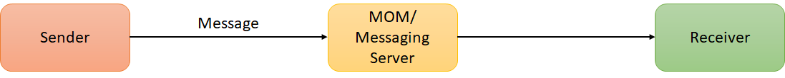
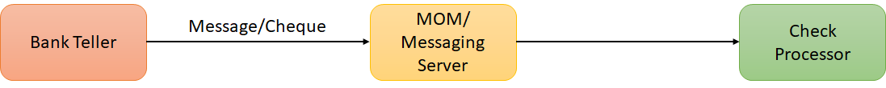
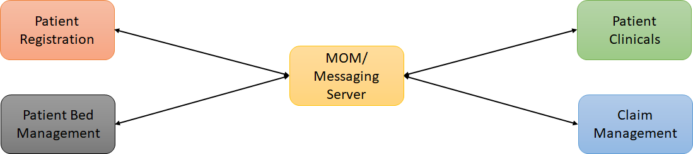

# Messaging Basics

## What is Messaging 

Messaging is processing business data or information across application

Someone of the MQ
1. Apache Active MQ
2. Sonic MQ
3. Websphere MQ
4. TIBCO MQ
   
**Example of Message Queue**

Bank Teller can post a check in Messaging Server and Check processor can collects the data from there.

Both the services don't know about each other, if tomorrow someone wants to change the Check processor it can be done without changing the Bank Teller.

## Why Messaging

Messaging helps us to communicate between the different programming languages, operating systems.

- Before Messaging applications was loosely coupled
- Messaging reduce System Bottlenecks
- JMS use asynchronous listeners, which makes system scalable
- JMS provide flexibility and agility
  
## What is JMS

JMS (Java Message Service) is an API that provides the facility to create, send and read messages. It provides loosely coupled, reliable and asynchronous communication.

JMS helps us to send and receive messages or different MQ

JMS is for messaging as JDBC is for database

## The two messaging models

1. P2P : 
   - Message consumes only ones
   - Async Fire and Forget
   - Synchronous request/reply messaging
   - Example - mail
   

2. Pub/Sub : 
   - Message published to virtual channel called topic
   - Message producer called Publisher 
   - Message consumer called Subscriber
   - Messages automatically published to subscriber
   - Example - Newspaper

## JMS Provider

- Apache ActiveMQ Artemis
