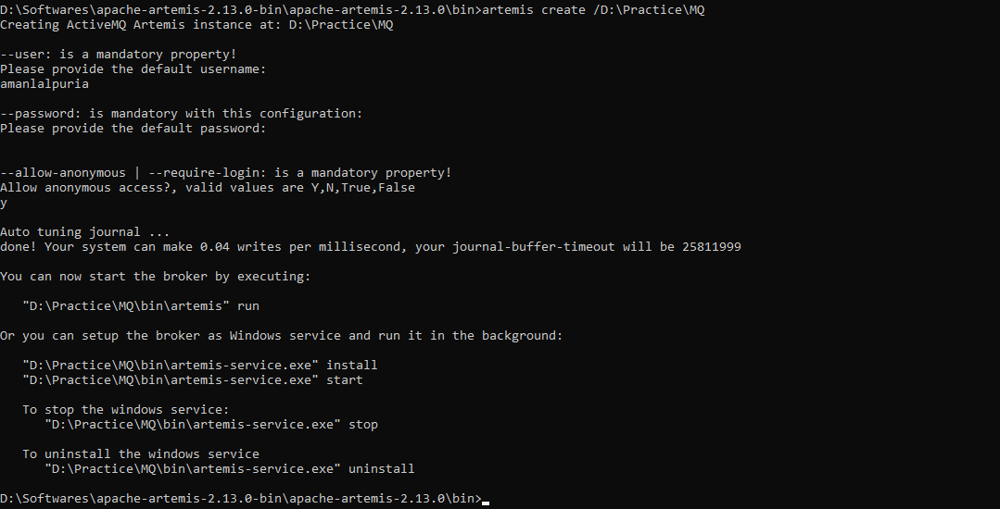
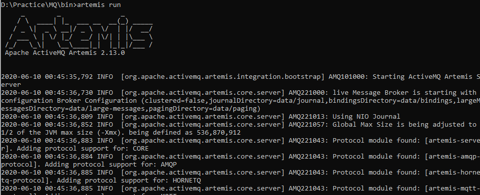

## Software Setup

1. Java 8 or higher
2. Spring Tool Suit
3. Apache ActiveMQ Artemis
   
## Create a Message Broker

1. Download https://activemq.apache.org/components/artemis/download/
2. Unzip
3. Go to bin
4. To create broker
   
        artemis create /D:\Practice\MQ
    
    
   
   - `D:..` is the path where you want to create MQ
   - Put username and password
5. To start the Broker, go to directory where broker setup, go to the bin
   
        artemis run
    
    
