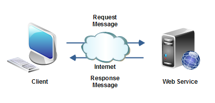
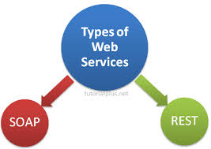

# Web Service

 A `Web service` is a server running on a computer device, listening for requests at a particular port over a network, serving web documents (HTML, JSON, XML, Images), and creating web applications services, which serve in solving specific domain problems over the web (www, internet, HTTP)

## Web API

A Web API is a development in Web services where emphasis has been moving to simpler representational state transfer (REST) based communications. Restful APIs do not require XML-based Web service protocols (SOAP and WSDL) to support their interfaces.

## Types of Web API
