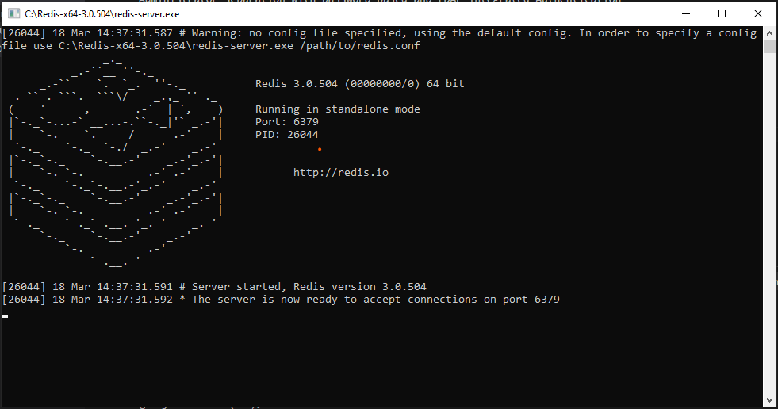
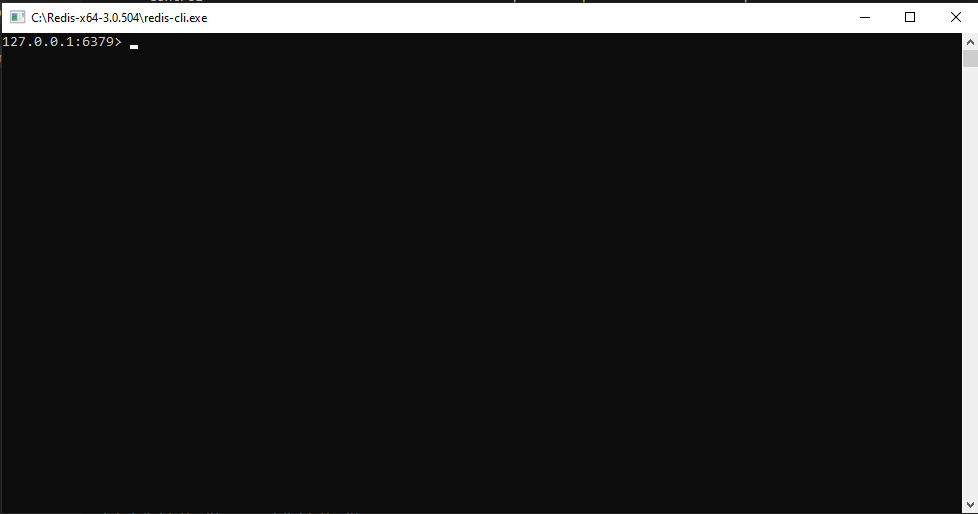
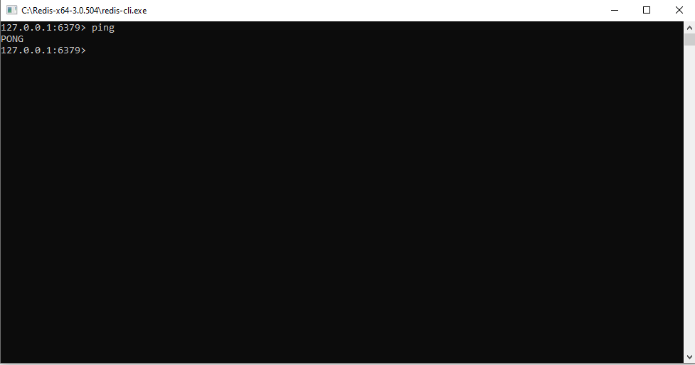

# Redis Installation

## Windows

1. We can download Redis from - https://github.com/MicrosoftArchive/redis/releases
2. Download the Zip file and Unzip it
3. Start the Redis Server 
    
        redis-server.exe

    
4. Now to use Redis start `Redis CLI`

        redis-cli.exe
    
    
5. To check Redis is setuped, try typing

        ping
    