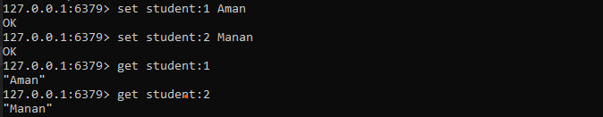
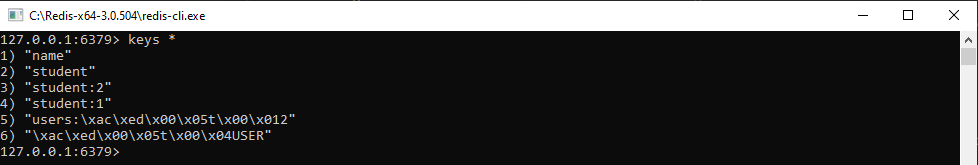
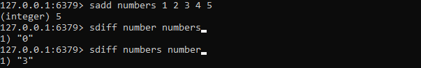

# Redis Data Types and Commands

Redis command documention can be find here - https://redis.io/commands

## String: Set and Get

* `Set` - Set key to hold the string value. If key already holds a value, it is overwritten, regardless of its type. Any previous time to live associated with the key is discarded on successful SET operation.
The SET command supports a set of options that modify its behavior:

    - EX seconds -- Set the specified expire time, in seconds.
    - PX milliseconds -- Set the specified expire time, in milliseconds.
    - NX -- Only set the key if it does not already exist.
    - XX -- Only set the key if it already exist.
    - KEEPTTL -- Retain the time to live associated with the key
* `Get` - Get the value of key. If the key does not exist the special value nil is returned. An error is returned if the value stored at key is not a string, because GET only handles string values.

    

* `DEL` - Removes the specified keys. A key is ignored if it does not exist.

        DEL student
    
    

## String: Key-naming and Querying

To get all the set keys:

    keys *

## String: Expire, XX, NX, Exists and TTL

* `EX` - Set a timeout on key. After the timeout has expired, the key will automatically be deleted. A key with an associated timeout is often said to be volatile in Redis terminology

        set student:4 Subhash EX 25

* `TTL` - Returns the remaining time to live of a key that has a timeout. This introspection capability allows a Redis client to check how many seconds a given key will continue to be part of the dataset.

        ttl student:4        

    

* `NX` - Set key to hold string value if key does not exist. In that case, it is equal to SET. When key already holds a value, no operation is performed. SETNX is short for "SET if Not eXists".
    
        set student:4 Subhash EX 20 NX

    

## String: Other Commands

* `APPEND` - If key already exists and is a string, this command appends the value at the end of the string. If key does not exist it is created and set as an empty string, so APPEND will be similar to SET in this special case.

        set name aman
        append name " lalpuria"
        get name

    

* `STRLEN`- Returns the length of the string value stored at key. An error is returned when key holds a non-string value.

        STRLEN name
    
    

* `INCR` - Increments the number stored at key by one. If the key does not exist, it is set to 0 before performing the operation. An error is returned if the key contains a value of the wrong type or contains a string that can not be represented as integer. This operation is limited to 64 bit signed integers.
    > Note: this is a string operation because Redis does not have a dedicated integer type. The string stored at the key is interpreted as a base-10 64 bit signed integer to execute the operation.

        set mykey 10
        incr mykey
        incrby mykey 10
        
    

* `DECR` - Decrements the number stored at key by one. If the key does not exist, it is set to 0 before performing the operation. An error is returned if the key contains a value of the wrong type or contains a string that can not be represented as integer. This operation is limited to 64 bit signed integers.

        decr mykey
        decrby mykey 10
    
    

## List

* `LPUSH` - Insert all the specified values at the head of the list stored at key. If key does not exist, it is created as empty list before performing the push operations. When key holds a value that is not a list, an error is returned.
It is possible to push multiple elements using a single command call just specifying multiple arguments at the end of the command. Elements are inserted one after the other to the head of the list, from the leftmost element to the rightmost element. So for instance the command LPUSH mylist a b c will result into a list containing c as first element, b as second element and a as third element.

        lpush names aman manan naman

* `LRANGE` - Returns the specified elements of the list stored at key. The offsets start and stop are zero-based indexes, with 0 being the first element of the list (the head of the list), 1 being the next element and so on.
These offsets can also be negative numbers indicating offsets starting at the end of the list. For example, -1 is the last element of the list, -2 the penultimate, and so on.

        lrange names 0 2
    
    

        lrange names 0 -1
    
    

* `RPUSH` - Inserts specified values at the tail of the list stored at key, only if key already exists and holds a list. In contrary to RPUSH, no operation will be performed when key does not yet exist.

        rpush names chaman
    
    

* `LLEN` - Returns the length of the list stored at key. If key does not exist, it is interpreted as an empty list and 0 is returned. An error is returned when the value stored at key is not a list

        llen names

    

* `LSET` - Sets the list element at index to element. For more information on the index argument, see LINDEX.

        lset name 0 gagan
        lset name 3 baban

    

* `RPOP` - Removes and returns the last element of the list stored at key.

        rpop names
    
* `LPOP` - Removes and returns the first element of the list stored at key.

        lpop names
    
    

## Set

Set don't allow repeatation of data in a key

* `SADD` - Add the specified members to the set stored at key. Specified members that are already a member of this set are ignored. If key does not exist, a new set is created before adding the specified members.
An error is returned when the value stored at key is not a set.

        sadd number 0 2 5 4 1

    

* `SMEMBERS` - eturns all the members of the set value stored at key.

        smembers number
    
    

* `SCARD` - Returns the set cardinality (number of elements) of the set stored at key.

        scard number

    

* `SDIFF` - Returns the members of the set resulting from the difference between the first set and all the successive sets.

        sadd numbers 1 2 3 4 5
        sdiff number numbers
        sdiff numbers number
    
    

* `SUNION` - Returns the members of the set resulting from the union of all the given sets.

        sunion numbers number
    
    

* `SINTER` - Returns the members of the set resulting from the intersection of all the given sets

        sinter number numbers
    
    
    
* `SPOP`- Removes and returns one or more random elements from the set value store at key.

        spop number
        spop numbers
    
    

* `SREM` - Remove the specified members from the set stored at key. Specified members that are not a member of this set are ignored. If key does not exist, it is treated as an empty set and this command returns 0.
An error is returned when the value stored at key is not a set.

        srem number 4
    
    

## Sorted Set

* `ZADD` - Adds all the specified members with the specified scores to the sorted set stored at key. It is possible to specify multiple score / member pairs. If a specified member is already a member of the sorted set, the score is updated and the element reinserted at the right position to ensure the correct ordering.
If key does not exist, a new sorted set with the specified members as sole members is created, like if the sorted set was empty. If the key exists but does not hold a sorted set, an error is returned.
The score values should be the string representation of a double precision floating point number. +inf and -inf values are valid values as well.

    - XX: Only update elements that already exist. Never add elements.
    - NX: Don't update already existing elements. Always add new elements.
    - CH: Modify the return value from the number of new elements added, to the total number of elements changed (CH is an abbreviation of changed). Changed elements are new elements added and elements already existing for which the score was updated. So elements specified in the command line having the same score as they had in the past are not counted. Note: normally the return value of ZADD only counts the number of new elements added.
    - INCR: When this option is specified ZADD acts like ZINCRBY. Only one score-element pair can be specified in this mode.

            zadd names 10 aman 20 manan 30 naman
* `ZRANGE` - Returns the specified range of elements in the sorted set stored at key. The elements are considered to be ordered from the lowest to the highest score. Lexicographical order is used for elements with equal score.

         zrange names 0 -1

    

* `ZCARD` - Returns the sorted set cardinality (number of elements) of the sorted set stored at key.

        zcard names

    

* `ZCOUNT` - Returns the number of elements in the sorted set at key with a score between min and max.

        zcount names -inf +inf

    

* `ZRANK` - Returns the rank of member in the sorted set stored at key, with the scores ordered from low to high. The rank (or index) is 0-based, which means that the member with the lowest score has rank 0.

        zrank names manan
    
    

* `ZSCORE` - Returns the score of member in the sorted set at key.

        zscore names manan
    
    

* `ZREM` - Removes the specified members from the sorted set stored at key. Non existing members are ignored.

        zrem names naman
    
    

## Hash

* `HSET` - Sets field in the hash stored at key to value. If key does not exist, a new key holding a hash is created. If field already exists in the hash, it is overwritten.

        hset student name aman

* `HGET` - Returns the value associated with field in the hash stored at key.

        hget student name
    
    
* `HMSET` - Sets the specified fields to their respective values in the hash stored at key. This command overwrites any specified fields already existing in the hash. If key does not exist, a new key holding a hash is created.

        hmset student name manan gender male grade A
    
* `HMGET` - Returns the values associated with the specified fields in the hash stored at key.
For every field that does not exist in the hash, a nil value is returned.

        hmset student name gender grade
    
    
    
* `HGETALL` - Returns all fields and values of the hash stored at key. In the returned value, every field name is followed by its value, so the length of the reply is twice the size of the hash.

        hgetall student

    

* `HEXISTS` - Returns if field is an existing field in the hash stored at key.

        hexists student name
    
    
    
* `HKEYS` - Array reply: list of fields in the hash, or an empty list when key does not exist.

        hkeys student
        
    

* `HVALS` - 

        hvals student
    
    
