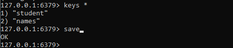
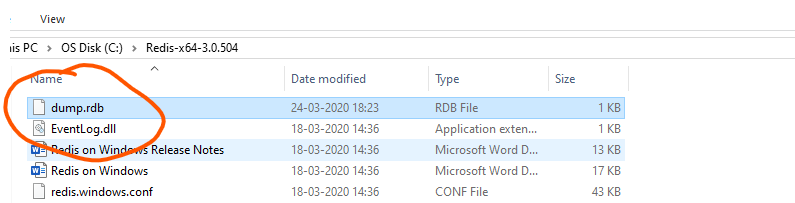
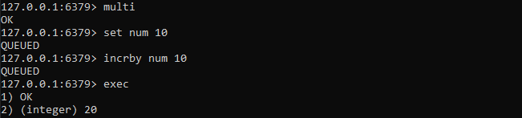
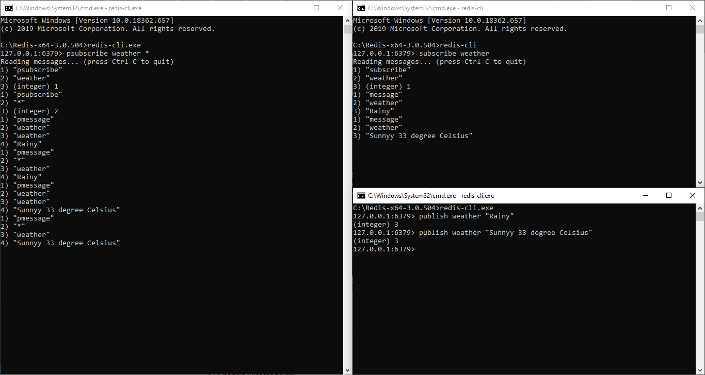

# Redis Advanced

## Redis Persistance(RDB, AOF, Hybrid Approach)

* `RDB` - makes a snapshot of the dataset at specific intervals.

## Redis Backup/Restore

`SAVE`- The SAVE commands performs a synchronous save of the dataset producing a point in time snapshot of all the data inside the Redis instance, in the form of an RDB file.

    save

We can check the backup file in redis directory

## Redis Sentinel 

`Redis Sentinel` is a system designed to help managing Redis instances.
This is the full list of Sentinel capabilities at a macroscopical level (i.e. the big picture):

* Monitoring - Sentinel constantly checks if your master and replica instances are working as expected.
* Notification - Sentinel can notify the system administrator, or other computer programs, via an API, that something is wrong with one of the monitored Redis instances.
* Automatic failover - If a master is not working as expected, Sentinel can start a failover process where a replica is promoted to master, the other additional replicas are reconfigured to use the new master, and the applications using the Redis server are informed about the new address to use when connecting.
* Configuration provider - Sentinel acts as a source of authority for clients service discovery: clients connect to Sentinels in order to ask for the address of the current Redis master responsible for a given service. If a failover occurs, Sentinels will report the new address.

## Redis Sentinel Demo

1. Create a config file for redis-slave
    i. change the port on which the serve need to be start
        port 9680
    ii. Uncomment the replicationof tag
        replicationof 127.0.0.1 6379

2. Start redis-master

    redis-server
3. Start redis-slave

    redis-server redis-slave.conf

4. Open Sentinel conif file 
    i. change the port 

5. Run the sentinel 

## Redis Cluster

`Redis Cluster` is a data sharding with automatic management, failover, and replication.

**Data sharding** is a method to break up a big database(DB) into may smaller parts. It is the process of breaking up a DB across multiple machines to enhance the manageability, availability, performance, and load balancing of an application.

The reason for data sharding is that after a certain scale point, it is cheaper and more attainable to scale horizontally by adding more machines than to grow it vertically by adding beefier servers.

Cluster mode provides similar high-availability to Sentinel mode, but sharding allows more data to be stored in the cluster. Cluster provides scalability to your application.

https://redis.io/topics/cluster-tutorial

## Redis Cluster Demo

1. cd utils
2. cd create-cluster
3. ./create-cluster start
4. ./create-cluster create
5. Go to src folder
6. ./redis-cli -c -p 30001

## Sentinel V/S Cluster

Similarities: Both solutions provide high availability for our system.

Use Sentinel when speed isn't primary concern, which makes it an excellent option for smaller implementation with high implementation with high availability concerns.

Redis cluster provides high availability plus clustering solution, it's an excellent choice to ensure high availability while keeping fast access speed in consideration to access data.

Bottom Line: If weneed an automatic failover solution without going to a full cluster solution, then use sentinel. For getting a complete clustering solution which splits database in between multiple nodes then go for clustering.

## Redis Transaction

`multi` - Marks the start of a transaction block. Subsequent commands will be queued for atomic execution using EXEC.

`exec` - Executes all previously queued commands in a transaction and restores the connection state to normal. When using WATCH, EXEC will execute commands only if the watched keys were not modified, allowing for a check-and-set mechanism.

`discard` - Flushes all previously queued commands in a transaction and restores the connection state to normal. If WATCH was used, DISCARD unwatches all keys watched by the connection.

`watch`- Marks the given keys to be watched for conditional execution of a transaction.

## Redis Phub/Sub

*Publisher and Subscriber*

`PSUBSCRIBE` pattern [pattern ...]
Subscribes the client to the given patterns.

Supported glob-style patterns:

* h?llo subscribes to hello, hallo and hxllo
* h*llo subscribes to hllo and heeeello
* h[ae]llo subscribes to hello and hallo, but not hillo

Use `\` to escape special characters if you want to match them verbatim

`SUBSCRIBE` channel [channel ...]
Subscribes the client to the specified channels.
Once the client enters the subscribed state it is not supposed to issue any other commands, except for additional SUBSCRIBE, PSUBSCRIBE, UNSUBSCRIBE, PUNSUBSCRIBE, PING and QUIT commands.

`PUBLISH` channel message
Posts a message to the given channel.

## Redis Authentication

To secure redis can set password in config file

or 

    config set requirepass aman

    set mykey value1

    auth aman

    set mykey value1

