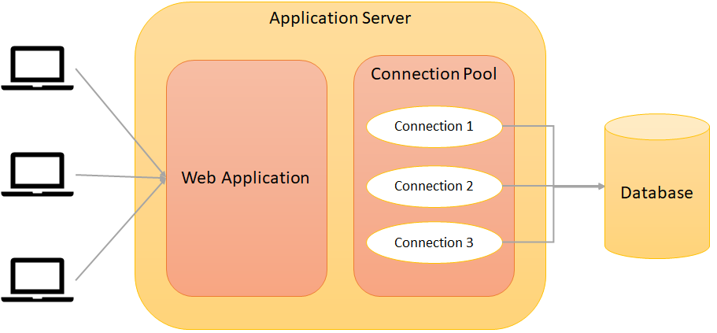

# Jedis and Spring Data Redis

## Introduction- Redis Java Client 

* `Jedis` - A blazingly small and sane redis java client
* `Lettuce` - Advanced Redis client for thread-safe sync, async, and reactive usage. Supports Cluster, Sentinel, Pipelining, and codecs.
## What is Jedis, and Jedis Pooling?

Jedis
* Small, light and extremely fast client library in Java for Redis 
* Supported by Spring Data
* Implementation using Jedis in painless
* Jedis instance is not thread safe.

Jedis Pool
* Jedis Pool Object is thread safe
* Pool is configurable 
* Pool improve performance



## Creating Spring Boot project

1. Create a Spring Boot application from - https://start.spring.io/
2. Add Dependencies - Web, Redis
3. Download the Project and import the project in eclipse
    ```xml
    <dependency>
        <groupId>org.springframework.boot</groupId>
        <artifactId>spring-boot-starter-data-redis</artifactId>
    </dependency>
    <dependency>
        <groupId>org.springframework.boot</groupId>
        <artifactId>spring-boot-starter-web</artifactId>
    </dependency>
    ```


## Redis Template

* Redis Template is crucial class in Spring Data Redis
* Redis Template class provides methods to communicate with a Redis instance

Redis Template Main Operations
* For value Operations use opsForValue(): return redis string (or value) operations\
* For Hash Operations use opsForHash(): return redus Hash operation
* For List Operations use opsForList(): return redus List operation
* For Set Operations use opsForSet(): return redus Set operation
* For Zset Operations use opsForZset(): return redus Zset operation


## Serializers

**Problem**:Data Stored in redis in bytes

**Required**:Convert bytes to String, Json, object, xml and vice versa

**Solution**: Use Serializers

Serializers

* **GeneriaToStringSerializer** : serializers string to bytes and vice versa. Relies on the Spring (@link ConversionService)
* **JacksonJsonRedisSerializer** : convert object to json and vice versa
* **JdkSerializationRedisSerializer** : User the default (Java based) serialization method. (Default Serializer for objects)
* **OxmSerializer** : Uses the Object/Xml mapping
* **StringRedisSerializer** : Convert string into bytes and vice versa using the specified charset(by default UTF-8)(Default Serializer for string values)