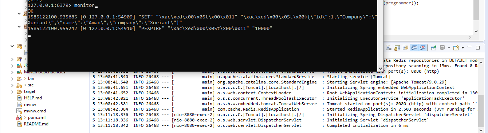
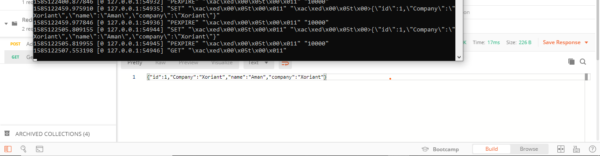
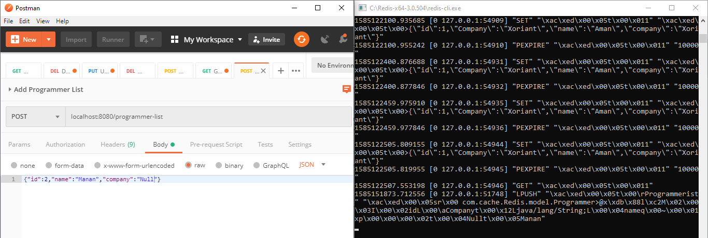
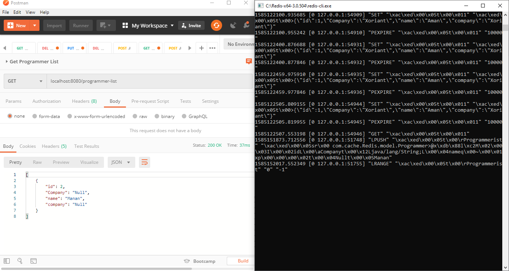
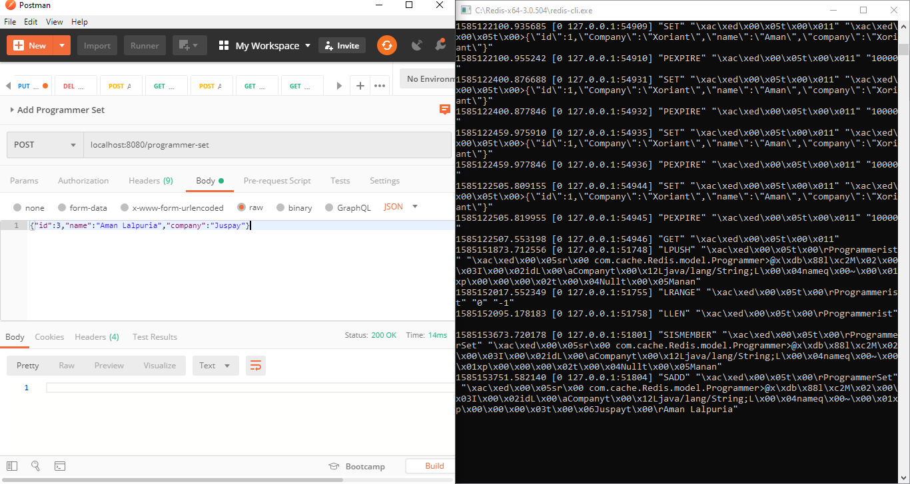
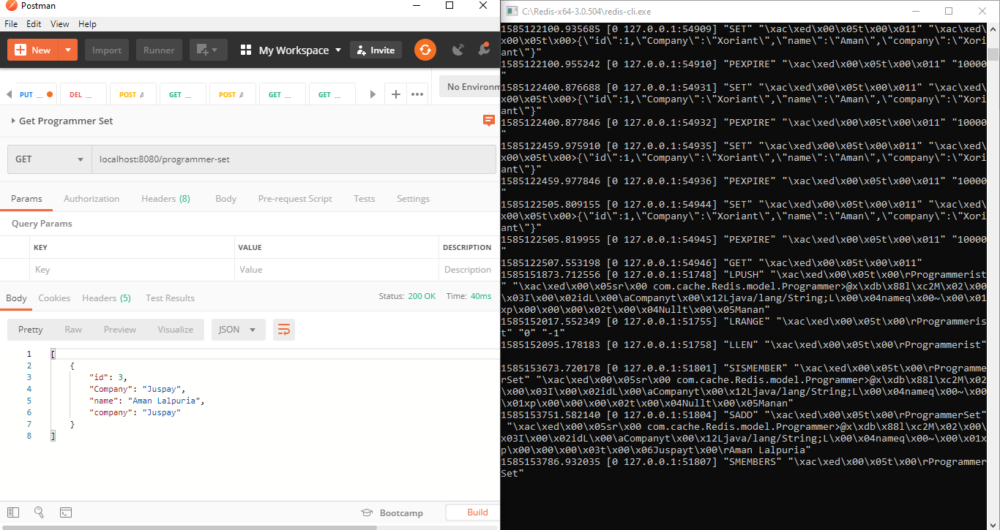
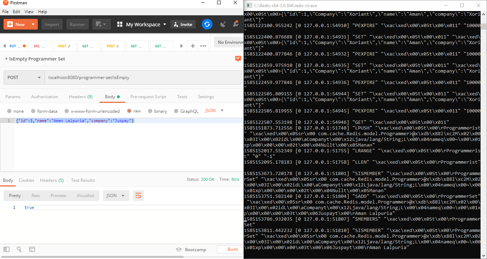

# Building Backend APIs for Redis Database

## Redis Template: Three Coding Steps for Creation Redis Template

Configure Redis Properties
```peoperties
redis.host=localhost
redis.port=6379
redis.password=
redis.jedis.pool.max-total=16
redis.jedis.pool.max-idle=8
redis.jedis.pool.min-idle=4
```

Create JedisClientConfiguration Bean
```java
@Bean
	public JedisClientConfiguration getJedisClientConfiguration() {
		JedisClientConfiguration.JedisPoolingClientConfigurationBuilder JedisPoolingClientConfigurationBuilder = (JedisClientConfiguration.JedisPoolingClientConfigurationBuilder) JedisClientConfiguration
				.builder();
		GenericObjectPoolConfig GenericObjectPoolConfig = new GenericObjectPoolConfig();
		GenericObjectPoolConfig.setMaxTotal(maxTotal);
		GenericObjectPoolConfig.setMaxIdle(maxIdle);
		GenericObjectPoolConfig.setMinIdle(minIdle);
		return JedisPoolingClientConfigurationBuilder.poolConfig(GenericObjectPoolConfig).build();
	}
```

Create JedisConnection

```java
@Bean
	public JedisConnectionFactory getJedisConnectionFactory() {
		RedisStandaloneConfiguration redisStandaloneConfiguration = new RedisStandaloneConfiguration();
		redisStandaloneConfiguration.setHostName(host);
		if(!StringUtils.isEmpty(password)) {
			redisStandaloneConfiguration.setPassword(RedisPassword.of(password));
		}
		redisStandaloneConfiguration.setPort(port);
		return new JedisConnectionFactory(redisStandaloneConfiguration, getJedisClientConfiguration());
	}
```
Define RedisTemplate

```java
@Bean
	public RedisTemplate<String, Object> redisTemplate() {
		RedisTemplate<String,Object> redisTemplate = new RedisTemplate<String,Object>();
		redisTemplate.setConnectionFactory(getJedisConnectionFactory());
		return redisTemplate;
	}
```

## String Impl: Building APIs

```java
@Override
public void setProgrammerAsString(String idKey, String programmer) {
    // TODO Auto-generated method stub
    redisTemplate.opsForValue().set(idKey, programmer);
    redisTemplate.expire(idKey, 10, TimeUnit.SECONDS);
}

@Override
public String getProgrammerAsString(String idKey) {
    // TODO Auto-generated method stub
    return (String) redisTemplate.opsForValue().get(idKey);
}
```

## String Impl: Calling APIs

```java
@PostMapping("/progrmmer-string")
public void addToTopic(@RequestBody Programmer programmer) throws JsonProcessingException{
    ObjectMapper mapper = new ObjectMapper();
    programmerService.setProgrammerAsString(String.valueOf(programmer.getId()), mapper.writeValueAsString(programmer));
}
```

```java	
@GetMapping("/programmer-string/{idKey}")
public String readString(@PathVariable String idKey) {
    return programmerService.getProgrammerAsString(idKey);
}
```


## List Impl: Building and Calling API

1. Configuration
```java
@Bean
@Qualifier("listOperations")
public ListOperations<String, Programmer> listOperations(RedisTemplate<String, Programmer> redisTemplate){
    return redisTemplate.opsForList();
}
```
2. Build API
```java
@Override
public void addToProgrammerList(Programmer programmer) {
    ListOps.leftPush(REDIS_LIST_KEY, programmer);
    
}

@Override
public List<Programmer> getProgrammerListMembers() {
    return (List<Programmer>) ListOps.range(REDIS_LIST_KEY, 0, -1);
}

@Override
public Long getProgrmmerListCount() {
    return ListOps.size(REDIS_LIST_KEY);
}
```

3. Calling API
```java
@PostMapping("/programmer-list")
public void addToProgrammerList(@RequestBody Programmer programmer){
    programmerService.addToProgrammerList(programmer);
}
```

```java
@GetMapping("/programmer-list")
public List<Programmer> getProgrammerListMembers() {
    return programmerService.getProgrammerListMembers();
}
```

```java
@GetMapping("/programmer-list/count")
public Long getProgrmmerListCount() {
    return programmerService.getProgrmmerListCount();
}
```
## Set Impl: Building and Calling API

1. Configuration
```java
@Bean
@Qualifier("setOperations")
public SetOperations<String, Programmer> setOperations(RedisTemplate<String, Programmer> redisTemplate){
    return redisTemplate.opsForSet();
}
```
2. Build API
```java
@Override
public void addToProgrammerSet(Programmer... programmer) {
    redisTemplate.opsForSet().add(REDIS_SET_KEY, programmer);
}

@Override
public Set<Programmer> getProgrammerSetMembers() {
    // TODO Auto-generated method stub
    return (Set)redisTemplate.opsForSet().members(REDIS_SET_KEY);
}

@Override
public boolean isSerMember(Programmer programmer) {
    // TODO Auto-generated method stub
    return redisTemplate.opsForSet().isMember(REDIS_SET_KEY, programmer);
}
```

3. Calling API
```java
@PostMapping("/programmer-set")
public void addToProgrammerSet(@RequestBody Programmer programmer){
    programmerService.addToProgrammerSet(programmer);
}
```

```java
@GetMapping("/programmer-set")
public Set<Programmer> getProgrammerSetMembers() {
    return programmerService.getProgrammerSetMembers();
}
```

```java
@PostMapping("/programmer-set/isEmpty")
public boolean isSerMember(@RequestBody Programmer programmer) {
    return programmerService.isSerMember(programmer);
}
```

