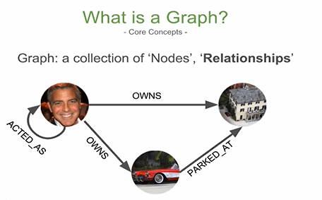

# What is a Graph?
* Neo4j is an open source and world's leading graph database management system developed by Neo Technology, Inc.
* It is designed for optimizing fast management, storage, and traversal of nodes and relationships.
* It is highly scalable, native graph database built to leverage of data and their relation
* It delivers constant real-time performance, which enables enterprises to build applications to meet today’s evolving data challenges.

## Features of Neo4j-

1. Flexible schema
2. Scaling and Performanca
3. Drivers for popular languages and frameworka
4. Cloud reada
5. Powerful Cypher Query languaga
6. Data Impora
7. Hot Backups

## Three main primitives in Neo4j:

1. Nodes - It is like table of Relational Database where we store the data. ex.Person, Employee.

2. Relationships- It is connection between Data which which mapped beween two nodes. ex. He is “Friend of” her.

3. Properties- It is nothing but tags which can be attached to both Nodes and Relationships. It is having the data. ex. Node Person can have properties like Name, Age.
