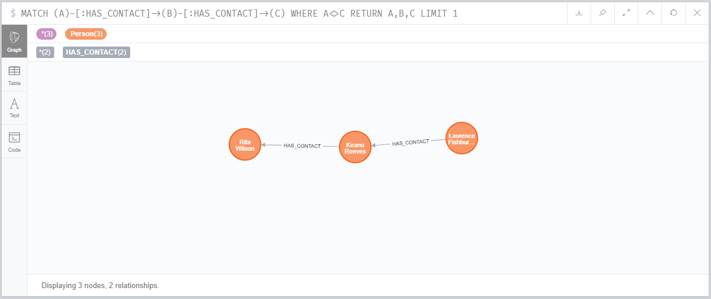
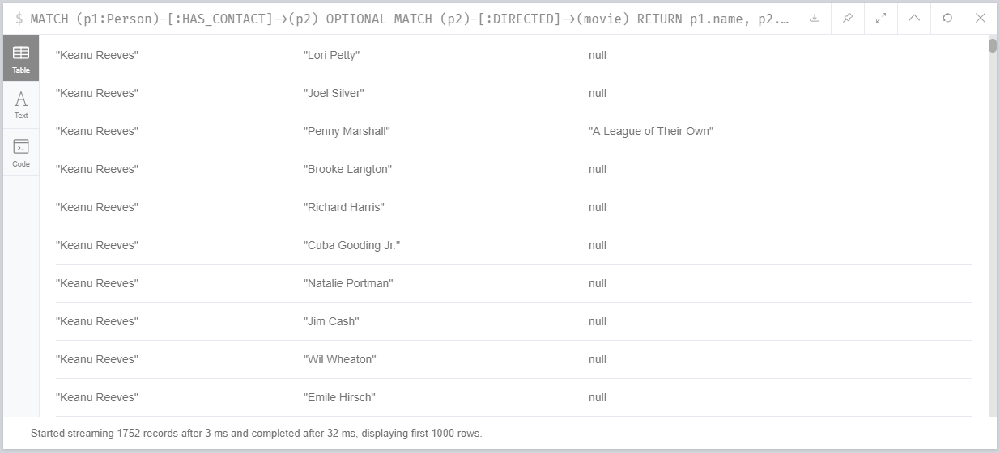

# Exercise

##  Exercise #1 *Contacts of Contacts*

If person A has a contact B, and B has a contact C, then return the name for A, B, C.
Limit the result to a single result.

```
MATCH (A)-[:HAS_CONTACT]->(B)-[:HAS_CONTACT]->(C)
WHERE A<>C
RETURN A,B,C
LIMIT 1
```

* *WHERE* - is for the condition where A and C should not be same.



## Exercise #2 *Movies that contacts directed*

List a contact's name, along with a movie they directed if they directed one

```
MATCH (p1:Person)-[:HAS_CONTACT]->(p2)
OPTIONAL MATCH (p2)-[:DIRECTED]->(movie)
RETURN p1.name, p2.name, movie.title
```

