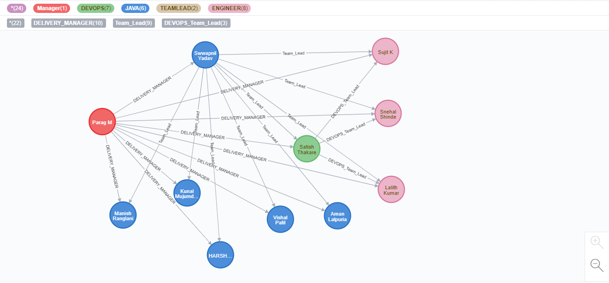
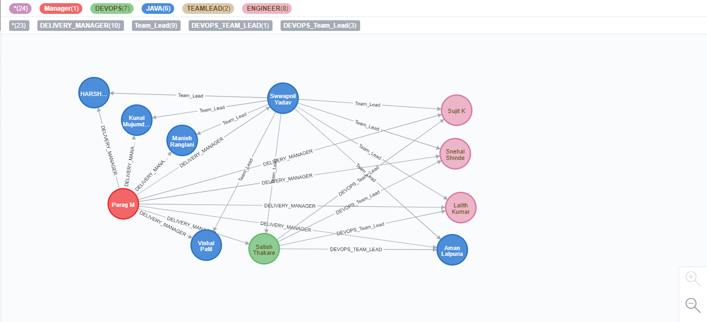

# Create

## 1. Nodes

```sql
CREATE (PARAG:Manager{name:'Parag M',Position:'Delivery Manager',Experience:'20'}),(SWWAPNIL:TEAMLEAD:JAVA:DEVOPS{name:'Swwapnil Yadav',Position:'Team Lead',Experience:'12'}),
(SATISH:TEAMLEAD:DEVOPS{name:'Satish Thakare',Position:'Team Lead DEVOPS',Experience:'10'}),(SUJIT:DEVOPS:ENGINEER{name:'Sujit K',Position:'Senior Software Engineer',Experience:'6'}),
(SNEHAL:DEVOPS:ENGINEER{name:'Snehal Shinde',Position:'Software Engineer',Experience:'6'}),
(LALITH:DEVOPS:ENGINEER{name:'Lalith Kumar',Position:'Software Engineer',Experience:'5'}),
(MANISH:JAVA:ENGINEER{name:'Manish Ranglani',Position:'Senior Software Engineer',Experience:'5'}),
(KUNAL:JAVA:ENGINEER{name:'Kunal Mujumdar',Position:'Software Engineer',Experience:'4'}),
(HARSHALI:JAVA:ENGINEER{name:'HARSHALI W.',Position:'Software Engineer',Experience:'4'}),
(VISHAL:DEVOPS:JAVA:ENGINEER{name:'Vishal Patil',Position:'Software Engineer',Experience:'2'}),
(AMAN:DEVOPS:JAVA:ENGINEER{name:'Aman Lalpuria',Position:'Associate Software Engineer',Experience:'1'})
```
## 2. Relationships

```
CREATE (PARAG)-[:DELIVERY_MANAGER]->(SWWAPNIL),(PARAG)-[:DELIVERY_MANAGER]->(SATISH),
(PARAG)-[:DELIVERY_MANAGER]->(SUJIT),
(PARAG)-[:DELIVERY_MANAGER]->(SNEHAL),
(PARAG)-[:DELIVERY_MANAGER]->(LALITH),
(PARAG)-[:DELIVERY_MANAGER]->(MANISH),
(PARAG)-[:DELIVERY_MANAGER]->(KUNAL),
(PARAG)-[:DELIVERY_MANAGER]->(HARSHALI),
(PARAG)-[:DELIVERY_MANAGER]->(VISHAL),
(PARAG)-[:DELIVERY_MANAGER]->(AMAN),
(SWWAPNIL)-[:Team_Lead]->(SATISH),
(SWWAPNIL)-[:Team_Lead]->(SUJIT),
(SWWAPNIL)-[:Team_Lead]->(SNEHAL),
(SWWAPNIL)-[:Team_Lead]->(LALITH),
(SWWAPNIL)-[:Team_Lead]->(MANISH),
(SWWAPNIL)-[:Team_Lead]->(KUNAL),
(SWWAPNIL)-[:Team_Lead]->(HARSHALI),
(SWWAPNIL)-[:Team_Lead]->(VISHAL),
(SWWAPNIL)-[:Team_Lead]->(AMAN),
(SATISH)-[:DEVOPS_Team_Lead]->(SUJIT),
(SATISH)-[:DEVOPS_Team_Lead]->(SNEHAL),
(SATISH)-[:DEVOPS_Team_Lead]->(LALITH)
```



## 3. Adding to existing data

```
MATCH (SATISH:TEAMLEAD:DEVOPS{name:'Satish Thakare',Position:'Team Lead DEVOPS',Experience:'10'}),(AMAN:DEVOPS:JAVA:ENGINEER{name:'Aman Lalpuria',Position:'Associate Software Engineer',Experience:'1'})
CREATE (SATISH)-[:DEVOPS_TEAM_LEAD]->(AMAN)
```

