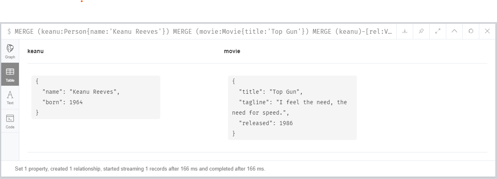
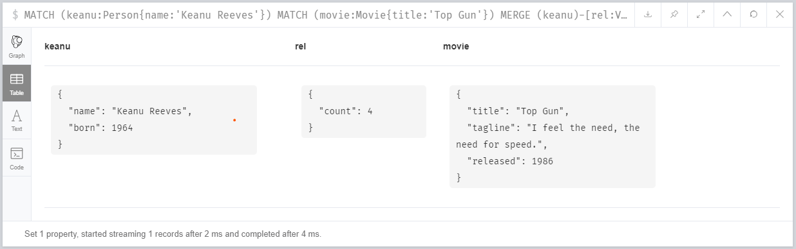

# Exercise

## Track Movie Viewings

Create a query to be run every time Keanu Reeves watches Top Gun 

The query should ensure a VIEWED relationship exists between Keanu and Top Gun, and should keep track of how many times Keanu has watched it

```
MERGE (keanu:Person{name:'Keanu Reeves'})
MERGE (movie:Movie{title:'Top Gun'})
MERGE (keanu)-[rel:VIEWED]->(movie)
ON CREATE SET rel.count=1
ON MATCH SET rel.count=rel.count+1
RETURN keanu, rel, movie
```



To check the count

```
MATCH (keanu:Person{name:'Keanu Reeves'})
MATCH (movie:Movie{title:'Top Gun'})
MERGE (keanu)-[rel:VIEWED]->(movie)
ON CREATE SET rel.count=1
ON MATCH SET rel.count=rel.count+1
RETURN keanu, rel, movie
```
