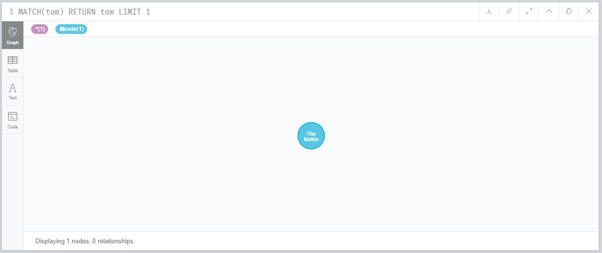
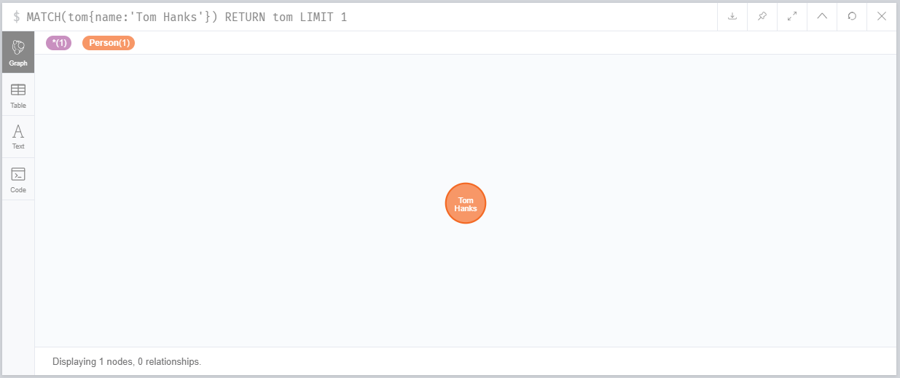
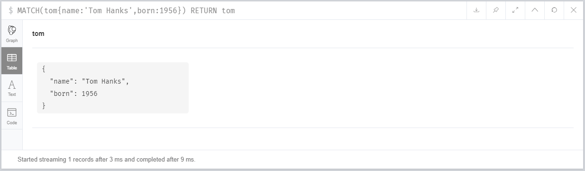
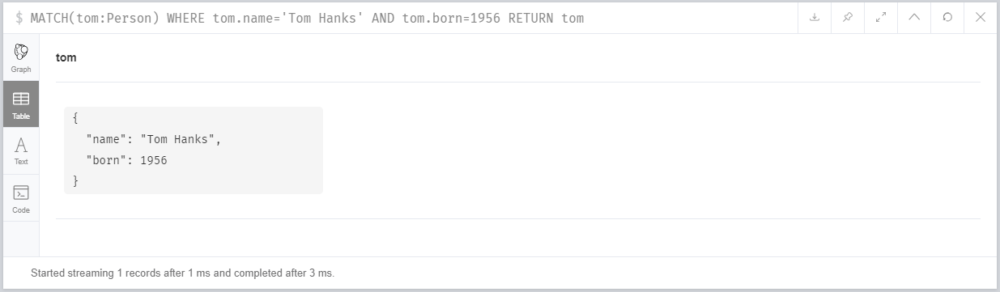
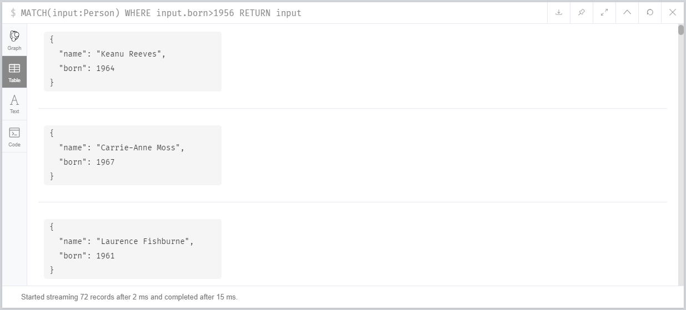
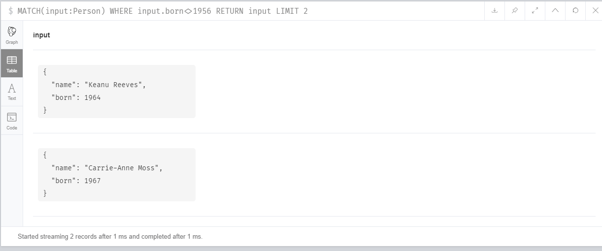
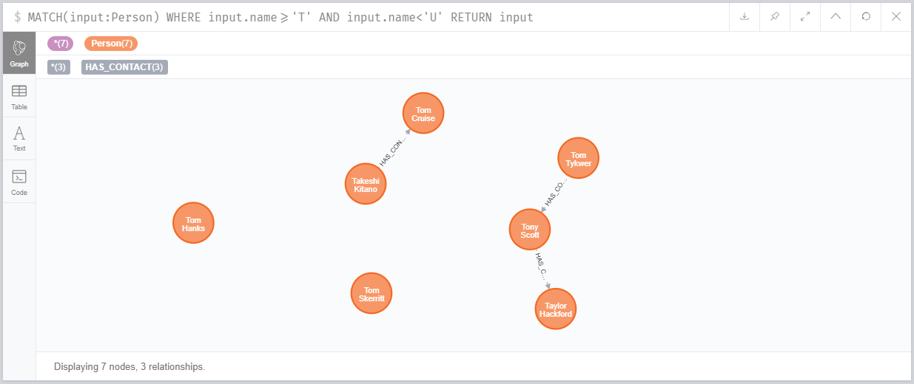
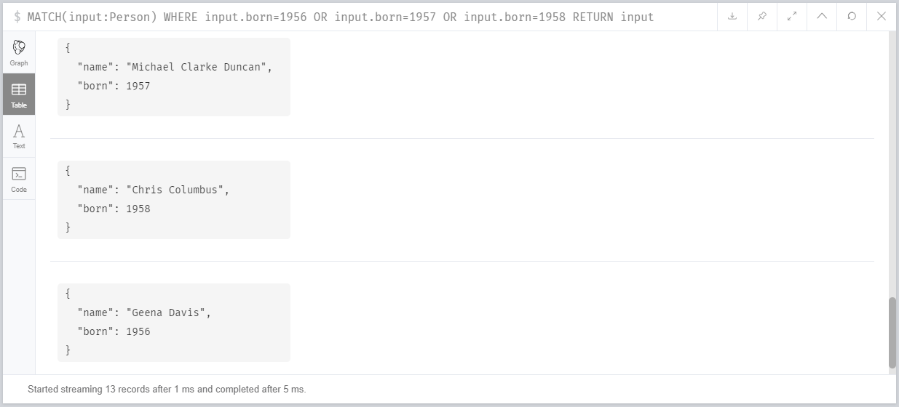

# Querying basics - Filtering, Transforming

## Filter by Properties

If we wants to search a node with the name :

```
MATCH(tom)
RETURN tom
LIMIT 1
```

tom is the node name from which we are searching



If we want to search using the property of the node :
```
MATCH(tom{name:'Tom Hanks'})
RETURN tom
LIMIT 1
```



Filtering using multiple properties
```
MATCH(tom{name:'Tom Hanks',born:1956})
RETURN tom
```



## WHERE Clause

`MATCH` is often coupled to a `WHERE` part which adds restrictions, or predicates, to the MATCH patterns, making them more specific

```
MATCH(tom:Person)
WHERE tom.name='Tom Hanks' AND tom.born=1956
RETURN tom
```



## Comparisson Operators

`=` - Equal to Operator

```
MATCH(tom:Person)
WHERE tom.name='Tom Hanks' AND tom.born=1956
RETURN tom
```


`>` - Greater than Operator

```
MATCH(input:Person)
WHERE input.born>1956
RETURN input
```



`<>` - NOT operator

```
MATCH(input:Person)
WHERE input.born<>1956
RETURN input
LIMIT 2
```



To check the name's which are going to start with `T`
```
MATCH(input:Person)
WHERE input.name>='T' AND input.name<'U'
RETURN input
```


## Boolean Operators

`AND`
```
MATCH(input:Person)
WHERE input.name>='T' AND input.name<'U'
RETURN input
```


`OR`
```
MATCH(input:Person)
WHERE input.born=1956 OR input.born=1957 OR input.born=1958
RETURN input
```


`IN`
```
MATCH(input:Person)
WHERE input.born IN [1956,1957,1958]
RETURN input
```


`NOT`
```
MATCH(input:Person)
WHERE NOT (input.born>=1956 AND input.born<1970)
RETURN input
```


```
MATCH (person:Person)-->(movie:Movie)
WHERE movie.title='Unforgiven' AND NOT (person)-[:DIRECTED]->(movie)
RETURN person, movie
```


## String Regex Expression

```
MATCH (movie:Movie)
WHERE movie.title=~'The.*'
RETURN movie.title
```

To find the movie title start with `The` and followed by something


```
MATCH (movie:Movie)
WHERE movie.title=~'.*The.*'
RETURN movie.title
```
In the above query we will get the movie title which contain the string start with `The`, its case sensitive


```
MATCH (movie:Movie)
WHERE movie.title=~'(?i).*The.*'
RETURN movie.title
```

To make the search case insensitive add `(?i)`


```
MATCH (movie:Movie)
WHERE movie.title=~'(?i).+The.*'
RETURN movie.title
```

`.+` to map the string anywhere in the between 


## Transform Results(ORDER BY, LIMIT, SKIP, AS)

```
MATCH (actor:Person)-[role:ACTED_IN]->(movie:Movie)
WHERE movie.title='Top Gun'
RETURN actor.name, role.earnings
ORDER BY role.earnings
```

`ORDER BY` - to arrange the output in ascending order


```
MATCH (actor:Person)-[role:ACTED_IN]->(movie:Movie)
WHERE movie.title='Top Gun'
RETURN actor.name, role.earnings
ORDER BY role.earnings DESC
```

`DESC` - to arrange the order in descending order


```
MATCH (actor:Person)-[role:ACTED_IN]->(movie:Movie)
WHERE movie.title='Top Gun'
RETURN actor.name, role.earnings
ORDER BY role.earnings DESC
LIMIT 3
```

`LIMIT` - to get the top 3 result


```
MATCH (actor:Person)-[role:ACTED_IN]->(movie:Movie)
WHERE movie.title='Top Gun'
RETURN actor.name, role.earnings
ORDER BY role.earnings DESC
SKIP 3
LIMIT 3
```

`SKIP` - to skip the first 3 result


```
MATCH (actor:Person)-[role:ACTED_IN]->(movie:Movie)
WHERE movie.title='Top Gun'
RETURN actor.name AS NAme, role.earnings AS Earned
ORDER BY role.earnings DESC
SKIP 3
LIMIT 3
```

`AS` - to name the field which you want to show as output


