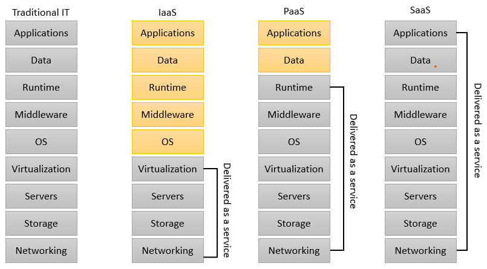
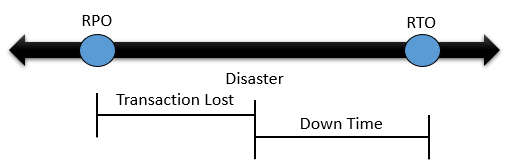
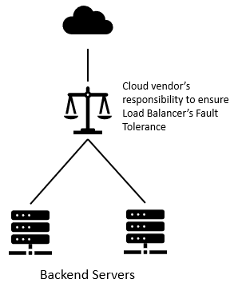

# Getting Started with OCI

## Introduction

Exam Topics
1. Cloud Concepts
    - Understanding of basic cloud concepts and its principles of economics
2. Getting Started with OCI
    - Describe the key features and components of OCI
    - Describe Core Solution on OCI
3. Core OCI Services
    - Discuss Core OCI services
    - Discuss Cloud Native services
4.  Security and Compliance
    - Explain the OCI Security model
    - Describe the OCI compliance structure
5. OCI pricing, support and operations
    - Explain the OCI pricing model
    - Explain the OCI operational and support model

## Cloud Concepts

**Cloud Computing**

`On-demand self-service`
Provision computing capabilities as needed automatically without requiring human interaction with service provider

`Broad network access`
Capabilities are available over the network and accessed through standard mechanisms

`Resource pooling`
The provider's computing resources are pooled to serve multiple consumers using a multi-tenant model, with different resources dynamically assigned and reassigned according to demand

`Rapid Elasticity`
Capabilities can be elastically provisioned and released, in some cases automatically, to scale rapidly outward and inward with demand.

`Measured Service`
Resource usage can be monitored, controlled, and reported, providing transparency for both the provider and consumer of the utilized service

### Service Models

- **IaaS**: cloud-based services, pay-as-you-go for services such as storage, networking, and virtualization.
*IaaS examples*: AWS EC2, Rackspace, Google Compute Engine (GCE), Digital Ocean, Magento 1 Enterprise Edition*.
- **PaaS**: hardware and software tools available over the internet.
*PaaS examples*: AWS Elastic Beanstalk, Heroku, Windows Azure (mostly used as PaaS), Force.com, OpenShift, Apache Stratos, Magento Commerce Cloud.
- **SaaS**: software that’s available via a third-party over the internet.
*SaaS examples*: BigCommerce, Google Apps, Salesforce, Dropbox, MailChimp, ZenDesk, DocuSign, Slack, Hubspot.

**High Availability**
- Computing environment configured to provide nearly full-time availability are known as high availability systems
- Such systems typically have redundant hardware and software that makes the system available despite failures
- Well designed high availability systems avoid having single points-of-failure
- When failures occur, the failover process moves processing performed by the failed component to the backup component. The more transparent that failover is to users, the higher the availability of the system.

**Disaster Recovery**
- Disaster recovery (DR) involves a set of policies, tools and procedures to enable the recovery or continuation of vital technology infrastructure and systems.
- Disaster recovery should indicate the key metrics of recovery point objective(RPO) and recovery time objective(RTO)

    

### Cloud Terminology

**Fault Tolerance**
- Describes how a cloud vendor will ensure minimal downtime for services provided

    
**Scalability**
- refer to scaling out(or in) or scaling up(or down)
- scaling out(or in) is called horizontal scaling
- scaling up(or out) is called vertical scaling

**Elasticity**
- is the ability to quickly increase or decrease resources.

### CAPEX v/s OPEX

**CAPEX**
- Capital expenditure or capital expense(CAPEX) is the money an organiztion or corporate entity spends to buy, maintain, or improve its fixed assets, such as buildings, vehicles, equipment, or land

**OPEX**
- Operational expenditure or OPEX is an ongoing cost for running a product, business, or system

Cloud lets you trade CAPEX for OPEX
Instead of having to invest heavily in data centers and infrastructure in the cloud, you can `pay only when you consume resources`, and `pay only for how much you consume`

## OCI Architecture

- `Region` Localized geographic area, comprised of one or more Availability Domain

- `Availability Domain (AD)` One or more fault-tolerant, isolated data centers located within a region, but connected to each other by a low latency, high bandwidth

- `Fault Domains (FD)` Grouping of hardware and infrastructure within an Availability Domain to provide anti-affinity (logical data center)

**One AD Region**
- OCI has chosen to launch region in new geographic with one AD(to increase our global reach quickly)
- For any region with one AD, a second AD or region in the same country or geo-political area will be made available within a year to enable further options for DR and data residency

**Choosing a region**
- `Location` choose a region closet to your users for lowest latency a highest performance!
- `Data Residency & Compliance` many countries have strict data residency requirements
- `Service Availability` New cloud services are made available based on regional demand, regulatory compliance, resource availability, and other factors

**Availability Domains**
- Availability domains are **isolated from each other**, fault tolerant , and very unlikely to fail simultaneously.
- Because availability domains **do not share physical infrastructure, such as power or cooling or the internal availability domain network**, a failure that impact one AD is unlikely to impact the availability of the others

**Fault Domains**
- In any region, resource in at most ONE fault domain are being actively changed at any point in time. This means that availability problems caused by change procedures are isolated at the fault domain level
- You can control the placement of your compute or database instance to fault domains at instance 'launch' time

**Avoid single points of failure**

Design your architecture to deploy instances that perform the same tasks
- In different Fault Domains(in one AD regions)
- In different Availability Domains for multiple AD regions

### Compartment

- A compartment is a collection of related resources. It help you isolate and control access to your resources.
- Each belong to a single compartment
- Resources can interact with other resources in different compartments
- Resources and compartments can be added and deleted anytime
- Resources can be moved from one compartment to another
- Resources from multiple region can be in same compartment
- Compartment can be nested(six level deep)
- You can give group of users access to compartments by writing Policies
- Analyze cost and assign budget for resource in compartments