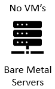
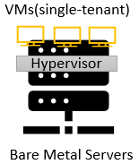
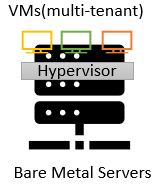

# Core OCI Services

## OCI Compute Services

**Bare Metal**
- Direct Hardware Access customers get the full bare metal server (single-tenant server)
- Physical server without any virtualization
- Code 
- App Container
- Language Runtime
- Operating System

    

*Use Case*
- Direct Hardware  Access with al the Security, Capabilities, Elasticity and Scalability of OCI
- Workloads that are performance-intensive
- Workloads that are not virtualized 
- Workloads that require a specific hypervisor
- Workloads that require BYO Licensing

**Dedicated Virtual Host**
- Has Vitalization
- Code
- App Container
- Language Runtime
- Operating System

    

**Virtual Machines**
- Code
- App Container
- Language Runtime
- Operating System

    

*Use Cases*
- Use VMs when you want to control all aspects of an environment
- Use VMs when you want to deploy a legacy app running on Windows or Linux
- You can use VMs to move applications from on-premises to Oracle Cloud Infrastructure
- VMs require work-OS patch management, security configuration, monitoring application configuration and scaling to handle variable traffic.

**Container Engine**
- Code
- App Container

**Functions**
- Code
- Pay for what you consume

## OCI Storage Services

## OCI Network Services

## OCI IAM

## OCI Database Services

