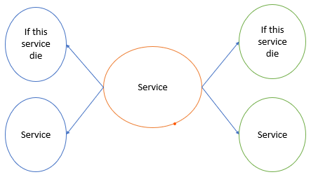

# Overview of Kubernetes and Openshift

## Limitation of Containers

As the number of containers managed by an organization grows, the work of manually starting them rises exponentially along with the need to quickly respond to external demands.

## Enterprises need:
Easy communication between large number of services.
Resource limit on application regardless of the number of containers running them
To respond to application usage spikes to increase or decrease running containers
To react to service deterioration with health check
Gradual roll out of a new release to a set of users

## Kubernetes 
- Orchestrates and schedules containers for high availability
- If container fails, Kubernetes will automatically create another container.
- Three challenges of a container cluster architecture:
    - Orchestration
    - Scheduling
    - Isolation

`Orchestration` is the traditional way of handling interactions between different services in Service-Oriented Architecture (SOA).

`Scheduling` watches for newly created Pods that have no Node assigned. For every Pod that the scheduler discovers, the scheduler becomes responsible for finding the best Node for that Pod to run on.

## Kubernetes Features

- Service discovery and load balancing 
- Horizontal Scaling
- Self-healing withe user defined health check
- Automated rollout and rollback
- Secrets and configuration management
- Operators

## Red Hat OpenShift Container Platform (RHOCP) 
Red Hat OpenShift Container Platform (RHOCP) is a set of modular components an services built on top of a Kubernetes container infrastructure.

RHOCP adds the capabilities to provide a production PaaS platform such a remote management, multitenancy, increased security, monitoring and auditing, application life-cycle management, and self-service interfaces for developers.

- Integrated developer workflow
- Routes
- Metrics and logging
- Unified UI

