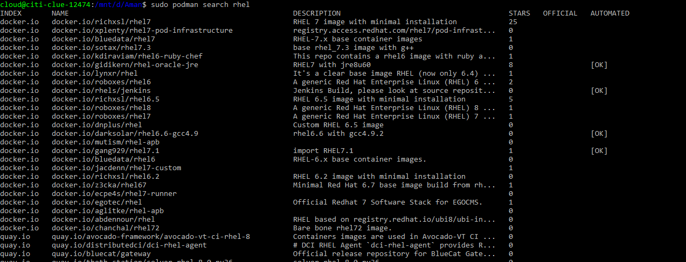
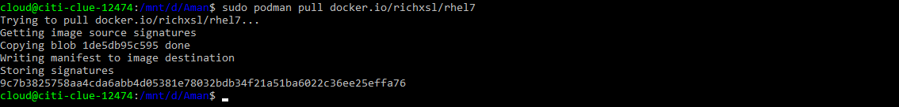
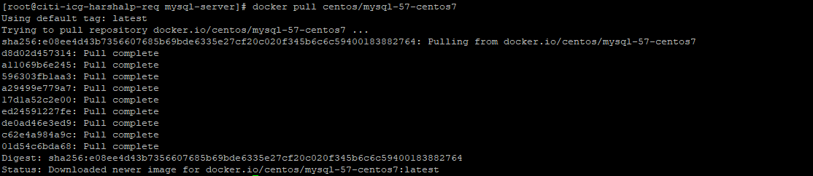
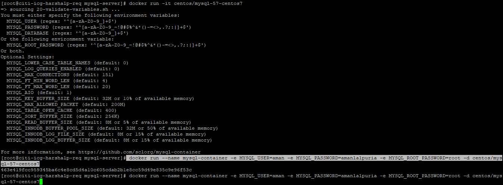
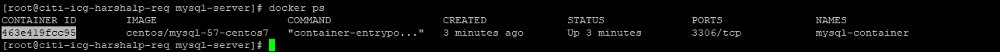
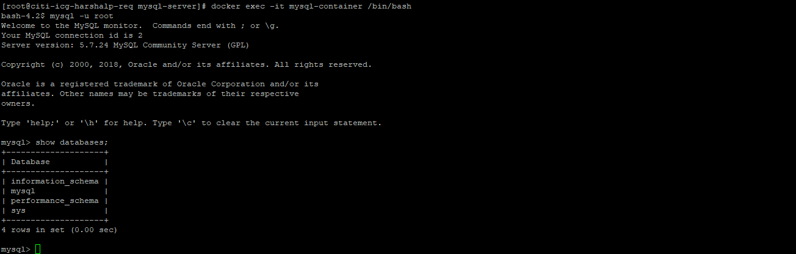

# Provisioning a Containerized Database Server

## Fetching Container Image

Running an application inside a container requires a container image, a file system bundle providing all application files, libraries, and dependencies the application need to run.
 
Container image can be found in image registries.

## Podman

To install Podman in `Centos`

    yum -y install podman

To search the image 

    podman search rhel

Container Image Name Syntax

Container images are named based on the following syntax:

    registry_name/user_name/image_name:tag

To pull the image 

    podman pull {image_name}

Running Container

The **podman run** command runs a container locally based on an image

    podman run docker.io/richxsl/rhel7 echo "Hello World"

The container image specifies a process that starts inside the container known as the entry point. The **podman run** command uses all parameters after the image name as the entry point command for the container.

- For MySQL image it can be - **podman run mysql_image mysqld --console**
- For a Jar image - **podman run jar_image java -jar jar_name.jar**

Use the *-d* option to run the process in the background

For starting redis server - **podman run redis_image -d src/redis-server**

`--name` **Container Name** allows you to specify a specific unique name for a container. If not provided, a name is automatically generated.

    sudo podman rum --name mysql-custom

`-t` **Pseudo Terminal** Create a pseudo terminal

`-i` **Interactive** Keeps STDIN open even if not attached

**Example**

    sudo podman run -it rhel7:75 /bin/bash

This will start the rhel the bash shell in the container

How do we get information into a container?

    sudo podman rum --name mysql-custom -e MYSQL_USER=root -e MYSQL_PASSWORD=root -d mysql_image:5.5

`-e` **Environment Variable** helps to pass the environment variable in the container

## Creating a MySQL Container Instance

1. Pull a docker image

        docker pull image_name

    

2. To start the docker container for the mysql server

        docker run --name mysql-container -e MYSQL_USER=aman -e MYSQL_PASSWORD=amanlalpuria -e MYSQL_ROOT_PASSWORD=root -d centos/mysql-57-centos7

    

3. To check if container is running 

        docker ps

    

4. To go inside the container

        docker exec -it mysql-container /bin/bash

    