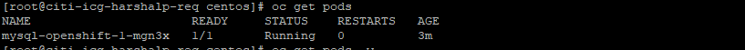

# Creating Basic Kubernetes and OpenShift Resource

## Kubernetes Architecture

- The smallest unit manageable in Kubernetes is a pod.
- A pod consist of one or more containers with its storage resources and IP
- A `Master node` provides basic cluster services such as APIs and controllers.
- A `Worker node` performs work in Kubernetes cluster. Application pods are scheduled onto worker nodes.
- A `Controller` is a kubernetes process that watches resources and make changes based in the state.

`Services `
Defines a single persistent IP/port combination that provides access to a pool of pods

`Replication Controller`
A Kubernetes resource that defines how pods are replicated(horizontally scaled) into different nodes. Replication controller are a basic Kubernetes service to provide high availability for pods and container.

`Persistent Volumes`
Define storage areas to be used by Kubernetes pods.

`Persistent Volume Claims`
Represent a request for storage by a pod. PVCs link a PV to a pod so its containers can make use of it.

`ConfigMaps and Secrets`
Contains a set of keys and values that can be used by other resources.

`Deployment Config (dc)`
Represents the set of containers included in a pod, and the deployment strategies to be used. A dc also provides a basic but extensible continuos delivery workflow.

`Build Config (bc)`
Defines a process to be executed in the OpenShift project. Used by the OpenShift Source-to-Image(S2I) feature to build a container image from application source code stored in a Git repository.

`Routes`
Represent a DNS host name recognized by the OpenShift router as an image point for applications and microservices.

<!--  -->

## What's new in OpenShift 4?

`CoreOS`
OpenShift Container Platform 4 uses Red Hat Enterprise Linux CoreOS, a container-oriented operating system. This OS is specifically designed to run containerized applications from OpenShift and provide simpler installation.

**Installation and Updates**

Installation of OCP 4.1 is as simple as running a single command. Updates are simple and automatic.

**Operators**

A convenient way to deploy application and software component for your application to use that leverage the container platform.

**The `oc` Utility**

The main method of interacting with the RHOCP cluster is using the oc command.

- `oc login <clusterURL>` Before interacting with a cluster, most operations require a logged-in user
- `oc new-app` is a powerful command that can create and run a containerized application based  on an image, a Git repository, or both
- `oc get` command allows user to get information about different OpenShift resources.
- `oc get pods` returns all the running pods
- `oc get all` print out the summary of resource type
- `oc describe` provides additional information about a particular resource.
- `oc export` will export a resource into a YAML definition file 
- `oc delete` remove a resource from the OCP cluster
- `oc exec` allows user to execute commands inside a container

OpenShift Deployment

1. Create a new Project

        oc new-project mysql-openshift

    

2. Create a new app

        oc new-app --docker-image=centos/mysql-57-centos7 --name=mysql-openshift -e MYSQL_USER=aman -e MYSQL_PASSWORD=amanlalpuria -e MYSQL_DATABASE=testdb -e MYSQL_ROOT_PASSWORD=root --insecure-registry=true

    

3. Check the pod details

        oc get pods
    
    

4. To check the service

        oc get svc
    
    

5. Create a route

        oc expose service mysql-openshift
    
    To check the route

        oc get route
    
    
