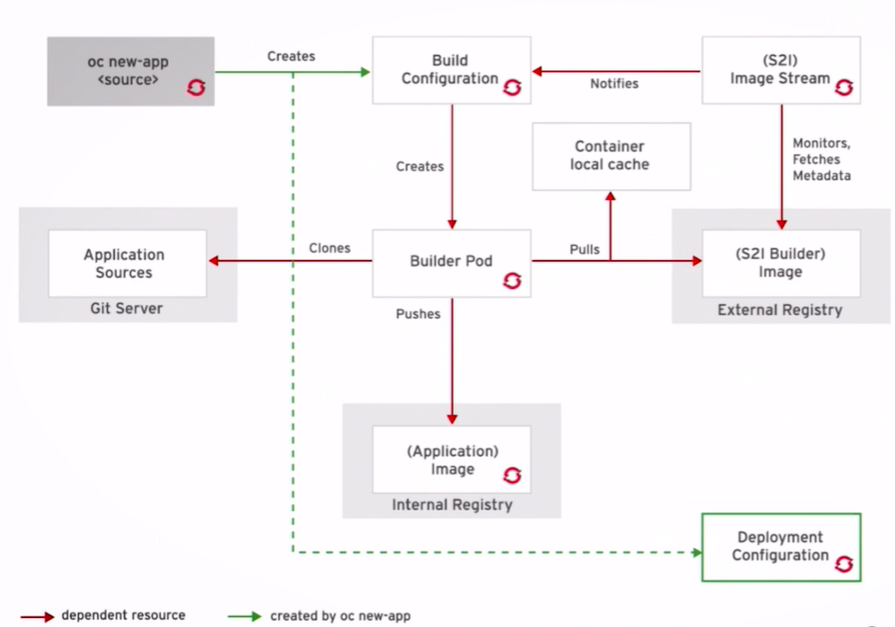

# Creating Applications with the Source-to-Image Facility

**User efficiency**

Developers do not need to understand Dockerfile and operating system commands such as yum install. They work using their standard programming language tools.

**Patching**

S2I allows for rebuilding all the applications consistently if a base image needs a patch due to a security issue.

**Speed**

With S2I, the assembly process can perform a large number of complex operations without creating a new layer at each step, resulting in faster builds.

**Ecosystem**

S2I encourages a shared ecosystem of images where base images and scripts can be customized and reused multiple types of applications.

## Image Stream

An Image Stream is a resource that defines related container images by tag. For example, a MySQL image stream containing a list of MySQL container image version.

OpenShift can be configured to "watch" an image stream and automatically perform an action when new image are created, such as triggering a new build when an updated parent image is available.

A source-to-image build is started by using the **oc new-app** command:

    oc new-app php~http://services.lab.example.com/app --name=myapp

**Building an Application with Source-to-Image with oc**

If no image stream is provided, OpenShift will attempt to identify the correct image stream for building the application.

- The JavaEE image stream is used if a pom.xml file is in the project source code.
- The Python image stream is used if a requirements.txt file exists.
- The build config pod is responsible for creating the images in OpenShift and pushing them to the internal Docker registry
- The deployment config is responsible for deploying into OpenShift.
- The Build/Deployment config resources do not interact directly
- The BuildConfig creates or updates a container image, the Deployment Config reacts to this new images or update image event and creates pods from the image.

