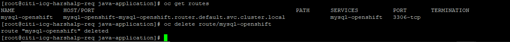

# Creating Routes

## Working with Routes

While services allow for network access between pods inside an OCP instance, routes allow for network access to pods from users and applications outside the OCP instance.

A route connects a public facing IP address and DNS hostname to an internal facing IP address provided by a service.

Routes are implemented by a shared router service that run as pods inside the OCP instance and can be scaled and replicated like any other pod.

## Sample Route

```json
{
    "apiVersion":"v1",
    "kind":"Route",
    "metadata":{
        "name":"quoteapp"
    },
    "spec":{
        "host":"quoteapp.apps.example.com"
        "to":{
            "kind":"Service"
            "name":"quoteapp"
        }
    }
}
```

## Creating Routes

- Use the `oc create` command to create route resources. (and just pass the json)
- The `oc new-app` command does not create a route when building a pod from container images, Dockerfile, or application source code.
- Another way to create a route is to use the oc expose service command, passing a service resource name as the input.
-The **--name** option can be used to control the name of the route resource

        oc expose service quotedb --name quoteapp
- By default, routes created by oc expose generate DNS names of the form:

        route-name-project-name.default-domain 


## Demonstration

To expose route for the service

    oc expose service mysql-openshift


To get detail information about routes

    oc describe route mysql-openshift


To delete the route

    oc delete route/mysql-openshift



To name the route

    oc expose svc/mysql-openshift --name=mysql-route

