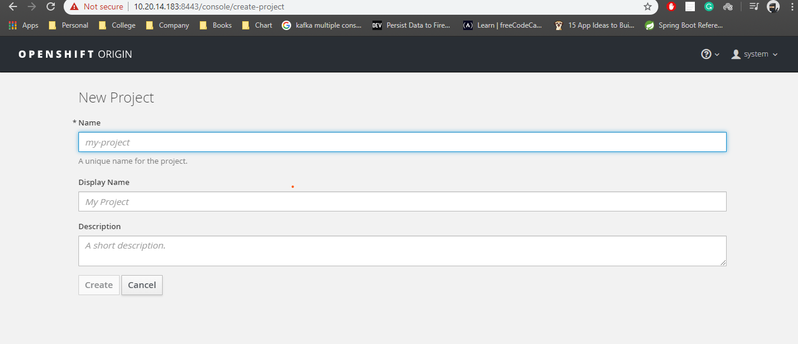

# Creating Applications with the OpenShift Web Console

## Accessing the OpenShift Web Console

- The OpenShift web console allows a user to execute many if the same tasks as the Openshift command line.
- The default URL is of the format
    > https://console-openshift-console.{wildcard DNS domain for the RHOCP cluster}/

- The Web Console uses a REST API to communicate with the OpenShift Cluster.
- The Web Console enables users to create and manage projects.
- Manage resources such as project quotas, user membership, secrete, and other advanced resources.
- Create persistent volume claims
- Monitor builds, deployments, pods, and system events.
- Create continuous integration and deployment pipelines and Jenkins

## Demonstration

1. Create a new Project

    

## Introduction to Containers, Kubernetes, and Red Hat OpenShift(DO180)

Learn to build and manage containers for deployment on a Kubernetes and RedHat OpenShift Cluster

redhat.com/training