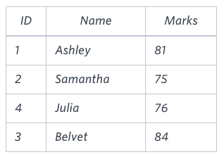

# Higher Than 75 Marks

Query the Name of any student in STUDENTS who scored higher than  Marks. Order your output by the last three characters of each name. If two or more students both have names ending in the same last three characters (i.e.: Bobby, Robby, etc.), secondary sort them by ascending ID.

## Input Format


The STUDENTS table is described as follows:  The Name column only contains uppercase (A-Z) and lowercase (a-z) letters.

## Sample Input



## Sample Output

    Ashley
    Julia
    Belvet
## Explanation

Only Ashley, Julia, and Belvet have Marks > `75`. If you look at the last three characters of each of their names, there are no duplicates and 'ley' < 'lia' < 'vet'.

## Code

```sql
SELECT Name FROM STUDENTS
WHERE Marks > 75
ORDER BY RIGHT(Name, 3), ID;
```
- `RIGHT()` - function extracts a number of characters from a string (starting from right).