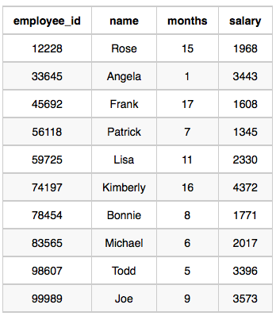

# Employee Salaries
Write a query that prints a list of employee names (i.e.: the name attribute) for employees in Employee having a salary greater than `$2000` per month who have been employees for less than `10` months. Sort your result by ascending employee_id.

## Input Format

The Employee table containing employee data for a company is described as follows:


where employee_id is an employee's ID number, name is their name, months is the total number of months they've been working for the company, and salary is the their monthly salary.

## Sample Input



## Sample Output

    Angela
    Michael
    Todd
    Joe
## Explanation

Angela has been an employee for `1` month and earns `$3443` per month.

Michael has been an employee for `6` months and earns `$2017` per month.

Todd has been an employee for `5` months and earns `$3396` per month.

Joe has been an employee for `9` months and earns `$3573` per month.

We order our output by ascending employee_id.

## Code

```sql
select name from employee
where salary>2000 AND months < 10
ORDER BY employee_id;
```