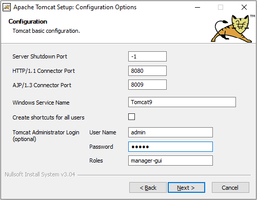
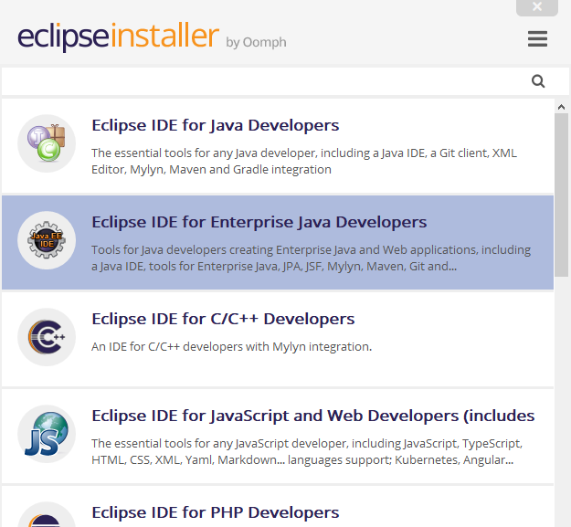
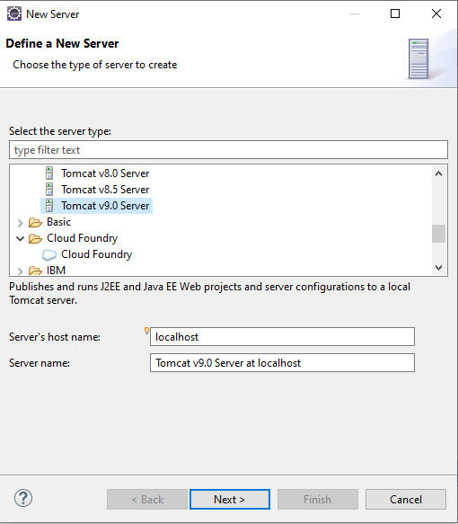
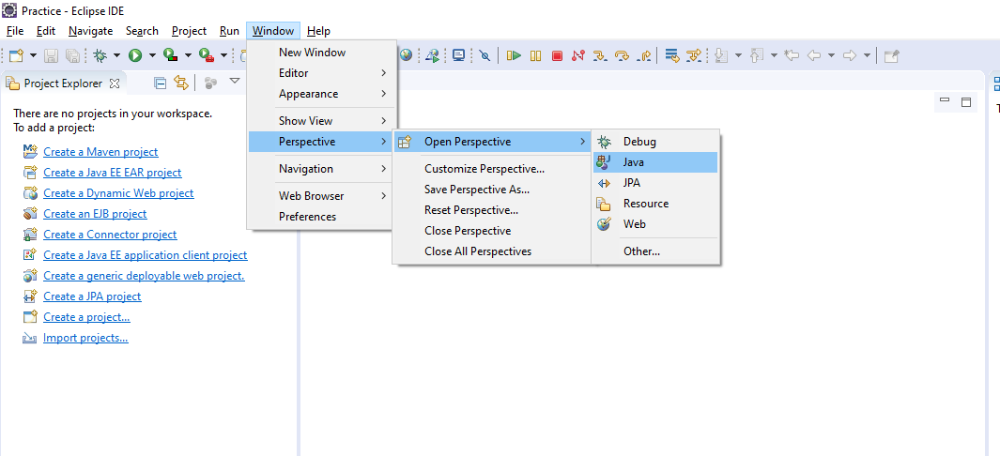

# Requirement

1. Java Application Server (Tomcat)
2. Java IDE (Eclipise)

## Installing Tomcat

1. We can download Tomcat from [Tomcat Website](https://tomcat.apache.org)
2. Select Tomcat from left hand side, Go to Binary Distribution
3. Select the Window Service Installer 
4. Set administrator login and ports

    
5. Keep the remaining settings as default and Finish the installation

## Installing Eclipse

1. We can download Eclipse from [Eclipse Website](https://www.eclipse.org/downloads/)
2. Click on Download and wait to complete
3. Start the installation, select the Java EE IDE
    
4. Set the `Workstation` and start the eclipse
5. Done

## Connecting Tomcat with Eclipse

1. Open Eclipse, at the down side you can find the tab name `Server` select it.
    
2. In the poped window select the **Apache** and scroll down from the list and find `Tomcat v9.0 Server` and continue
    
3. Now browse to the Apache installed directory

## Download Spring Jar

1. Start by changing perspective to Java
    OPen Eclipse -> Window -> Perspective -> Open Perspective -> Java
    
2. Create new Java Project
3. Download Spring from [https://repo.spring.io/release/org/springframework/spring/](https://repo.spring.io/release/org/springframework/spring/)
4. Select a version and proceed
5. Select `-dist.zip` with your version number.
6. Unzip the downloaded zip and go to the libs folder and copy all the jar file.
7. Go to Project in eclipse, right click on it select new then folder, give name as lib
8. Paste the copied libs file in the created folder
9. Right click on Project go to properties
10. Select Java Build Path and then Liberaries
11. Click on Add JARs..
12. Select all the JARs from the lib folder and Click Apply Changes